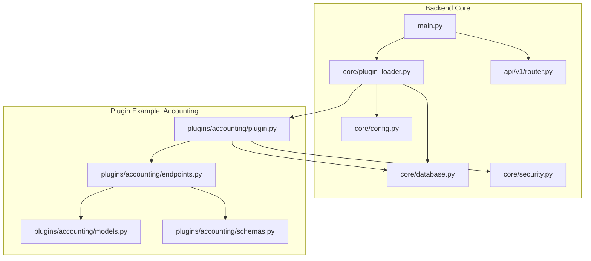
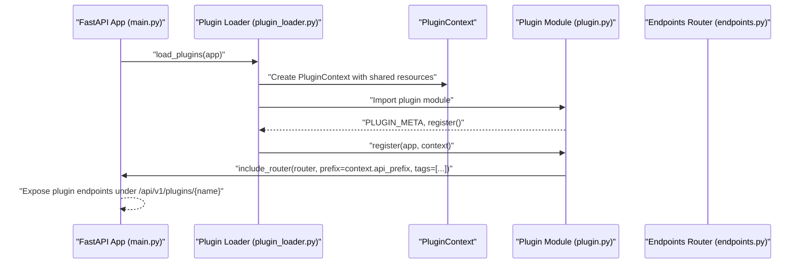
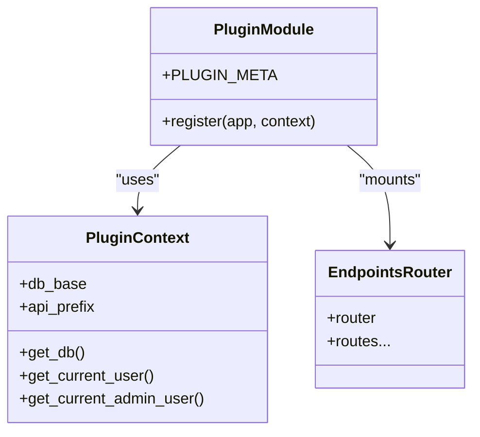
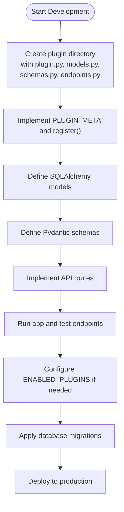
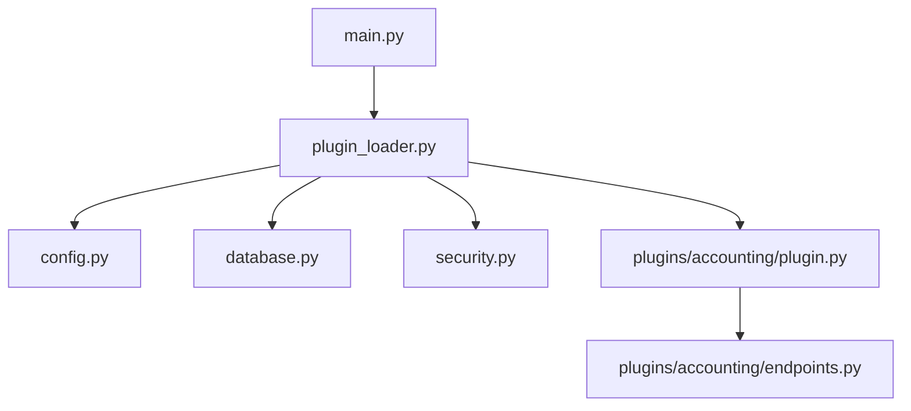

# Plugin Architecture Pattern

<cite>
**Referenced Files in This Document**
- [plugin_loader.py](file://backend/app/core/plugin_loader.py)
- [main.py](file://backend/app/main.py)
- [config.py](file://backend/app/core/config.py)
- [database.py](file://backend/app/core/database.py)
- [security.py](file://backend/app/core/security.py)
- [router.py](file://backend/app/api/v1/router.py)
- [plugin.py](file://backend/app/plugins/accounting/plugin.py)
- [endpoints.py](file://backend/app/plugins/accounting/endpoints.py)
- [models.py](file://backend/app/plugins/accounting/models.py)
- [schemas.py](file://backend/app/plugins/accounting/schemas.py)
</cite>

## Table of Contents
1. [Introduction](#introduction)
2. [Project Structure](#project-structure)
3. [Core Components](#core-components)
4. [Architecture Overview](#architecture-overview)
5. [Detailed Component Analysis](#detailed-component-analysis)
6. [Dependency Analysis](#dependency-analysis)
7. [Performance Considerations](#performance-considerations)
8. [Troubleshooting Guide](#troubleshooting-guide)
9. [Conclusion](#conclusion)

## Introduction
This document describes the plugin architecture pattern used in the backend service. It explains the standardized plugin structure, the required components, the PLUGIN_META metadata, the register() function contract, and how API endpoints are organized under a consistent prefix. It also covers the plugin development lifecycle, practical examples of plugin structure, API prefix generation, database integration patterns, plugin isolation and namespace management, and strategies for inter-plugin communication.

## Project Structure
The plugin system is organized under a dedicated plugins directory. Each plugin provides:
- plugin.py: Defines PLUGIN_META and a register(app, context) function.
- models.py: Declares SQLAlchemy models that extend the shared Base.
- schemas.py: Defines Pydantic models for request/response validation.
- endpoints.py: Implements FastAPI routers and route handlers.

The plugin loader discovers plugins dynamically, constructs a PluginContext with shared resources, and mounts each plugin’s router under a consistent API prefix.

**Diagram sources**
- [main.py:17-48](file://backend/app/main.py#L17-L48)
- [plugin_loader.py:25-99](file://backend/app/core/plugin_loader.py#L25-L99)
- [plugin.py:1-17](file://backend/app/plugins/accounting/plugin.py#L1-L17)
- [endpoints.py:1-61](file://backend/app/plugins/accounting/endpoints.py#L1-L61)
- [models.py:1-28](file://backend/app/plugins/accounting/models.py#L1-L28)
- [schemas.py:1-36](file://backend/app/plugins/accounting/schemas.py#L1-L36)
- [config.py:25-27](file://backend/app/core/config.py#L25-L27)
- [database.py:1-18](file://backend/app/core/database.py#L1-L18)
- [security.py:61-98](file://backend/app/core/security.py#L61-L98)
- [router.py:1-10](file://backend/app/api/v1/router.py#L1-L10)

**Section sources**
- [main.py:17-48](file://backend/app/main.py#L17-L48)
- [plugin_loader.py:25-99](file://backend/app/core/plugin_loader.py#L25-L99)
- [router.py:1-10](file://backend/app/api/v1/router.py#L1-L10)

## Core Components
- Plugin discovery and registration:
  - The loader scans the plugins directory, filters by ENABLED_PLUGINS if set, imports plugin modules, reads PLUGIN_META, and invokes register(app, context).
  - It constructs a PluginContext containing shared resources: db_base, api_prefix, get_db, get_current_user, get_current_admin_user.
- API prefix generation:
  - The loader builds a consistent prefix per plugin: /api/v1/plugins/{plugin_name}.
- Endpoint mounting:
  - Each plugin registers its router with the app using the provided context.api_prefix and tags.

Key responsibilities:
- plugin.py: Define metadata and register() to mount endpoints.
- models.py: Define SQLAlchemy models extending Base for database integration.
- schemas.py: Define Pydantic models for request/response validation.
- endpoints.py: Implement API routes with dependency injection for database sessions and user authentication.

**Section sources**
- [plugin_loader.py:16-23](file://backend/app/core/plugin_loader.py#L16-L23)
- [plugin_loader.py:69-76](file://backend/app/core/plugin_loader.py#L69-L76)
- [plugin_loader.py:78](file://backend/app/core/plugin_loader.py#L78)
- [plugin.py:1-17](file://backend/app/plugins/accounting/plugin.py#L1-L17)

## Architecture Overview
The plugin architecture follows a layered pattern:
- Core layer: FastAPI app, configuration, database, security, and plugin loader.
- Plugin layer: Per-plugin modules implementing models, schemas, endpoints, and registration.
- Runtime lifecycle: On startup, the app loads plugins, creates tables for plugin models, and exposes plugin APIs under a consistent prefix.

**Diagram sources**
- [main.py:25-27](file://backend/app/main.py#L25-L27)
- [plugin_loader.py:69-76](file://backend/app/core/plugin_loader.py#L69-L76)
- [plugin_loader.py:78](file://backend/app/core/plugin_loader.py#L78)
- [plugin.py:9-17](file://backend/app/plugins/accounting/plugin.py#L9-L17)

## Detailed Component Analysis

### Plugin Metadata and Registration Contract
- PLUGIN_META:
  - Required keys: name, version, description, author.
  - Used to identify the plugin and present status during loading.
- register(app, context):
  - Receives the FastAPI app instance and a PluginContext.
  - Must import the plugin’s router and include it with context.api_prefix and tags.

Implementation pattern:
- Import the plugin’s router from endpoints.py.
- Call app.include_router with prefix=context.api_prefix and tags=[PluginName].

**Section sources**
- [plugin.py:1-6](file://backend/app/plugins/accounting/plugin.py#L1-L6)
- [plugin.py:9-17](file://backend/app/plugins/accounting/plugin.py#L9-L17)
- [plugin_loader.py:60-67](file://backend/app/core/plugin_loader.py#L60-L67)

### API Endpoint Organization
- Each plugin defines its own APIRouter and routes.
- Routes commonly depend on:
  - get_db for database sessions.
  - get_current_active_user or get_current_admin_user for authorization.
- Example routes include listing, creating, retrieving, and filtering resources.

Endpoint example structure:
- GET /interfaces
- POST /interfaces
- GET /interfaces/{id}
- GET /traffic/{interface_id}

These are mounted under /api/v1/plugins/{plugin_name} via the loader-provided context.api_prefix.

**Section sources**
- [endpoints.py:14-61](file://backend/app/plugins/accounting/endpoints.py#L14-L61)
- [plugin_loader.py:72](file://backend/app/core/plugin_loader.py#L72)

### Database Integration Patterns
- Models:
  - Extend the shared Base from core/database.py.
  - Define tables and columns appropriate to the plugin domain.
- Sessions:
  - Endpoints receive a Session via Depends(get_db).
  - Queries use SQLAlchemy ORM patterns.
- Lifecycle:
  - On startup, Base.metadata.create_all is called to create tables for core and plugin models.

**Diagram sources**
- [plugin_loader.py:16-23](file://backend/app/core/plugin_loader.py#L16-L23)
- [plugin_loader.py:69-76](file://backend/app/core/plugin_loader.py#L69-L76)
- [plugin.py:9-17](file://backend/app/plugins/accounting/plugin.py#L9-L17)
- [endpoints.py:11](file://backend/app/plugins/accounting/endpoints.py#L11)

**Section sources**
- [models.py:1-28](file://backend/app/plugins/accounting/models.py#L1-L28)
- [database.py:1-18](file://backend/app/core/database.py#L1-L18)
- [main.py:23-30](file://backend/app/main.py#L23-L30)

### Authentication and Authorization in Plugins
- Plugins rely on shared security utilities:
  - get_current_active_user for basic active-user checks.
  - get_current_admin_user for admin-only endpoints.
- These dependencies are injected into plugin routes to enforce permissions.

**Section sources**
- [endpoints.py:16-27](file://backend/app/plugins/accounting/endpoints.py#L16-L27)
- [security.py:61-98](file://backend/app/core/security.py#L61-L98)

### Plugin Development Lifecycle
- Initial setup:
  - Create a new folder under backend/app/plugins/<your_plugin>.
  - Add plugin.py with PLUGIN_META and register().
  - Add models.py, schemas.py, and endpoints.py.
- Local development:
  - Run the FastAPI app; plugins are auto-loaded on startup.
  - Verify endpoints under /api/v1/plugins/<name>.
- Enable/disable plugins:
  - Set ENABLED_PLUGINS in configuration to restrict loaded plugins.
- Deployment:
  - Ensure database migrations are applied (Alembic recommended).
  - Confirm CORS and environment settings align with frontend.

[No sources needed since this diagram shows conceptual workflow, not actual code structure]

## Dependency Analysis
- Plugin loader dependencies:
  - Imports plugin modules dynamically and reads metadata and registration functions.
  - Provides a shared PluginContext to each plugin.
- Plugin dependencies:
  - Endpoints import models and schemas from the same plugin namespace.
  - Endpoints depend on shared database and security utilities.
- Core dependencies:
  - FastAPI app depends on plugin loader for runtime plugin registration.
  - Configuration controls plugin enablement.

**Diagram sources**
- [plugin_loader.py:1-13](file://backend/app/core/plugin_loader.py#L1-L13)
- [main.py:9-12](file://backend/app/main.py#L9-L12)
- [config.py:25-27](file://backend/app/core/config.py#L25-L27)
- [database.py:1-18](file://backend/app/core/database.py#L1-L18)
- [security.py:1-12](file://backend/app/core/security.py#L1-L12)
- [plugin.py:1-17](file://backend/app/plugins/accounting/plugin.py#L1-L17)
- [endpoints.py:1-11](file://backend/app/plugins/accounting/endpoints.py#L1-L11)

**Section sources**
- [plugin_loader.py:25-99](file://backend/app/core/plugin_loader.py#L25-L99)
- [main.py:25-27](file://backend/app/main.py#L25-L27)

## Performance Considerations
- Plugin discovery:
  - Directory scanning and dynamic imports occur at startup; keep the number of plugins reasonable.
- Database:
  - Each plugin’s models extend the shared Base; ensure efficient queries and proper indexing.
- Token and session handling:
  - Shared JWT utilities and database sessions are reused across plugins to minimize overhead.

[No sources needed since this section provides general guidance]

## Troubleshooting Guide
Common issues and resolutions:
- Plugin not loaded:
  - Ensure plugin.py contains PLUGIN_META and register().
  - Verify the plugin directory is not hidden and contains plugin.py.
  - Check ENABLED_PLUGINS configuration if restricting plugins.
- Missing tables:
  - Confirm Base.metadata.create_all runs after plugin models are imported.
- Permission errors:
  - Use get_current_active_user or get_current_admin_user in routes as needed.
- API prefix conflicts:
  - Prefixes are generated automatically; avoid manual overrides in plugin.register.

**Section sources**
- [plugin_loader.py:46-48](file://backend/app/core/plugin_loader.py#L46-L48)
- [plugin_loader.py:63-67](file://backend/app/core/plugin_loader.py#L63-L67)
- [plugin_loader.py:89-97](file://backend/app/core/plugin_loader.py#L89-L97)
- [main.py:29-30](file://backend/app/main.py#L29-L30)
- [endpoints.py:16-27](file://backend/app/plugins/accounting/endpoints.py#L16-L27)

## Conclusion
The plugin architecture provides a clean, scalable way to extend the backend with modular functionality. By adhering to the standardized structure—PLUGIN_META and register(), shared database and security contexts, and consistent API prefixing—you can develop, test, and deploy plugins efficiently while maintaining isolation and predictable behavior.