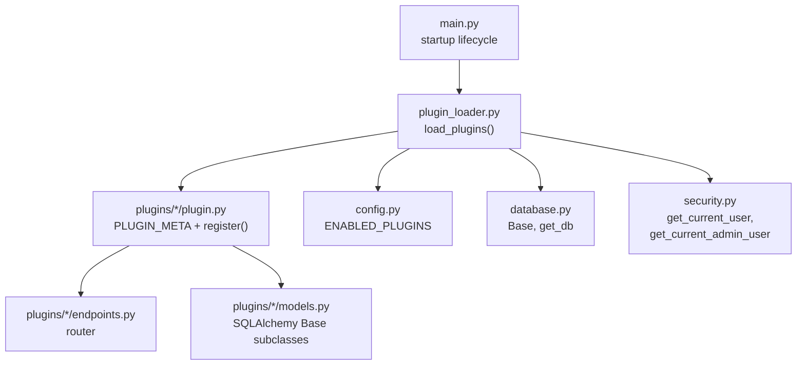
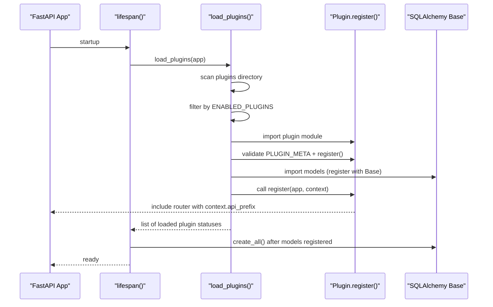
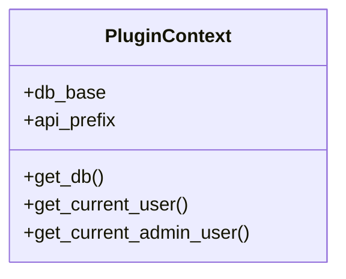
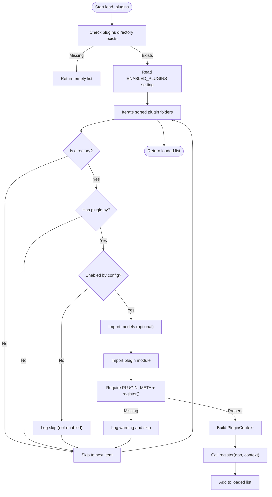
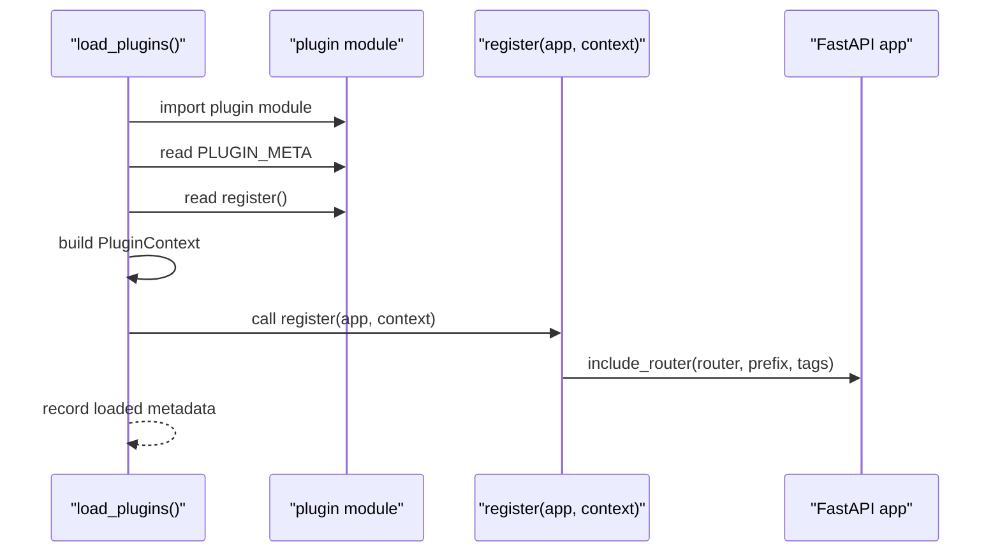
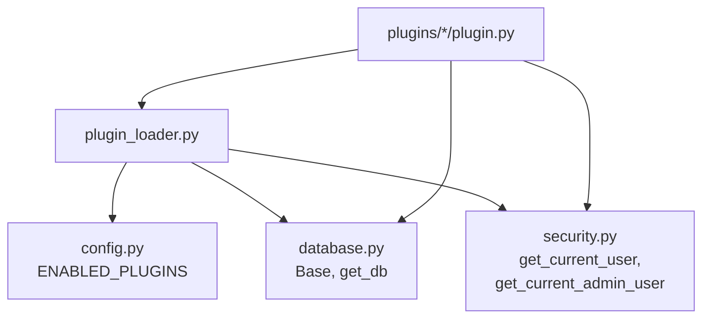

# Plugin Loading Mechanism

<cite>
**Referenced Files in This Document**
- [plugin_loader.py](file://backend/app/core/plugin_loader.py)
- [config.py](file://backend/app/core/config.py)
- [main.py](file://backend/app/main.py)
- [database.py](file://backend/app/core/database.py)
- [security.py](file://backend/app/core/security.py)
- [accounting/plugin.py](file://backend/app/plugins/accounting/plugin.py)
- [configuration/plugin.py](file://backend/app/plugins/configuration/plugin.py)
- [incidents/plugin.py](file://backend/app/plugins/incidents/plugin.py)
- [accounting/endpoints.py](file://backend/app/plugins/accounting/endpoints.py)
- [accounting/models.py](file://backend/app/plugins/accounting/models.py)
- [user.py](file://backend/app/models/user.py)
</cite>

## Table of Contents
1. [Introduction](#introduction)
2. [Project Structure](#project-structure)
3. [Core Components](#core-components)
4. [Architecture Overview](#architecture-overview)
5. [Detailed Component Analysis](#detailed-component-analysis)
6. [Dependency Analysis](#dependency-analysis)
7. [Performance Considerations](#performance-considerations)
8. [Troubleshooting Guide](#troubleshooting-guide)
9. [Conclusion](#conclusion)

## Introduction
This document explains the plugin loading mechanism used by the backend service. It covers dynamic plugin discovery, directory scanning, import system, the PluginContext role in providing shared dependencies, filtering via ENABLED_PLUGINS, and the end-to-end loading workflow. It also documents error handling, logging, and how plugin ordering and conflicts are managed.

## Project Structure
The plugin system is organized under backend/app/plugins with one subdirectory per plugin. Each plugin exposes a plugin.py that defines metadata and a registration function. Plugins may optionally define models.py and endpoints.py. The central loader resides in backend/app/core/plugin_loader.py and is invoked during application startup in main.py.

**Diagram sources**
- [main.py:17-48](file://backend/app/main.py#L17-L48)
- [plugin_loader.py:25-99](file://backend/app/core/plugin_loader.py#L25-L99)
- [config.py:25-26](file://backend/app/core/config.py#L25-L26)
- [database.py:1-18](file://backend/app/core/database.py#L1-L18)
- [security.py:61-98](file://backend/app/core/security.py#L61-L98)

**Section sources**
- [main.py:17-48](file://backend/app/main.py#L17-L48)
- [plugin_loader.py:25-99](file://backend/app/core/plugin_loader.py#L25-L99)

## Core Components
- PluginContext: Provides shared dependencies to plugins, including the SQLAlchemy declarative base, database session factory, and security helpers. It also computes a plugin-specific API prefix.
- load_plugins(): Scans the plugins directory, filters by ENABLED_PLUGINS, imports plugin modules, validates required metadata and registration function, constructs PluginContext, and invokes register() to attach routers and models.

Key behaviors:
- Directory scanning ignores non-directories and hidden names (leading underscore).
- Models are imported first to register ORM classes with Base.metadata.
- Registration requires both PLUGIN_META and register(app, context).
- Logging distinguishes skipped, loaded, and errored plugins.

**Section sources**
- [plugin_loader.py:16-23](file://backend/app/core/plugin_loader.py#L16-L23)
- [plugin_loader.py:25-99](file://backend/app/core/plugin_loader.py#L25-L99)

## Architecture Overview
The plugin loading pipeline integrates with FastAPI’s lifespan manager. It initializes logging, creates database tables, loads plugins, re-creates tables to include new plugin models, and exposes a plugin listing endpoint.

**Diagram sources**
- [main.py:17-48](file://backend/app/main.py#L17-L48)
- [plugin_loader.py:25-99](file://backend/app/core/plugin_loader.py#L25-L99)

## Detailed Component Analysis

### PluginContext
PluginContext encapsulates shared resources and utilities passed to each plugin during registration. It ensures consistent access to:
- Database base class for model registration
- Database session provider
- Current user and admin validators
- Computed API prefix scoped to the plugin

**Diagram sources**
- [plugin_loader.py:16-23](file://backend/app/core/plugin_loader.py#L16-L23)

**Section sources**
- [plugin_loader.py:16-23](file://backend/app/core/plugin_loader.py#L16-L23)

### Plugin Discovery and Filtering
Discovery scans the plugins directory, skipping non-directories and names starting with underscore. It checks for the presence of plugin.py. If ENABLED_PLUGINS is set, only plugins whose names appear in the comma-separated list are loaded; others are skipped with an info log.

**Diagram sources**
- [plugin_loader.py:25-99](file://backend/app/core/plugin_loader.py#L25-L99)
- [config.py:25-26](file://backend/app/core/config.py#L25-L26)

**Section sources**
- [plugin_loader.py:25-99](file://backend/app/core/plugin_loader.py#L25-L99)
- [config.py:25-26](file://backend/app/core/config.py#L25-L26)

### Registration Workflow
Each plugin’s register function receives the FastAPI app and PluginContext. It typically includes the plugin’s router with a prefix derived from context.api_prefix and applies optional tags. The loader collects metadata such as plugin name, version, and description.

**Diagram sources**
- [plugin_loader.py:50-87](file://backend/app/core/plugin_loader.py#L50-L87)
- [accounting/plugin.py:9-17](file://backend/app/plugins/accounting/plugin.py#L9-L17)
- [configuration/plugin.py:9-17](file://backend/app/plugins/configuration/plugin.py#L9-L17)
- [incidents/plugin.py:9-17](file://backend/app/plugins/incidents/plugin.py#L9-L17)

**Section sources**
- [plugin_loader.py:50-87](file://backend/app/core/plugin_loader.py#L50-L87)
- [accounting/plugin.py:9-17](file://backend/app/plugins/accounting/plugin.py#L9-L17)
- [configuration/plugin.py:9-17](file://backend/app/plugins/configuration/plugin.py#L9-L17)
- [incidents/plugin.py:9-17](file://backend/app/plugins/incidents/plugin.py#L9-L17)

### Example: Successful Plugin Loading
- A plugin folder contains plugin.py with PLUGIN_META and a register() function.
- Optional models.py is imported first to register ORM classes with Base.
- The loader builds PluginContext and calls register(), attaching a router with a plugin-scoped prefix.
- The loader logs success and records the plugin’s metadata.

Relevant references:
- [plugin_loader.py:50-87](file://backend/app/core/plugin_loader.py#L50-L87)
- [accounting/plugin.py:1-17](file://backend/app/plugins/accounting/plugin.py#L1-L17)
- [accounting/endpoints.py:1-61](file://backend/app/plugins/accounting/endpoints.py#L1-L61)
- [accounting/models.py:1-28](file://backend/app/plugins/accounting/models.py#L1-L28)

**Section sources**
- [plugin_loader.py:50-87](file://backend/app/core/plugin_loader.py#L50-L87)
- [accounting/plugin.py:1-17](file://backend/app/plugins/accounting/plugin.py#L1-L17)
- [accounting/endpoints.py:1-61](file://backend/app/plugins/accounting/endpoints.py#L1-L61)
- [accounting/models.py:1-28](file://backend/app/plugins/accounting/models.py#L1-L28)

### Example: Failed Plugin Loading
Failure scenarios include:
- Missing plugin.py or absence of PLUGIN_META/register().
- Import errors when importing models or plugin modules.
- Runtime exceptions inside register().

The loader catches exceptions, logs an error with stack trace, and records the failure in the returned list.

Relevant references:
- [plugin_loader.py:63-67](file://backend/app/core/plugin_loader.py#L63-L67)
- [plugin_loader.py:89-97](file://backend/app/core/plugin_loader.py#L89-L97)

**Section sources**
- [plugin_loader.py:63-67](file://backend/app/core/plugin_loader.py#L63-L67)
- [plugin_loader.py:89-97](file://backend/app/core/plugin_loader.py#L89-L97)

### Error Handling and Logging
- Skipped plugins (not enabled) are logged at INFO level.
- Plugins missing required metadata are logged at WARNING level.
- Import or runtime errors are logged at ERROR level with exception info.
- The loader returns a list of dictionaries containing name, version, description, status, and error details when applicable.

Relevant references:
- [plugin_loader.py:33-48](file://backend/app/core/plugin_loader.py#L33-L48)
- [plugin_loader.py:64-67](file://backend/app/core/plugin_loader.py#L64-L67)
- [plugin_loader.py:89-97](file://backend/app/core/plugin_loader.py#L89-L97)

**Section sources**
- [plugin_loader.py:33-48](file://backend/app/core/plugin_loader.py#L33-L48)
- [plugin_loader.py:64-67](file://backend/app/core/plugin_loader.py#L64-L67)
- [plugin_loader.py:89-97](file://backend/app/core/plugin_loader.py#L89-L97)

### Plugin Ordering and Conflict Prevention
- Directory iteration is performed over a sorted list of plugin folders, ensuring deterministic order.
- Each plugin registers its own router with a unique prefix derived from the plugin name, preventing route conflicts.
- Model registration occurs before attempting to register routers, ensuring database tables are created consistently.

Relevant references:
- [plugin_loader.py:38](file://backend/app/core/plugin_loader.py#L38)
- [plugin_loader.py:70-76](file://backend/app/core/plugin_loader.py#L70-L76)
- [plugin_loader.py:52-55](file://backend/app/core/plugin_loader.py#L52-L55)

**Section sources**
- [plugin_loader.py:38](file://backend/app/core/plugin_loader.py#L38)
- [plugin_loader.py:70-76](file://backend/app/core/plugin_loader.py#L70-L76)
- [plugin_loader.py:52-55](file://backend/app/core/plugin_loader.py#L52-L55)

## Dependency Analysis
The loader depends on configuration for filtering, database facilities for model registration, and security helpers for protected endpoints. Plugins depend on the loader-provided context and the global database base.

**Diagram sources**
- [plugin_loader.py:25-99](file://backend/app/core/plugin_loader.py#L25-L99)
- [config.py:25-26](file://backend/app/core/config.py#L25-L26)
- [database.py:1-18](file://backend/app/core/database.py#L1-L18)
- [security.py:61-98](file://backend/app/core/security.py#L61-L98)

**Section sources**
- [plugin_loader.py:25-99](file://backend/app/core/plugin_loader.py#L25-L99)
- [config.py:25-26](file://backend/app/core/config.py#L25-L26)
- [database.py:1-18](file://backend/app/core/database.py#L1-L18)
- [security.py:61-98](file://backend/app/core/security.py#L61-L98)

## Performance Considerations
- Deterministic order: Sorting plugin directories avoids inconsistent load orders across environments.
- Minimal overhead: Importing models first ensures database schema creation happens once after all models are registered.
- Logging level: Configure LOG_LEVEL appropriately to reduce noise in production.

## Troubleshooting Guide
Common issues and resolutions:
- Plugins directory not found: The loader logs a warning and returns an empty list. Verify the plugins directory path and permissions.
- Plugin skipped due to ENABLED_PLUGINS: Ensure the plugin name matches exactly one of the comma-separated entries.
- Missing PLUGIN_META or register(): Add the required metadata and registration function to plugin.py.
- Import errors in models or plugin modules: Fix import paths and dependencies; ensure all required packages are installed.
- Route conflicts: Each plugin uses a unique prefix derived from its name; avoid overriding prefixes in register().
- Database schema inconsistencies: Rerun table creation after loading plugins to ensure all models are reflected.

Operational endpoints:
- GET /api/v1/plugins returns the list of loaded plugins with status and metadata.

**Section sources**
- [plugin_loader.py:29-31](file://backend/app/core/plugin_loader.py#L29-L31)
- [plugin_loader.py:46-48](file://backend/app/core/plugin_loader.py#L46-L48)
- [plugin_loader.py:63-67](file://backend/app/core/plugin_loader.py#L63-L67)
- [plugin_loader.py:89-97](file://backend/app/core/plugin_loader.py#L89-L97)
- [main.py:84-87](file://backend/app/main.py#L84-L87)

## Conclusion
The plugin loading mechanism provides a robust, extensible foundation for adding features to the backend. It supports selective activation via configuration, safe model registration, and consistent routing through PluginContext. By following the documented patterns and troubleshooting steps, teams can reliably add, update, or remove plugins while maintaining system stability.