# Plugin System Architecture

<cite>
**Referenced Files in This Document**
- [plugin_loader.py](file://backend/app/core/plugin_loader.py)
- [main.py](file://backend/app/main.py)
- [plugin.py](file://backend/app/plugins/accounting/plugin.py)
- [plugin.py](file://backend/app/plugins/configuration/plugin.py)
- [plugin.py](file://backend/app/plugins/incidents/plugin.py)
- [plugin.py](file://backend/app/plugins/inventory/plugin.py)
- [plugin.py](file://backend/app/plugins/performance/plugin.py)
- [plugin.py](file://backend/app/plugins/security_module/plugin.py)
- [plugin.py](file://backend/app/plugins/customer_services/plugin.py)
- [endpoints.py](file://backend/app/plugins/accounting/endpoints.py)
- [endpoints.py](file://backend/app/plugins/configuration/endpoints.py)
- [endpoints.py](file://backend/app/plugins/incidents/endpoints.py)
- [endpoints.py](file://backend/app/plugins/customer_services/endpoints.py)
- [models.py](file://backend/app/plugins/customer_services/models.py)
- [schemas.py](file://backend/app/plugins/customer_services/schemas.py)
- [pluginRegistry.js](file://frontend/src/stores/pluginRegistry.js)
- [main.js](file://frontend/src/main.js)
- [index.js](file://frontend/src/router/index.js)
- [IncidentsList.vue](file://frontend/src/plugins/incidents/views/IncidentsList.vue)
- [Accounting.vue](file://frontend/src/plugins/accounting/views/Accounting.vue)
- [Configuration.vue](file://frontend/src/plugins/configuration/views/Configuration.vue)
- [CustomerServices.vue](file://frontend/src/plugins/customer_services/views/CustomerServices.vue)
</cite>

## Update Summary
**Changes Made**
- Added comprehensive documentation for the Customer Services plugin as a detailed example
- Updated plugin architecture examples to include advanced features like CSV import and real-time service management
- Enhanced frontend integration documentation with Vue.js component examples
- Added new sections covering CSV data handling, real-time service management, and advanced plugin features

## Table of Contents
1. [Introduction](#introduction)
2. [Project Structure](#project-structure)
3. [Core Components](#core-components)
4. [Architecture Overview](#architecture-overview)
5. [Detailed Component Analysis](#detailed-component-analysis)
6. [Advanced Plugin Features](#advanced-plugin-features)
7. [Dependency Analysis](#dependency-analysis)
8. [Performance Considerations](#performance-considerations)
9. [Troubleshooting Guide](#troubleshooting-guide)
10. [Conclusion](#conclusion)
11. [Appendices](#appendices)

## Introduction
This document describes the plugin-based system architecture of the platform. It explains how plugins are discovered, loaded, and registered in both the backend and frontend, and how they integrate with the main application. The system now includes advanced plugins like Customer Services that demonstrate sophisticated features such as CSV data import, real-time service management, and comprehensive Vue.js frontend integration. It also documents the standardized plugin structure, the plugin development lifecycle, and practical examples of plugin integration, menu generation, and state management. Communication patterns between the backend plugin loader and the frontend plugin registry are covered, along with extensibility mechanisms and best practices.

## Project Structure
The plugin system spans two primary areas:
- Backend: Dynamic discovery and registration of plugins via a loader that imports plugin modules and registers API routers under a plugin-specific prefix.
- Frontend: Runtime discovery of loaded plugins, dynamic registration of plugin manifests, and menu generation for navigation.

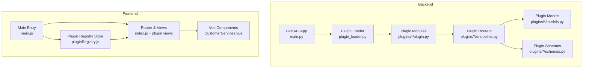

**Diagram sources**
- [main.py:17-48](file://backend/app/main.py#L17-L48)
- [plugin_loader.py:25-99](file://backend/app/core/plugin_loader.py#L25-L99)
- [plugin.py:1-17](file://backend/app/plugins/accounting/plugin.py#L1-L17)
- [endpoints.py:1-61](file://backend/app/plugins/accounting/endpoints.py#L1-L61)
- [models.py:1-74](file://backend/app/plugins/customer_services/models.py#L1-L74)
- [schemas.py:1-54](file://backend/app/plugins/customer_services/schemas.py#L1-L54)
- [main.js:18-51](file://frontend/src/main.js#L18-L51)
- [pluginRegistry.js:1-53](file://frontend/src/stores/pluginRegistry.js#L1-L53)
- [index.js:26-32](file://frontend/src/router/index.js#L26-L32)
- [CustomerServices.vue:1-384](file://frontend/src/plugins/customer_services/views/CustomerServices.vue#L1-L384)

**Section sources**
- [main.py:17-48](file://backend/app/main.py#L17-L48)
- [plugin_loader.py:25-99](file://backend/app/core/plugin_loader.py#L25-L99)
- [pluginRegistry.js:1-53](file://frontend/src/stores/pluginRegistry.js#L1-L53)
- [main.js:18-51](file://frontend/src/main.js#L18-L51)
- [index.js:26-32](file://frontend/src/router/index.js#L26-L32)

## Core Components
- Backend plugin loader: Discovers plugin directories, validates plugin metadata and registration function, constructs a plugin context, and invokes the plugin's register function to attach API routes.
- Plugin modules: Provide metadata and a register function that includes a FastAPI router under a plugin-scoped prefix.
- Plugin endpoints: Define API endpoints for each plugin's domain logic, including advanced features like CSV import and real-time data management.
- Plugin models and schemas: Define SQLAlchemy models and Pydantic schemas for data persistence and validation.
- Frontend plugin registry: Dynamically loads plugin manifests from the backend, aggregates menu items, and exposes computed state for UI rendering.
- Frontend router and views: Define plugin routes and render plugin-specific views with comprehensive Vue.js components.

Key responsibilities:
- Backend: Plugin discovery, model registration, API router inclusion, CSV data import, and runtime plugin status exposure.
- Frontend: Plugin manifest registration, menu aggregation, route composition, and complex view rendering with real-time data management.

**Section sources**
- [plugin_loader.py:25-99](file://backend/app/core/plugin_loader.py#L25-L99)
- [plugin.py:1-17](file://backend/app/plugins/accounting/plugin.py#L1-L17)
- [endpoints.py:1-61](file://backend/app/plugins/accounting/endpoints.py#L1-L61)
- [models.py:1-74](file://backend/app/plugins/customer_services/models.py#L1-L74)
- [schemas.py:1-54](file://backend/app/plugins/customer_services/schemas.py#L1-L54)
- [pluginRegistry.js:1-53](file://frontend/src/stores/pluginRegistry.js#L1-L53)
- [main.js:18-51](file://frontend/src/main.js#L18-L51)
- [index.js:26-32](file://frontend/src/router/index.js#L26-L32)

## Architecture Overview
The system follows a dual-layer plugin architecture with advanced capabilities:
- Backend layer: Plugins are Python packages under a dedicated directory. Each plugin defines a metadata dictionary and a register function that receives a FastAPI app and a plugin context. The loader imports plugin models first, then the plugin module, validates metadata, and calls register to attach routes. Advanced plugins like Customer Services include CSV import functionality and real-time data management.
- Frontend layer: On startup, the frontend fetches the list of loaded plugins from the backend, constructs plugin manifests, and registers them in a Pinia store. Menu items are generated per plugin and exposed for the sidebar navigation. Complex Vue.js components handle real-time data updates and user interactions.

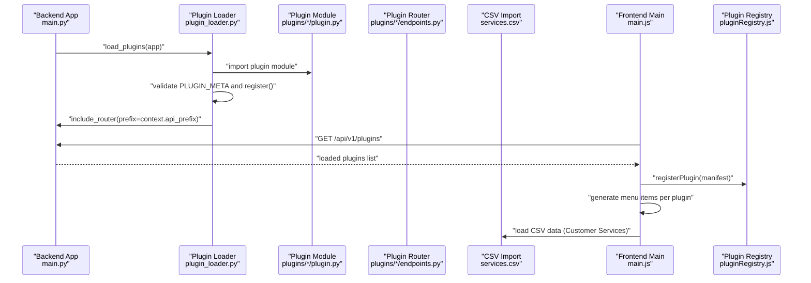

**Diagram sources**
- [main.py:17-48](file://backend/app/main.py#L17-L48)
- [plugin_loader.py:25-99](file://backend/app/core/plugin_loader.py#L25-L99)
- [plugin.py:1-17](file://backend/app/plugins/accounting/plugin.py#L1-L17)
- [endpoints.py:1-61](file://backend/app/plugins/accounting/endpoints.py#L1-L61)
- [endpoints.py:24-67](file://backend/app/plugins/customer_services/endpoints.py#L24-L67)
- [main.js:18-51](file://frontend/src/main.js#L18-L51)
- [pluginRegistry.js:1-53](file://frontend/src/stores/pluginRegistry.js#L1-L53)

## Detailed Component Analysis

### Backend Plugin Loader
The loader performs:
- Directory scanning for plugin folders.
- Optional filtering by an enabled-plugins setting.
- Model import to register SQLAlchemy models with the shared metadata base.
- Plugin module import and validation of required metadata and registration function.
- Construction of a plugin context containing database base, API prefix, and security helpers.
- Invocation of the plugin's register function to attach routes.
- Aggregation of plugin status and metadata for runtime reporting.

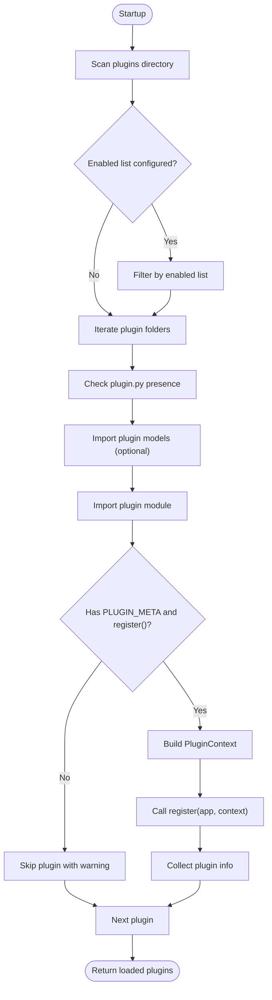

**Diagram sources**
- [plugin_loader.py:25-99](file://backend/app/core/plugin_loader.py#L25-L99)

**Section sources**
- [plugin_loader.py:25-99](file://backend/app/core/plugin_loader.py#L25-L99)
- [main.py:17-48](file://backend/app/main.py#L17-L48)

### Plugin Module Structure and Registration
Each plugin must provide:
- Metadata dictionary with at least name, version, description, and author.
- A register function that accepts the FastAPI app and a plugin context, and includes a router under a plugin-scoped prefix.

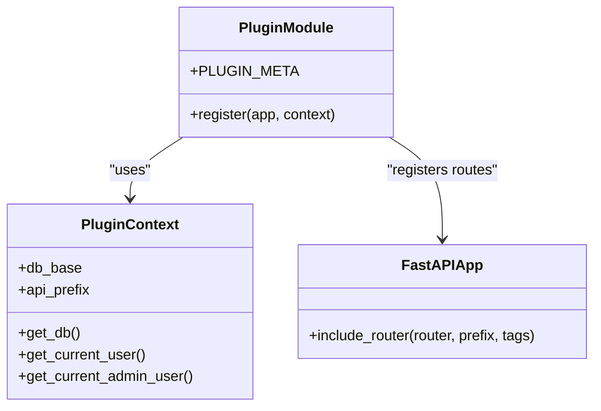

**Diagram sources**
- [plugin_loader.py:69-76](file://backend/app/core/plugin_loader.py#L69-L76)
- [plugin.py:1-17](file://backend/app/plugins/accounting/plugin.py#L1-L17)
- [plugin.py:1-17](file://backend/app/plugins/customer_services/plugin.py#L1-L17)

**Section sources**
- [plugin.py:1-17](file://backend/app/plugins/accounting/plugin.py#L1-L17)
- [plugin.py:1-17](file://backend/app/plugins/configuration/plugin.py#L1-L17)
- [plugin.py:1-17](file://backend/app/plugins/incidents/plugin.py#L1-L17)
- [plugin.py:1-17](file://backend/app/plugins/inventory/plugin.py#L1-L17)
- [plugin.py:1-17](file://backend/app/plugins/performance/plugin.py#L1-L17)
- [plugin.py:1-17](file://backend/app/plugins/security_module/plugin.py#L1-L17)
- [plugin.py:1-17](file://backend/app/plugins/customer_services/plugin.py#L1-L17)

### Plugin Endpoints and API Exposure
Each plugin defines an API router with endpoints for its domain. The loader attaches each router under a prefix derived from the plugin's metadata name. Authentication and authorization are enforced via dependency-injected security functions. Advanced plugins like Customer Services include CSV import functionality and real-time data management capabilities.

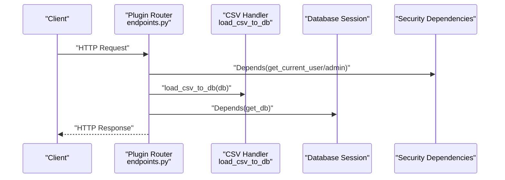

**Diagram sources**
- [endpoints.py:1-61](file://backend/app/plugins/accounting/endpoints.py#L1-L61)
- [endpoints.py:1-71](file://backend/app/plugins/configuration/endpoints.py#L1-L71)
- [endpoints.py:1-122](file://backend/app/plugins/incidents/endpoints.py#L1-L122)
- [endpoints.py:24-67](file://backend/app/plugins/customer_services/endpoints.py#L24-L67)

**Section sources**
- [endpoints.py:1-61](file://backend/app/plugins/accounting/endpoints.py#L1-L61)
- [endpoints.py:1-71](file://backend/app/plugins/configuration/endpoints.py#L1-L71)
- [endpoints.py:1-122](file://backend/app/plugins/incidents/endpoints.py#L1-L122)
- [endpoints.py:24-67](file://backend/app/plugins/customer_services/endpoints.py#L24-L67)

### Frontend Plugin Registry and Menu Generation
On startup, the frontend:
- Fetches the list of loaded plugins from the backend.
- Constructs plugin manifests with metadata and menu items.
- Registers each plugin in a Pinia store and marks initialization complete.
- Exposes computed lists of enabled plugins and aggregated menu items grouped by section and ordered by priority.

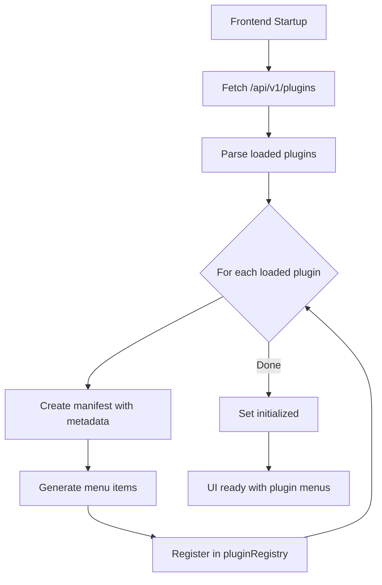

**Diagram sources**
- [main.js:18-51](file://frontend/src/main.js#L18-L51)
- [pluginRegistry.js:1-53](file://frontend/src/stores/pluginRegistry.js#L1-L53)

**Section sources**
- [main.js:18-51](file://frontend/src/main.js#L18-L51)
- [pluginRegistry.js:1-53](file://frontend/src/stores/pluginRegistry.js#L1-L53)

### Frontend Router Integration and View Rendering
The frontend router defines plugin routes and lazy-loads plugin views. Each plugin view consumes the backend APIs exposed under the plugin's prefixed endpoints. The Customer Services view demonstrates comprehensive data management with CSV import, real-time updates, and advanced filtering capabilities.

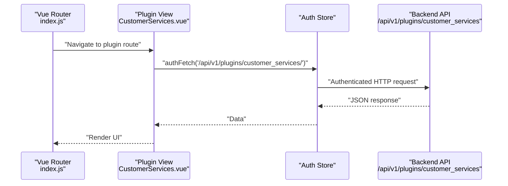

**Diagram sources**
- [index.js:114-144](file://frontend/src/router/index.js#L114-L144)
- [CustomerServices.vue:77-100](file://frontend/src/plugins/customer_services/views/CustomerServices.vue#L77-L100)

**Section sources**
- [index.js:114-144](file://frontend/src/router/index.js#L114-L144)
- [CustomerServices.vue:77-100](file://frontend/src/plugins/customer_services/views/CustomerServices.vue#L77-L100)

## Advanced Plugin Features

### CSV Data Import and Management
The Customer Services plugin demonstrates sophisticated CSV data import capabilities:
- Automatic CSV file detection and loading
- Database population from CSV data
- Prevention of duplicate data loading
- Real-time data synchronization with database

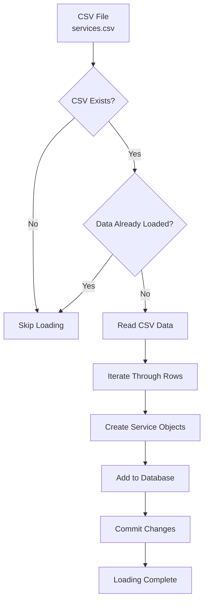

**Diagram sources**
- [endpoints.py:24-67](file://backend/app/plugins/customer_services/endpoints.py#L24-L67)

**Section sources**
- [endpoints.py:24-67](file://backend/app/plugins/customer_services/endpoints.py#L24-L67)

### Real-Time Service Management
The Customer Services plugin provides comprehensive service management with:
- Real-time service listing with pagination and filtering
- Individual service retrieval and updates
- Service statistics and distribution analysis
- Advanced search capabilities across multiple fields

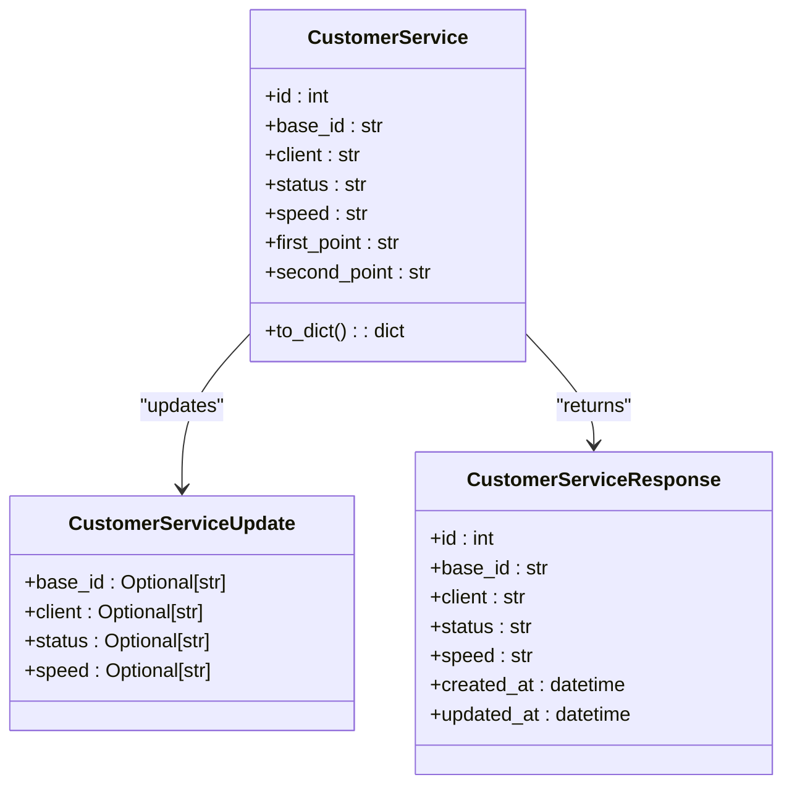

**Diagram sources**
- [models.py:6-74](file://backend/app/plugins/customer_services/models.py#L6-L74)
- [schemas.py:6-54](file://backend/app/plugins/customer_services/schemas.py#L6-L54)

**Section sources**
- [models.py:6-74](file://backend/app/plugins/customer_services/models.py#L6-L74)
- [schemas.py:6-54](file://backend/app/plugins/customer_services/schemas.py#L6-L54)

### Comprehensive Vue.js Frontend Integration
The Customer Services frontend component demonstrates advanced Vue.js integration:
- Real-time data fetching and display
- Advanced filtering and search capabilities
- Pagination with navigation controls
- Modal-based service editing
- Status-based visual indicators
- Responsive table layout with column management

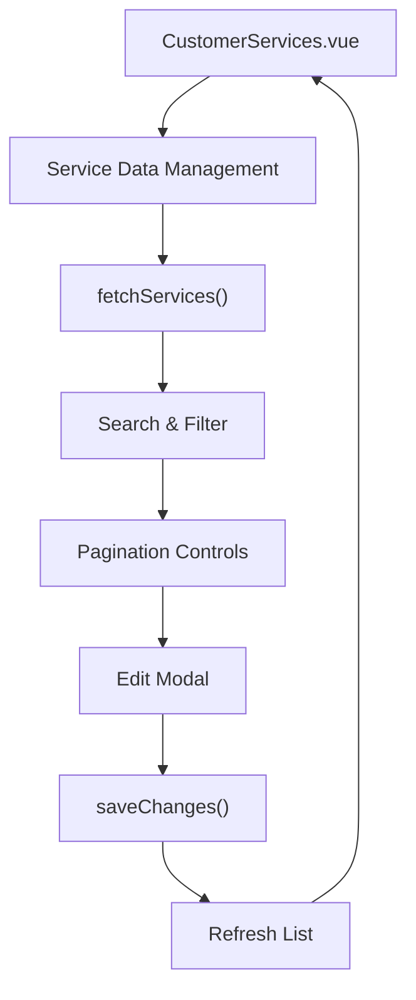

**Diagram sources**
- [CustomerServices.vue:1-384](file://frontend/src/plugins/customer_services/views/CustomerServices.vue#L1-L384)

**Section sources**
- [CustomerServices.vue:1-384](file://frontend/src/plugins/customer_services/views/CustomerServices.vue#L1-L384)

### Practical Examples

#### Example: Customer Services Plugin Integration
- Backend: The Customer Services plugin registers a router under a plugin-scoped prefix, includes CSV import functionality, and exposes endpoints for listing, searching, retrieving, updating, and getting statistics about services.
- Frontend: The Customer Services view fetches data from the backend, renders a comprehensive service management interface, supports advanced filtering and pagination, and provides modal-based editing capabilities.

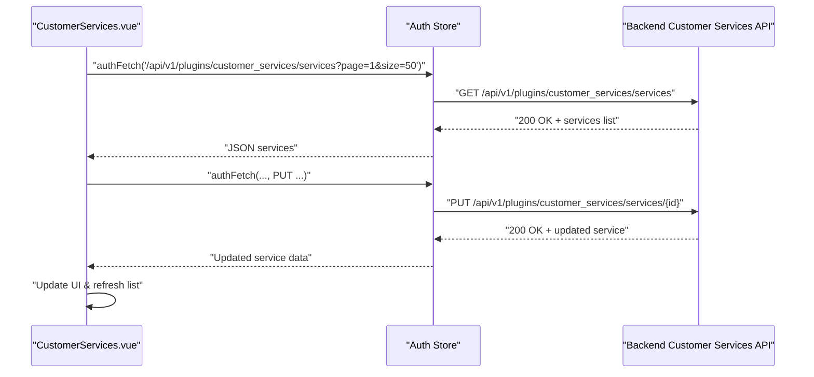

**Diagram sources**
- [CustomerServices.vue:77-142](file://frontend/src/plugins/customer_services/views/CustomerServices.vue#L77-L142)
- [endpoints.py:69-147](file://backend/app/plugins/customer_services/endpoints.py#L69-L147)

**Section sources**
- [CustomerServices.vue:77-142](file://frontend/src/plugins/customer_services/views/CustomerServices.vue#L77-L142)
- [endpoints.py:69-147](file://backend/app/plugins/customer_services/endpoints.py#L69-L147)

#### Example: Incidents Plugin Integration
- Backend: The incidents plugin registers a router under a plugin-scoped prefix and exposes endpoints for listing, creating, retrieving, updating, and deleting incidents.
- Frontend: The incidents view fetches data from the backend, renders a list of incidents, supports creating new incidents, and updating statuses.

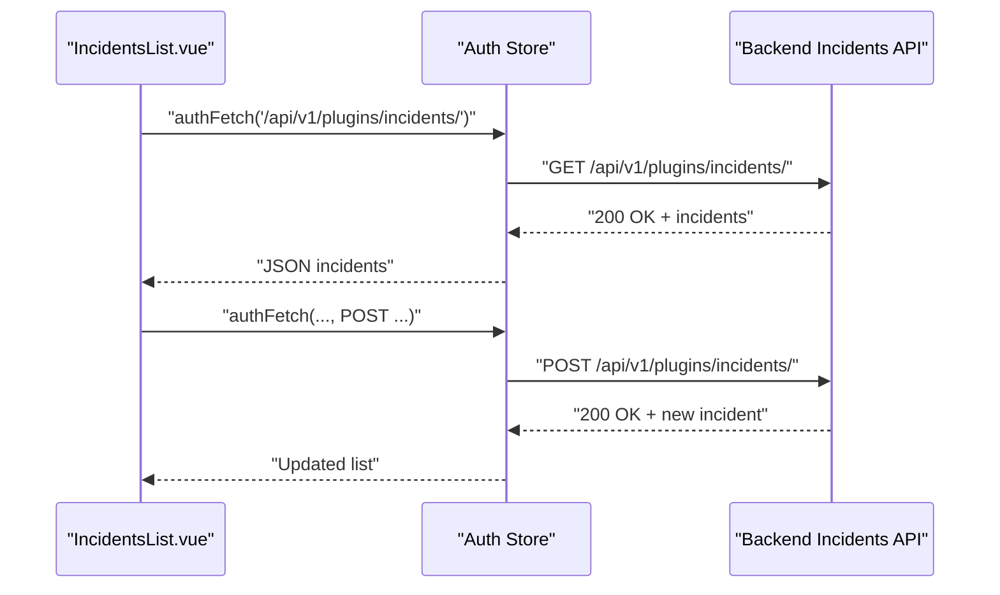

**Diagram sources**
- [IncidentsList.vue:41-104](file://frontend/src/plugins/incidents/views/IncidentsList.vue#L41-L104)
- [endpoints.py:18-38](file://backend/app/plugins/incidents/endpoints.py#L18-L38)

**Section sources**
- [IncidentsList.vue:41-104](file://frontend/src/plugins/incidents/views/IncidentsList.vue#L41-L104)
- [endpoints.py:18-38](file://backend/app/plugins/incidents/endpoints.py#L18-L38)

#### Example: Menu Generation and Navigation
- The frontend generates menu items for each plugin and groups them by section and order. The router defines plugin routes that lazy-load plugin views.

**Diagram sources**
- [main.js:53-113](file://frontend/src/main.js#L53-L113)
- [index.js:114-144](file://frontend/src/router/index.js#L114-L144)

**Section sources**
- [main.js:53-113](file://frontend/src/main.js#L53-L113)
- [index.js:114-144](file://frontend/src/router/index.js#L114-L144)

#### Example: State Management with Plugin Registry
- The plugin registry maintains a reactive list of plugins, filters enabled ones, and computes aggregated menu items. It exposes getters to retrieve specific plugins and helpers to manage initialization.

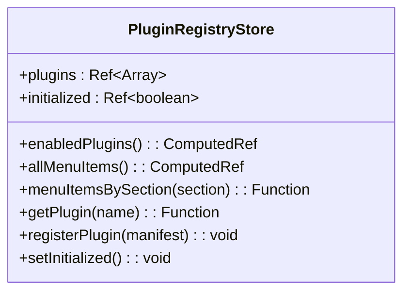

**Diagram sources**
- [pluginRegistry.js:1-53](file://frontend/src/stores/pluginRegistry.js#L1-L53)

**Section sources**
- [pluginRegistry.js:1-53](file://frontend/src/stores/pluginRegistry.js#L1-L53)

## Dependency Analysis
The plugin system exhibits clear separation of concerns with advanced plugin capabilities:
- Backend depends on the loader to discover and register plugins; each plugin depends on the loader-provided context to register routes.
- Frontend depends on the backend for plugin metadata and on the registry store for UI composition.
- Views depend on the router and the auth store for authenticated requests.
- Advanced plugins like Customer Services have additional dependencies on CSV processing and real-time data management.

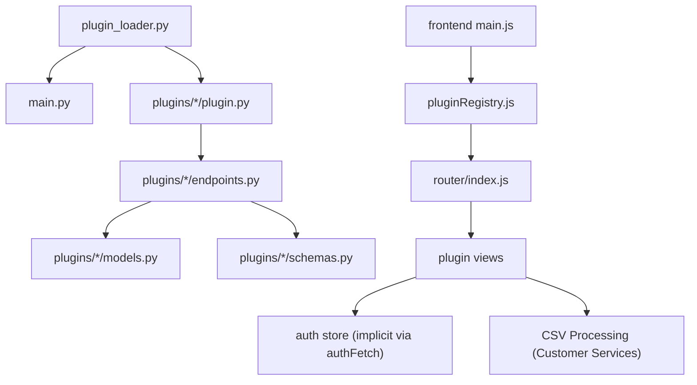

**Diagram sources**
- [plugin_loader.py:25-99](file://backend/app/core/plugin_loader.py#L25-L99)
- [main.py:17-48](file://backend/app/main.py#L17-L48)
- [plugin.py:1-17](file://backend/app/plugins/accounting/plugin.py#L1-L17)
- [endpoints.py:1-61](file://backend/app/plugins/accounting/endpoints.py#L1-L61)
- [models.py:1-74](file://backend/app/plugins/customer_services/models.py#L1-L74)
- [schemas.py:1-54](file://backend/app/plugins/customer_services/schemas.py#L1-L54)
- [main.js:18-51](file://frontend/src/main.js#L18-L51)
- [pluginRegistry.js:1-53](file://frontend/src/stores/pluginRegistry.js#L1-L53)
- [index.js:114-144](file://frontend/src/router/index.js#L114-L144)

**Section sources**
- [plugin_loader.py:25-99](file://backend/app/core/plugin_loader.py#L25-L99)
- [main.py:17-48](file://backend/app/main.py#L17-L48)
- [pluginRegistry.js:1-53](file://frontend/src/stores/pluginRegistry.js#L1-L53)
- [main.js:18-51](file://frontend/src/main.js#L18-L51)
- [index.js:114-144](file://frontend/src/router/index.js#L114-L144)

## Performance Considerations
- Plugin discovery scans the plugins directory and imports modules; keep the number of plugins reasonable and avoid heavy imports in plugin initialization.
- Route registration occurs during startup; minimize expensive operations inside register functions.
- Frontend plugin initialization fetches a small JSON payload; ensure the backend endpoint responds quickly.
- Lazy-loading of plugin views reduces initial bundle size; maintain this pattern for scalability.
- CSV import operations should be optimized to prevent duplicate data loading and minimize database writes.
- Real-time data updates should implement efficient polling or WebSocket connections to reduce server load.

## Troubleshooting Guide
Common issues and resolutions:
- Plugin not loaded: Verify the plugin folder contains a valid plugin module with metadata and a register function. Check backend logs for warnings or errors during discovery.
- Missing endpoints: Confirm the plugin's register function includes the router with the correct prefix and tags.
- Frontend menu missing: Ensure the backend returns loaded plugins and the frontend's manifest generation includes menu items for the plugin.
- Authentication failures: Verify that endpoints depend on appropriate security functions and that the frontend uses authenticated fetch calls.
- CSV import issues: Check CSV file path and format, ensure proper delimiter usage, and verify database connection for data insertion.
- Real-time data synchronization: Monitor database connection pool and implement proper error handling for data import operations.

**Section sources**
- [plugin_loader.py:89-97](file://backend/app/core/plugin_loader.py#L89-L97)
- [plugin.py:9-16](file://backend/app/plugins/accounting/plugin.py#L9-L16)
- [main.js:18-51](file://frontend/src/main.js#L18-L51)
- [endpoints.py:24-67](file://backend/app/plugins/customer_services/endpoints.py#L24-L67)

## Conclusion
The plugin system provides a clean, extensible architecture for both backend and frontend with advanced capabilities demonstrated by the Customer Services plugin. The backend loader standardizes plugin discovery and registration, while the frontend registry enables dynamic UI composition and navigation. The Customer Services plugin showcases sophisticated features including CSV import, real-time service management, and comprehensive Vue.js frontend integration. By adhering to the standardized plugin structure and leveraging the provided context and store utilities, developers can implement robust, maintainable plugins that integrate seamlessly with the main application and support complex business requirements.

## Appendices

### Standardized Plugin Structure
- Directory: backend/app/plugins/<plugin_name>/
- Required files:
  - plugin.py: Defines PLUGIN_META and a register(app, context) function.
  - endpoints.py: Defines APIRouter with plugin endpoints.
  - Optional: models.py and schemas.py for domain models and Pydantic schemas.
  - Optional: data/ directory for CSV files and other static data.

**Section sources**
- [plugin.py:1-17](file://backend/app/plugins/accounting/plugin.py#L1-L17)
- [endpoints.py:1-61](file://backend/app/plugins/accounting/endpoints.py#L1-L61)
- [plugin.py:1-17](file://backend/app/plugins/customer_services/plugin.py#L1-L17)
- [models.py:1-74](file://backend/app/plugins/customer_services/models.py#L1-L74)
- [schemas.py:1-54](file://backend/app/plugins/customer_services/schemas.py#L1-L54)

### Plugin Development Lifecycle
- Create plugin directory and files following the standardized structure.
- Implement endpoints and models/schemas as needed.
- Register routes in the plugin's register function.
- Test endpoints via the backend API.
- On the frontend, add menu items and ensure routes are defined.
- Implement advanced features like CSV import and real-time data management.
- Deploy backend and frontend together; verify plugin appears in the UI.

**Section sources**
- [plugin_loader.py:25-99](file://backend/app/core/plugin_loader.py#L25-L99)
- [main.py:17-48](file://backend/app/main.py#L17-L48)
- [main.js:53-113](file://frontend/src/main.js#L53-L113)
- [index.js:114-144](file://frontend/src/router/index.js#L114-L144)

### Communication Patterns and Extensibility
- Backend-to-Frontend: The backend exposes a simple JSON endpoint listing loaded plugins. The frontend consumes this endpoint to build plugin manifests and menus.
- Data Sharing: Plugin views communicate with backend APIs using authenticated fetch calls, enabling secure data exchange.
- Extensibility: New plugins require minimal boilerplate—metadata, registration, and endpoints—allowing rapid feature addition.
- Advanced Features: Plugins can implement sophisticated functionality like CSV import, real-time data management, and complex frontend integrations.

**Section sources**
- [main.py:84-87](file://backend/app/main.py#L84-L87)
- [main.js:18-51](file://frontend/src/main.js#L18-L51)
- [CustomerServices.vue:41-104](file://frontend/src/plugins/customer_services/views/CustomerServices.vue#L41-L104)
- [endpoints.py:24-67](file://backend/app/plugins/customer_services/endpoints.py#L24-L67)