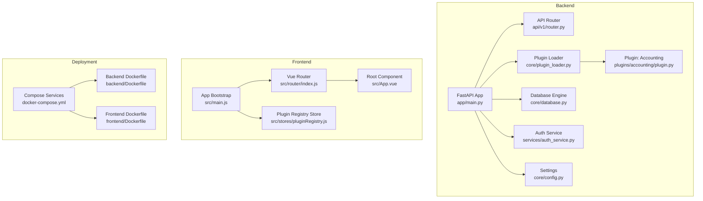
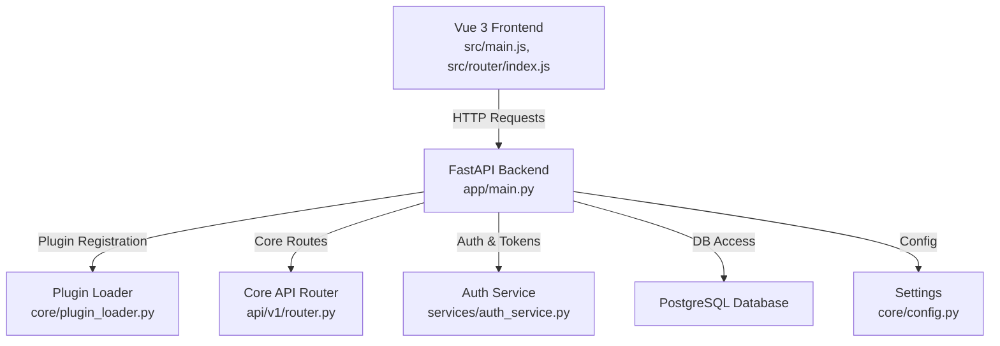
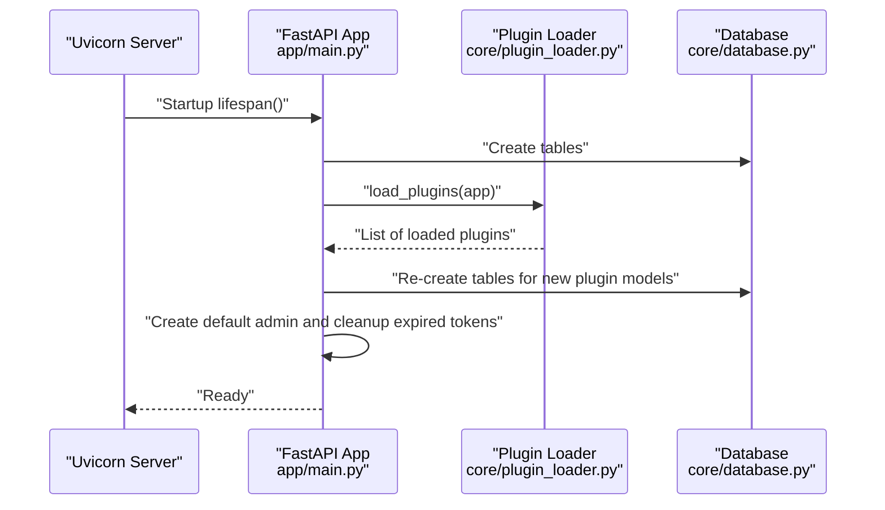
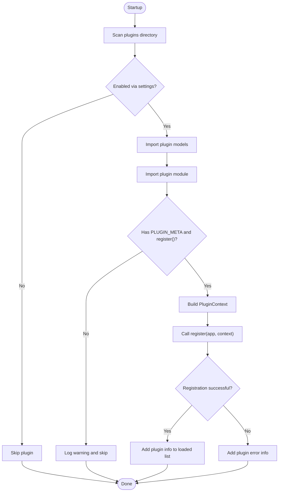
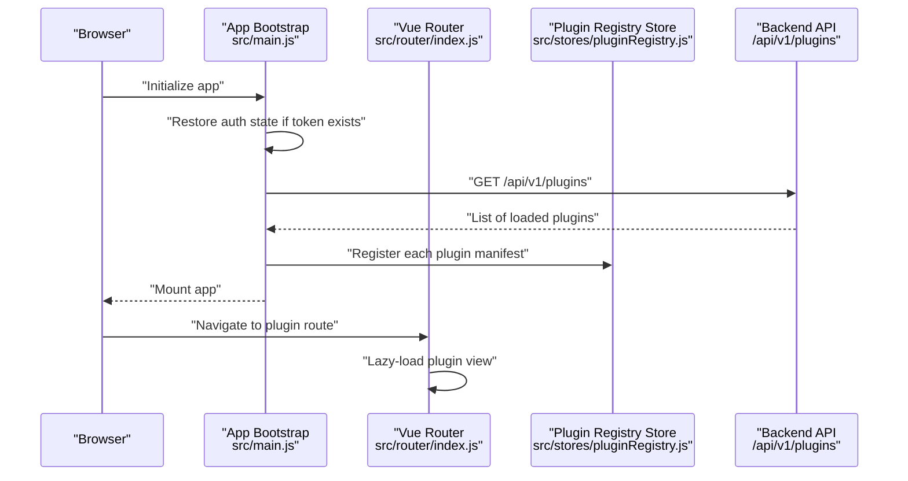
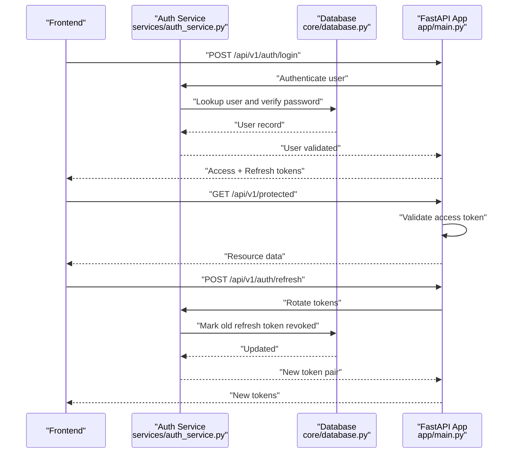
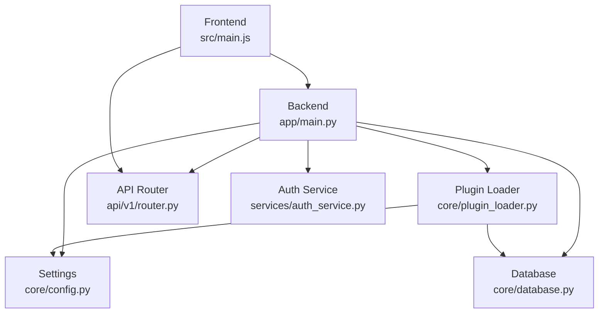
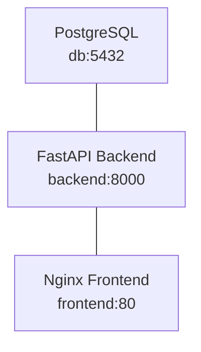

# Architecture Overview

<cite>
**Referenced Files in This Document**
- [backend/app/main.py](file://backend/app/main.py)
- [backend/app/core/plugin_loader.py](file://backend/app/core/plugin_loader.py)
- [backend/app/api/v1/router.py](file://backend/app/api/v1/router.py)
- [backend/app/core/config.py](file://backend/app/core/config.py)
- [backend/app/core/database.py](file://backend/app/core/database.py)
- [backend/app/services/auth_service.py](file://backend/app/services/auth_service.py)
- [backend/app/plugins/accounting/plugin.py](file://backend/app/plugins/accounting/plugin.py)
- [backend/Dockerfile](file://backend/Dockerfile)
- [frontend/src/main.js](file://frontend/src/main.js)
- [frontend/src/stores/pluginRegistry.js](file://frontend/src/stores/pluginRegistry.js)
- [frontend/src/router/index.js](file://frontend/src/router/index.js)
- [frontend/src/App.vue](file://frontend/src/App.vue)
- [frontend/Dockerfile](file://frontend/Dockerfile)
- [docker-compose.yml](file://docker-compose.yml)
</cite>

## Table of Contents
1. [Introduction](#introduction)
2. [Project Structure](#project-structure)
3. [Core Components](#core-components)
4. [Architecture Overview](#architecture-overview)
5. [Detailed Component Analysis](#detailed-component-analysis)
6. [Dependency Analysis](#dependency-analysis)
7. [Performance Considerations](#performance-considerations)
8. [Troubleshooting Guide](#troubleshooting-guide)
9. [Conclusion](#conclusion)
10. [Appendices](#appendices)

## Introduction
This document presents a comprehensive architecture overview of the NOC Vision platform. It describes the high-level system design with a FastAPI backend implementing a plugin-based modular architecture, a Vue 3 frontend with a component-based UI and dynamic plugin routing, and containerized deployment via Docker Compose. The document explains data flow between frontend and backend, plugin communication mechanisms, service orchestration, and the architectural patterns used (MVC, plugin pattern, factory pattern). It also covers system boundaries, component interactions, scalability considerations, security architecture, and deployment topology.

## Project Structure
The repository is organized into two primary modules:
- Backend: FastAPI application with core services, API routers, plugin loader, database ORM, and configuration.
- Frontend: Vue 3 application with Pinia stores, Vue Router, UI components, and plugin-specific views.

**Diagram sources**
- [backend/app/main.py:1-87](file://backend/app/main.py#L1-L87)
- [backend/app/core/plugin_loader.py:1-100](file://backend/app/core/plugin_loader.py#L1-L100)
- [backend/app/api/v1/router.py:1-10](file://backend/app/api/v1/router.py#L1-L10)
- [backend/app/core/config.py:1-46](file://backend/app/core/config.py#L1-L46)
- [backend/app/core/database.py:1-18](file://backend/app/core/database.py#L1-L18)
- [backend/app/services/auth_service.py:1-139](file://backend/app/services/auth_service.py#L1-L139)
- [backend/app/plugins/accounting/plugin.py:1-17](file://backend/app/plugins/accounting/plugin.py#L1-L17)
- [frontend/src/main.js:1-132](file://frontend/src/main.js#L1-L132)
- [frontend/src/router/index.js:1-174](file://frontend/src/router/index.js#L1-L174)
- [frontend/src/stores/pluginRegistry.js:1-53](file://frontend/src/stores/pluginRegistry.js#L1-L53)
- [frontend/src/App.vue:1-17](file://frontend/src/App.vue#L1-L17)
- [docker-compose.yml:1-52](file://docker-compose.yml#L1-L52)
- [backend/Dockerfile:1-17](file://backend/Dockerfile#L1-L17)
- [frontend/Dockerfile:1-13](file://frontend/Dockerfile#L1-L13)

**Section sources**
- [backend/app/main.py:1-87](file://backend/app/main.py#L1-L87)
- [backend/app/core/plugin_loader.py:1-100](file://backend/app/core/plugin_loader.py#L1-L100)
- [backend/app/api/v1/router.py:1-10](file://backend/app/api/v1/router.py#L1-L10)
- [frontend/src/main.js:1-132](file://frontend/src/main.js#L1-L132)
- [frontend/src/router/index.js:1-174](file://frontend/src/router/index.js#L1-L174)
- [frontend/src/stores/pluginRegistry.js:1-53](file://frontend/src/stores/pluginRegistry.js#L1-L53)
- [frontend/src/App.vue:1-17](file://frontend/src/App.vue#L1-L17)
- [docker-compose.yml:1-52](file://docker-compose.yml#L1-L52)
- [backend/Dockerfile:1-17](file://backend/Dockerfile#L1-L17)
- [frontend/Dockerfile:1-13](file://frontend/Dockerfile#L1-L13)

## Core Components
- FastAPI Application: Initializes middleware, loads plugins, registers core API routes, and exposes health and plugin listing endpoints.
- Plugin Loader: Discovers and dynamically loads plugins from the plugins directory, constructs a PluginContext, and invokes each plugin’s registration function.
- API Routers: Centralized API router aggregates endpoint routers for Authentication, Users, Dashboard, and Settings.
- Configuration and Database: Centralized settings management and SQLAlchemy engine/session factory.
- Authentication Service: Token lifecycle management, refresh token rotation, default admin creation, and expired token cleanup.
- Vue 3 Frontend: Bootstraps the app, initializes authentication state, dynamically loads plugins from backend, and mounts the UI.
- Router and Stores: Vue Router defines routes for core and plugin views; Pinia store manages plugin registry and computed menu items.
- Deployment: Docker Compose orchestrates PostgreSQL, backend, and frontend containers with health checks and port mappings.

**Section sources**
- [backend/app/main.py:17-87](file://backend/app/main.py#L17-L87)
- [backend/app/core/plugin_loader.py:25-100](file://backend/app/core/plugin_loader.py#L25-L100)
- [backend/app/api/v1/router.py:1-10](file://backend/app/api/v1/router.py#L1-L10)
- [backend/app/core/config.py:5-46](file://backend/app/core/config.py#L5-L46)
- [backend/app/core/database.py:1-18](file://backend/app/core/database.py#L1-L18)
- [backend/app/services/auth_service.py:19-139](file://backend/app/services/auth_service.py#L19-L139)
- [frontend/src/main.js:18-132](file://frontend/src/main.js#L18-L132)
- [frontend/src/router/index.js:26-174](file://frontend/src/router/index.js#L26-L174)
- [frontend/src/stores/pluginRegistry.js:1-53](file://frontend/src/stores/pluginRegistry.js#L1-L53)
- [docker-compose.yml:1-52](file://docker-compose.yml#L1-L52)

## Architecture Overview
The system follows a layered architecture with clear separation of concerns:
- Presentation Layer (Vue 3): Handles UI rendering, navigation, and user interactions. It dynamically discovers available plugins and renders plugin-specific views.
- Application Layer (FastAPI): Exposes REST endpoints, enforces authentication and authorization, and orchestrates plugin registration and lifecycle.
- Domain and Persistence Layers (Services and Database): Manage business logic and data persistence via SQLAlchemy.

**Diagram sources**
- [frontend/src/main.js:18-132](file://frontend/src/main.js#L18-L132)
- [backend/app/main.py:50-87](file://backend/app/main.py#L50-L87)
- [backend/app/core/plugin_loader.py:25-100](file://backend/app/core/plugin_loader.py#L25-L100)
- [backend/app/api/v1/router.py:1-10](file://backend/app/api/v1/router.py#L1-L10)
- [backend/app/services/auth_service.py:19-139](file://backend/app/services/auth_service.py#L19-L139)
- [backend/app/core/config.py:5-46](file://backend/app/core/config.py#L5-L46)

## Detailed Component Analysis

### Backend: FastAPI Application Lifecycle and Plugin Loading
The backend application initializes logging, creates database tables, loads plugins, sets up CORS, and registers core API routes. It exposes health and plugin listing endpoints and cleans up expired tokens during startup.

**Diagram sources**
- [backend/app/main.py:17-48](file://backend/app/main.py#L17-L48)
- [backend/app/core/plugin_loader.py:25-100](file://backend/app/core/plugin_loader.py#L25-L100)
- [backend/app/core/database.py:1-18](file://backend/app/core/database.py#L1-L18)

**Section sources**
- [backend/app/main.py:17-87](file://backend/app/main.py#L17-L87)
- [backend/app/core/plugin_loader.py:25-100](file://backend/app/core/plugin_loader.py#L25-L100)
- [backend/app/core/database.py:1-18](file://backend/app/core/database.py#L1-L18)

### Plugin Communication Mechanism
Plugins are discovered and registered dynamically. Each plugin defines metadata and a registration function that receives a PluginContext containing shared resources (database base, database session factory, current user resolvers). The plugin registers its own router under a prefixed path derived from plugin metadata.

**Diagram sources**
- [backend/app/core/plugin_loader.py:25-100](file://backend/app/core/plugin_loader.py#L25-L100)
- [backend/app/plugins/accounting/plugin.py:1-17](file://backend/app/plugins/accounting/plugin.py#L1-L17)

**Section sources**
- [backend/app/core/plugin_loader.py:16-100](file://backend/app/core/plugin_loader.py#L16-L100)
- [backend/app/plugins/accounting/plugin.py:1-17](file://backend/app/plugins/accounting/plugin.py#L1-L17)

### Frontend: Dynamic Plugin Initialization and Routing
The frontend bootstraps the app, restores authentication state if available, fetches the plugin list from the backend, and registers each loaded plugin with a manifest and menu items. Vue Router lazily imports plugin views and organizes them under plugin-specific routes.

**Diagram sources**
- [frontend/src/main.js:18-132](file://frontend/src/main.js#L18-L132)
- [frontend/src/router/index.js:26-174](file://frontend/src/router/index.js#L26-L174)
- [frontend/src/stores/pluginRegistry.js:1-53](file://frontend/src/stores/pluginRegistry.js#L1-L53)

**Section sources**
- [frontend/src/main.js:18-132](file://frontend/src/main.js#L18-L132)
- [frontend/src/router/index.js:26-174](file://frontend/src/router/index.js#L26-L174)
- [frontend/src/stores/pluginRegistry.js:1-53](file://frontend/src/stores/pluginRegistry.js#L1-L53)

### Authentication and Authorization Flow
The backend manages JWT-based authentication with refresh token rotation and revoked token tracking. The frontend stores tokens and uses them for protected requests. The backend enforces access policies via dependency resolvers for active and admin users.

**Diagram sources**
- [backend/app/services/auth_service.py:19-139](file://backend/app/services/auth_service.py#L19-L139)
- [backend/app/core/database.py:1-18](file://backend/app/core/database.py#L1-L18)
- [backend/app/main.py:50-87](file://backend/app/main.py#L50-L87)

**Section sources**
- [backend/app/services/auth_service.py:19-139](file://backend/app/services/auth_service.py#L19-L139)
- [backend/app/core/database.py:1-18](file://backend/app/core/database.py#L1-L18)
- [backend/app/main.py:50-87](file://backend/app/main.py#L50-L87)

### Architectural Patterns
- MVC (Model-View-Controller):
  - Model: SQLAlchemy declarative base and ORM models (e.g., User, RefreshToken).
  - View: Vue components and templates (frontend) and FastAPI response models (backend).
  - Controller: FastAPI routers and handlers; Vue components and stores manage state and navigation.
- Plugin Pattern:
  - Plugins expose a registration function and metadata; the loader dynamically imports and registers them.
- Factory Pattern:
  - PluginContext acts as a factory for providing shared dependencies (database base, session factory, user resolvers) to plugins.

**Section sources**
- [backend/app/core/plugin_loader.py:16-23](file://backend/app/core/plugin_loader.py#L16-L23)
- [backend/app/plugins/accounting/plugin.py:9-17](file://backend/app/plugins/accounting/plugin.py#L9-L17)
- [backend/app/core/database.py:1-18](file://backend/app/core/database.py#L1-L18)

## Dependency Analysis
The backend and frontend communicate over HTTP with the backend exposing plugin discovery and core endpoints. The plugin loader depends on configuration and security utilities to construct contexts for plugins. The frontend depends on the backend for authentication and plugin manifests.

**Diagram sources**
- [frontend/src/main.js:18-132](file://frontend/src/main.js#L18-L132)
- [backend/app/main.py:50-87](file://backend/app/main.py#L50-L87)
- [backend/app/core/plugin_loader.py:25-100](file://backend/app/core/plugin_loader.py#L25-L100)
- [backend/app/api/v1/router.py:1-10](file://backend/app/api/v1/router.py#L1-L10)
- [backend/app/services/auth_service.py:19-139](file://backend/app/services/auth_service.py#L19-L139)
- [backend/app/core/config.py:5-46](file://backend/app/core/config.py#L5-L46)
- [backend/app/core/database.py:1-18](file://backend/app/core/database.py#L1-L18)

**Section sources**
- [frontend/src/main.js:18-132](file://frontend/src/main.js#L18-L132)
- [backend/app/main.py:50-87](file://backend/app/main.py#L50-L87)
- [backend/app/core/plugin_loader.py:25-100](file://backend/app/core/plugin_loader.py#L25-L100)
- [backend/app/api/v1/router.py:1-10](file://backend/app/api/v1/router.py#L1-L10)
- [backend/app/services/auth_service.py:19-139](file://backend/app/services/auth_service.py#L19-L139)
- [backend/app/core/config.py:5-46](file://backend/app/core/config.py#L5-L46)
- [backend/app/core/database.py:1-18](file://backend/app/core/database.py#L1-L18)

## Performance Considerations
- Database pooling and pre-ping are configured to improve connection reliability.
- Alembic migrations are applied at startup to keep schema in sync; consider background migration jobs in production.
- Plugin loading occurs at startup; limit the number of enabled plugins to reduce initialization overhead.
- Frontend lazy-loads plugin views to minimize initial bundle size.
- Consider caching frequently accessed plugin metadata and user preferences.

[No sources needed since this section provides general guidance]

## Troubleshooting Guide
- Health check endpoint: Use the backend health endpoint to verify service availability.
- Plugin loading logs: Inspect backend logs for plugin load warnings or errors.
- CORS issues: Verify allowed origins in settings match frontend host.
- Authentication failures: Confirm token validity, refresh token rotation, and revoked token cleanup.
- Database connectivity: Ensure the database service is healthy and reachable.

**Section sources**
- [backend/app/main.py:79-87](file://backend/app/main.py#L79-L87)
- [backend/app/core/plugin_loader.py:89-98](file://backend/app/core/plugin_loader.py#L89-L98)
- [backend/app/core/config.py:15-20](file://backend/app/core/config.py#L15-L20)
- [backend/app/services/auth_service.py:103-110](file://backend/app/services/auth_service.py#L103-L110)
- [docker-compose.yml:14-18](file://docker-compose.yml#L14-L18)

## Conclusion
NOC Vision employs a clean separation of concerns with a FastAPI backend and Vue 3 frontend, unified by a plugin-based architecture. The system leverages proven patterns (MVC, plugin, factory) to achieve modularity, maintainability, and extensibility. Containerized deployment simplifies orchestration, while authentication and database abstractions support secure and scalable operations.

[No sources needed since this section summarizes without analyzing specific files]

## Appendices

### System Boundaries and Integration Points
- Internal boundaries:
  - Backend: FastAPI app, plugin loader, API routers, services, and database.
  - Frontend: Vue app, router, stores, and plugin views.
- External integrations:
  - PostgreSQL for persistence.
  - HTTP clients for inter-service communication.
  - Environment variables for configuration.

**Section sources**
- [backend/app/main.py:50-87](file://backend/app/main.py#L50-L87)
- [backend/app/core/config.py:5-46](file://backend/app/core/config.py#L5-L46)
- [docker-compose.yml:1-52](file://docker-compose.yml#L1-L52)

### Deployment Topology
- Services:
  - Database: PostgreSQL with health checks.
  - Backend: Python FastAPI with Alembic migrations and Uvicorn server.
  - Frontend: Nginx serving built assets.
- Orchestration: Docker Compose coordinates service startup, dependencies, and port exposure.

**Diagram sources**
- [docker-compose.yml:3-52](file://docker-compose.yml#L3-L52)
- [backend/Dockerfile:14-17](file://backend/Dockerfile#L14-L17)
- [frontend/Dockerfile:11-13](file://frontend/Dockerfile#L11-L13)