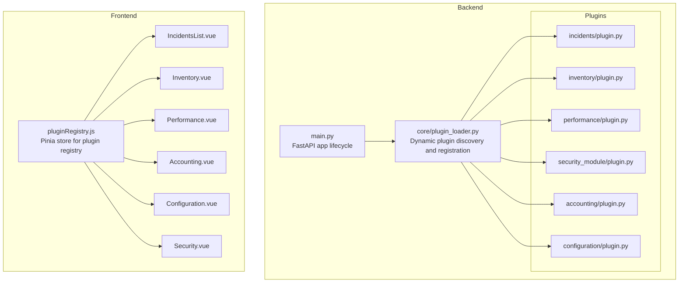
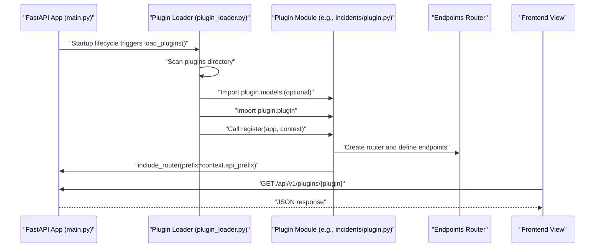
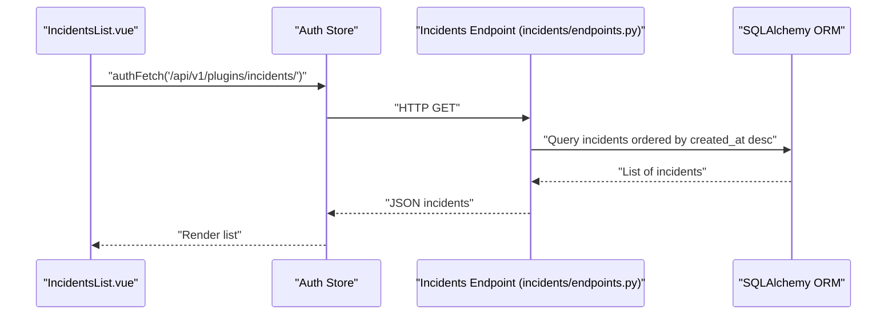
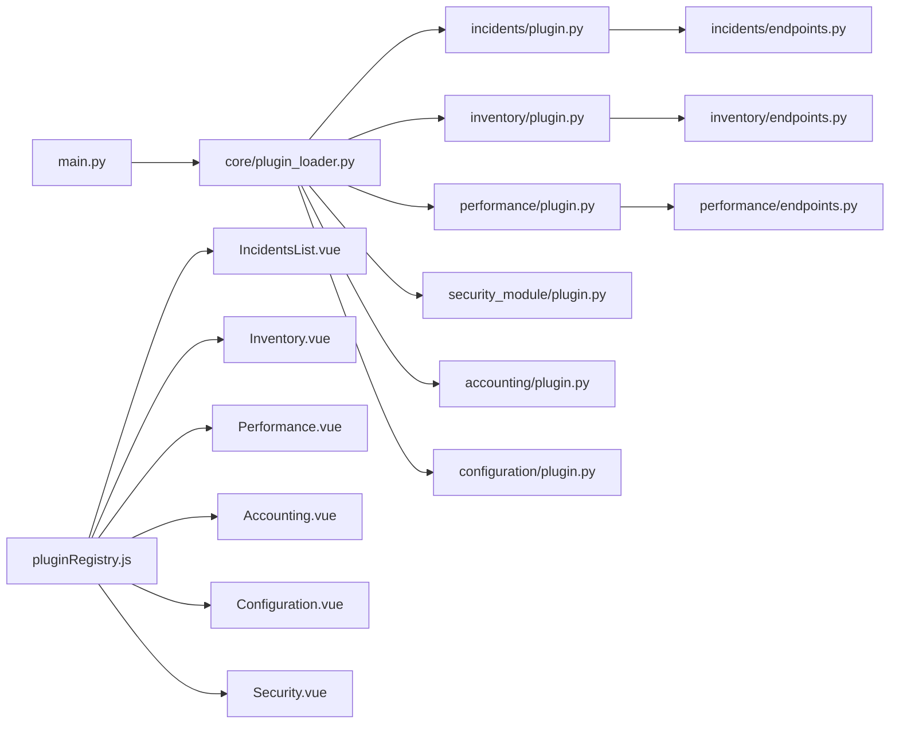

# Built-in Plugins

<cite>
**Referenced Files in This Document**
- [plugin_loader.py](file://backend/app/core/plugin_loader.py)
- [main.py](file://backend/app/main.py)
- [pluginRegistry.js](file://frontend/src/stores/pluginRegistry.js)
- [incidents/plugin.py](file://backend/app/plugins/incidents/plugin.py)
- [incidents/endpoints.py](file://backend/app/plugins/incidents/endpoints.py)
- [inventory/plugin.py](file://backend/app/plugins/inventory/plugin.py)
- [inventory/endpoints.py](file://backend/app/plugins/inventory/endpoints.py)
- [performance/plugin.py](file://backend/app/plugins/performance/plugin.py)
- [performance/endpoints.py](file://backend/app/plugins/performance/endpoints.py)
- [security_module/plugin.py](file://backend/app/plugins/security_module/plugin.py)
- [accounting/plugin.py](file://backend/app/plugins/accounting/plugin.py)
- [configuration/plugin.py](file://backend/app/plugins/configuration/plugin.py)
- [IncidentsList.vue](file://frontend/src/plugins/incidents/views/IncidentsList.vue)
- [Inventory.vue](file://frontend/src/plugins/inventory/views/Inventory.vue)
- [Performance.vue](file://frontend/src/plugins/performance/views/Performance.vue)
- [Accounting.vue](file://frontend/src/plugins/accounting/views/Accounting.vue)
- [Configuration.vue](file://frontend/src/plugins/configuration/views/Configuration.vue)
- [Security.vue](file://frontend/src/plugins/security/views/Security.vue)
</cite>

## Table of Contents
1. [Introduction](#introduction)
2. [Project Structure](#project-structure)
3. [Core Components](#core-components)
4. [Architecture Overview](#architecture-overview)
5. [Detailed Component Analysis](#detailed-component-analysis)
6. [Dependency Analysis](#dependency-analysis)
7. [Performance Considerations](#performance-considerations)
8. [Troubleshooting Guide](#troubleshooting-guide)
9. [Conclusion](#conclusion)
10. [Appendices](#appendices)

## Introduction
This document describes the NOC Vision built-in plugins overview. It explains the six built-in plugins—Incidents, Inventory, Performance, Security Module, Accounting, and Configuration—covering their purpose, core functionality, and typical use cases within the NOC ecosystem. It also documents the plugin architecture enabling modular functionality and dynamic loading, outlines interdependencies and shared resources, and demonstrates how plugins integrate to deliver comprehensive NOC capabilities.

## Project Structure
The NOC Vision backend implements a plugin system that dynamically discovers and registers plugin modules at startup. Each plugin exposes a registration interface and optional API endpoints. The frontend integrates plugin-managed UI views and uses a registry to manage plugin metadata and menu items.

**Diagram sources**
- [main.py:17-48](file://backend/app/main.py#L17-L48)
- [plugin_loader.py:25-99](file://backend/app/core/plugin_loader.py#L25-L99)
- [pluginRegistry.js:1-53](file://frontend/src/stores/pluginRegistry.js#L1-L53)

**Section sources**
- [main.py:17-48](file://backend/app/main.py#L17-L48)
- [plugin_loader.py:25-99](file://backend/app/core/plugin_loader.py#L25-L99)
- [pluginRegistry.js:1-53](file://frontend/src/stores/pluginRegistry.js#L1-L53)

## Core Components
- Backend plugin loader: Discovers plugins, imports models, validates plugin metadata, constructs API prefixes, and registers routers with the FastAPI app.
- Plugin modules: Each plugin defines a metadata dictionary and a register function that mounts endpoints under a plugin-specific route prefix.
- Frontend plugin registry: Manages plugin manifests, filters enabled plugins, aggregates menu items, and exposes helpers to locate plugin views.
- Plugin views: Vue components that consume plugin APIs and render UI surfaces for each module.

Key implementation references:
- Dynamic plugin loading and registration: [plugin_loader.py:25-99](file://backend/app/core/plugin_loader.py#L25-L99)
- Plugin registration contract: [incidents/plugin.py:1-17](file://backend/app/plugins/incidents/plugin.py#L1-L17), [inventory/plugin.py:1-17](file://backend/app/plugins/inventory/plugin.py#L1-L17), [performance/plugin.py:1-17](file://backend/app/plugins/performance/plugin.py#L1-L17), [security_module/plugin.py:1-17](file://backend/app/plugins/security_module/plugin.py#L1-L17), [accounting/plugin.py:1-17](file://backend/app/plugins/accounting/plugin.py#L1-L17), [configuration/plugin.py:1-17](file://backend/app/plugins/configuration/plugin.py#L1-L17)
- Frontend plugin registry store: [pluginRegistry.js:1-53](file://frontend/src/stores/pluginRegistry.js#L1-L53)

**Section sources**
- [plugin_loader.py:25-99](file://backend/app/core/plugin_loader.py#L25-L99)
- [incidents/plugin.py:1-17](file://backend/app/plugins/incidents/plugin.py#L1-L17)
- [inventory/plugin.py:1-17](file://backend/app/plugins/inventory/plugin.py#L1-L17)
- [performance/plugin.py:1-17](file://backend/app/plugins/performance/plugin.py#L1-L17)
- [security_module/plugin.py:1-17](file://backend/app/plugins/security_module/plugin.py#L1-L17)
- [accounting/plugin.py:1-17](file://backend/app/plugins/accounting/plugin.py#L1-L17)
- [configuration/plugin.py:1-17](file://backend/app/plugins/configuration/plugin.py#L1-L17)
- [pluginRegistry.js:1-53](file://frontend/src/stores/pluginRegistry.js#L1-L53)

## Architecture Overview
The plugin architecture follows a consistent pattern:
- Discovery: The loader scans the plugins directory and filters by configuration.
- Initialization: Models are imported first to register SQLAlchemy tables, then the plugin module is imported.
- Registration: The plugin’s register function receives a context containing shared resources (database base, API prefix, dependency providers) and mounts endpoints.
- Runtime: Plugins expose REST endpoints under a structured prefix and are consumed by frontend views via authenticated fetch calls.

**Diagram sources**
- [main.py:25-27](file://backend/app/main.py#L25-L27)
- [plugin_loader.py:50-78](file://backend/app/core/plugin_loader.py#L50-L78)
- [incidents/plugin.py:9-17](file://backend/app/plugins/incidents/plugin.py#L9-L17)

**Section sources**
- [main.py:25-27](file://backend/app/main.py#L25-L27)
- [plugin_loader.py:50-78](file://backend/app/core/plugin_loader.py#L50-L78)
- [incidents/plugin.py:9-17](file://backend/app/plugins/incidents/plugin.py#L9-L17)

## Detailed Component Analysis

### Incidents Plugin
Purpose: Incident management for creating, tracking, and resolving network incidents.
Core functionality:
- Incident CRUD operations with status transitions and resolution timestamps.
- Commenting on incidents with user association.
- Access control: authenticated users for reads, admin privileges for deletions.

API endpoints (selected):
- GET /api/v1/plugins/incidents/
- POST /api/v1/plugins/incidents/
- GET /api/v1/plugins/incidents/{incident_id}
- PUT /api/v1/plugins/incidents/{incident_id}
- DELETE /api/v1/plugins/incidents/{incident_id}
- GET /api/v1/plugins/incidents/{incident_id}/comments
- POST /api/v1/plugins/incidents/{incident_id}/comments

Frontend integration:
- Vue component consumes plugin endpoints via authenticated fetch and renders incident cards with status controls.

**Diagram sources**
- [IncidentsList.vue:41-55](file://frontend/src/plugins/incidents/views/IncidentsList.vue#L41-L55)
- [incidents/endpoints.py:18-25](file://backend/app/plugins/incidents/endpoints.py#L18-L25)

**Section sources**
- [incidents/plugin.py:1-17](file://backend/app/plugins/incidents/plugin.py#L1-L17)
- [incidents/endpoints.py:18-122](file://backend/app/plugins/incidents/endpoints.py#L18-L122)
- [IncidentsList.vue:41-104](file://frontend/src/plugins/incidents/views/IncidentsList.vue#L41-L104)

### Inventory Plugin
Purpose: Equipment inventory management covering devices, sites, and device types.
Core functionality:
- Device CRUD operations with admin-only write access.
- Site and device type management.

API endpoints (selected):
- GET /api/v1/plugins/inventory/devices
- POST /api/v1/plugins/inventory/devices
- GET /api/v1/plugins/inventory/devices/{device_id}
- PUT /api/v1/plugins/inventory/devices/{device_id}
- DELETE /api/v1/plugins/inventory/devices/{device_id}
- GET /api/v1/plugins/inventory/sites
- POST /api/v1/plugins/inventory/sites
- GET /api/v1/plugins/inventory/device-types
- POST /api/v1/plugins/inventory/device-types

Frontend integration:
- Placeholder view indicates upcoming device management features.

**Section sources**
- [inventory/plugin.py:1-17](file://backend/app/plugins/inventory/plugin.py#L1-L17)
- [inventory/endpoints.py:20-130](file://backend/app/plugins/inventory/endpoints.py#L20-L130)
- [Inventory.vue:1-34](file://frontend/src/plugins/inventory/views/Inventory.vue#L1-L34)

### Performance Plugin
Purpose: Network performance monitoring with targets and metrics sampling.
Core functionality:
- Monitor target CRUD operations.
- Retrieve metric samples for a given target with ordering and limits.

API endpoints (selected):
- GET /api/v1/plugins/performance/targets
- POST /api/v1/plugins/performance/targets
- GET /api/v1/plugins/performance/targets/{target_id}
- DELETE /api/v1/plugins/performance/targets/{target_id}
- GET /api/v1/plugins/performance/metrics/{target_id}

Frontend integration:
- Placeholder view indicates upcoming performance monitoring features.

**Section sources**
- [performance/plugin.py:1-17](file://backend/app/plugins/performance/plugin.py#L1-L17)
- [performance/endpoints.py:14-75](file://backend/app/plugins/performance/endpoints.py#L14-L75)
- [Performance.vue:1-34](file://frontend/src/plugins/performance/views/Performance.vue#L1-L34)

### Security Module Plugin
Purpose: Security monitoring and event tracking including audit logs and access monitoring.
Core functionality:
- Exposes security-related endpoints under a dedicated router.

API endpoints (selected):
- Mounted under /api/v1/plugins/security

Frontend integration:
- Placeholder view indicates upcoming security features.

**Section sources**
- [security_module/plugin.py:1-17](file://backend/app/plugins/security_module/plugin.py#L1-L17)
- [Security.vue:1-34](file://frontend/src/plugins/security/views/Security.vue#L1-L34)

### Accounting Plugin
Purpose: Traffic accounting including interfaces, traffic records, and bandwidth usage.
Core functionality:
- Provides accounting-related endpoints under a dedicated router.

API endpoints (selected):
- Mounted under /api/v1/plugins/accounting

Frontend integration:
- Placeholder view indicates upcoming accounting features.

**Section sources**
- [accounting/plugin.py:1-17](file://backend/app/plugins/accounting/plugin.py#L1-L17)
- [Accounting.vue:1-34](file://frontend/src/plugins/accounting/views/Accounting.vue#L1-L34)

### Configuration Plugin
Purpose: Configuration management including snapshots, templates, and change tracking.
Core functionality:
- Provides configuration management endpoints under a dedicated router.

API endpoints (selected):
- Mounted under /api/v1/plugins/configuration

Frontend integration:
- Placeholder view indicates upcoming configuration features.

**Section sources**
- [configuration/plugin.py:1-17](file://backend/app/plugins/configuration/plugin.py#L1-L17)
- [Configuration.vue:1-34](file://frontend/src/plugins/configuration/views/Configuration.vue#L1-L34)

## Dependency Analysis
- Backend plugin loader depends on:
  - FastAPI app lifecycle for startup/shutdown hooks.
  - Environment settings to filter enabled plugins.
  - Shared database base and dependency providers for endpoints.
- Each plugin depends on:
  - Its own endpoints router and models (where present).
  - Shared database session and security dependencies.
- Frontend depends on:
  - Authenticated fetch wrappers to call plugin endpoints.
  - Plugin registry store to discover and render plugin views.

**Diagram sources**
- [main.py:25-27](file://backend/app/main.py#L25-L27)
- [plugin_loader.py:25-99](file://backend/app/core/plugin_loader.py#L25-L99)
- [incidents/plugin.py:9-17](file://backend/app/plugins/incidents/plugin.py#L9-L17)
- [inventory/plugin.py:9-17](file://backend/app/plugins/inventory/plugin.py#L9-L17)
- [performance/plugin.py:9-17](file://backend/app/plugins/performance/plugin.py#L9-L17)
- [security_module/plugin.py:9-17](file://backend/app/plugins/security_module/plugin.py#L9-L17)
- [accounting/plugin.py:9-17](file://backend/app/plugins/accounting/plugin.py#L9-L17)
- [configuration/plugin.py:9-17](file://backend/app/plugins/configuration/plugin.py#L9-L17)
- [pluginRegistry.js:1-53](file://frontend/src/stores/pluginRegistry.js#L1-L53)

**Section sources**
- [main.py:25-27](file://backend/app/main.py#L25-L27)
- [plugin_loader.py:25-99](file://backend/app/core/plugin_loader.py#L25-L99)
- [pluginRegistry.js:1-53](file://frontend/src/stores/pluginRegistry.js#L1-L53)

## Performance Considerations
- Plugin discovery occurs during startup; filtering by enabled plugins reduces unnecessary imports.
- Endpoints use pagination parameters (skip/limit) to constrain result sets.
- Metrics retrieval supports limiting returned samples to control payload sizes.
- Frontend components should implement loading states and error handling to avoid blocking user interactions.

[No sources needed since this section provides general guidance]

## Troubleshooting Guide
Common issues and resolutions:
- Plugin not loaded:
  - Verify the plugin directory contains a plugin.py with PLUGIN_META and register function.
  - Confirm the plugin name appears in the enabled plugins setting.
  - Check server logs for plugin load warnings or errors.
- Endpoint access denied:
  - Ensure proper authentication and authorization; some endpoints require admin privileges.
- Frontend view not rendering:
  - Confirm the plugin manifest is registered in the frontend registry and the view component is present.

Operational references:
- Plugin loading and error reporting: [plugin_loader.py:89-97](file://backend/app/core/plugin_loader.py#L89-L97)
- Health check endpoint: [main.py:79-82](file://backend/app/main.py#L79-L82)
- Plugin listing endpoint: [main.py:84-87](file://backend/app/main.py#L84-L87)

**Section sources**
- [plugin_loader.py:89-97](file://backend/app/core/plugin_loader.py#L89-L97)
- [main.py:79-87](file://backend/app/main.py#L79-L87)

## Conclusion
The NOC Vision built-in plugins provide a modular, extensible foundation for network operations. The centralized plugin loader and consistent registration pattern enable dynamic discovery and integration of functionality across Incidents, Inventory, Performance, Security Module, Accounting, and Configuration. Together with the frontend registry and plugin views, this architecture delivers a cohesive platform for comprehensive NOC operations.

[No sources needed since this section summarizes without analyzing specific files]

## Appendices

### Plugin API Prefixes and Tags
Each plugin is mounted under a predictable prefix and tagged for API documentation grouping:
- Incidents: /api/v1/plugins/incidents, tag “Incidents”
- Inventory: /api/v1/plugins/inventory, tag “Inventory”
- Performance: /api/v1/plugins/performance, tag “Performance”
- Security: /api/v1/plugins/security, tag “Security”
- Accounting: /api/v1/plugins/accounting, tag “Accounting”
- Configuration: /api/v1/plugins/configuration, tag “Configuration”

**Section sources**
- [incidents/plugin.py:9-17](file://backend/app/plugins/incidents/plugin.py#L9-L17)
- [inventory/plugin.py:9-17](file://backend/app/plugins/inventory/plugin.py#L9-L17)
- [performance/plugin.py:9-17](file://backend/app/plugins/performance/plugin.py#L9-L17)
- [security_module/plugin.py:9-17](file://backend/app/plugins/security_module/plugin.py#L9-L17)
- [accounting/plugin.py:9-17](file://backend/app/plugins/accounting/plugin.py#L9-L17)
- [configuration/plugin.py:9-17](file://backend/app/plugins/configuration/plugin.py#L9-L17)