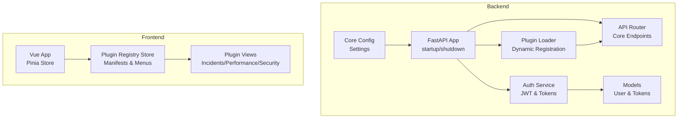
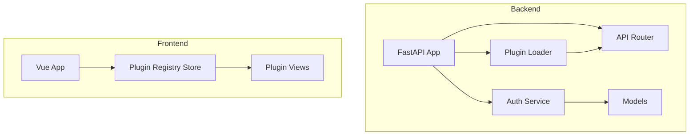
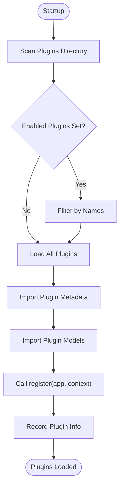
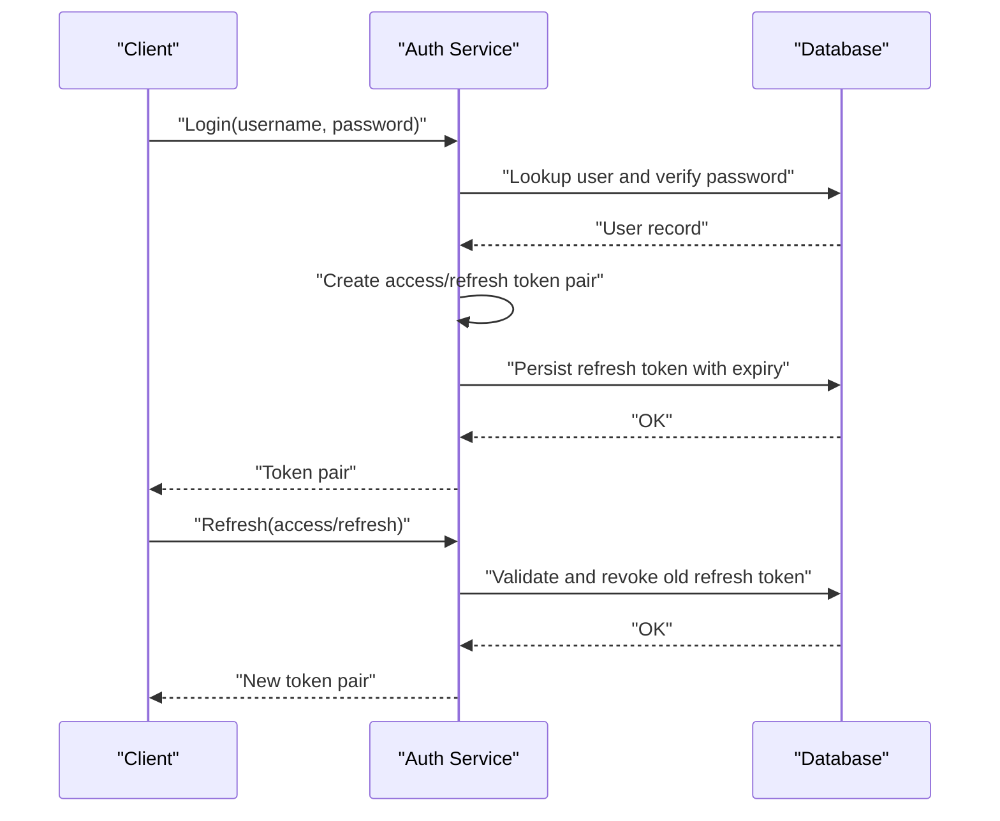
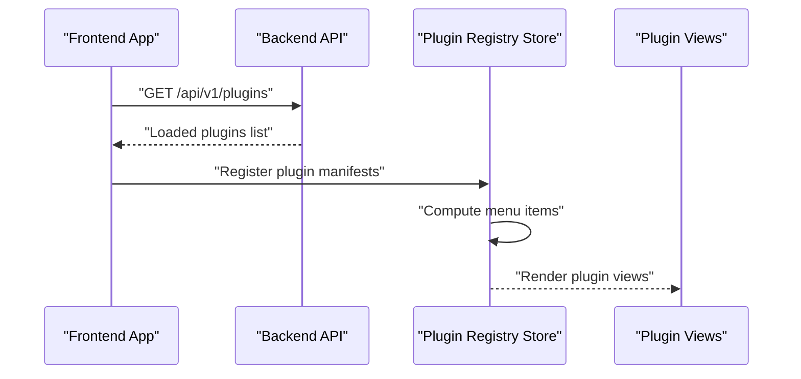
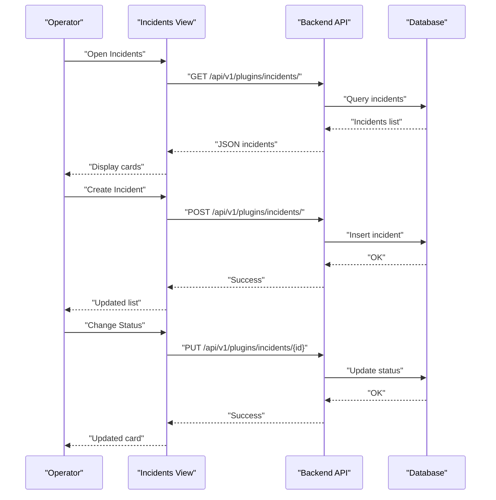
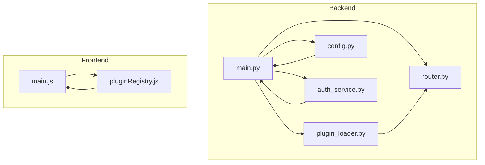

# Introduction

<cite>
**Referenced Files in This Document**
- [README.md](file://README.md)
- [main.py](file://backend/app/main.py)
- [plugin_loader.py](file://backend/app/core/plugin_loader.py)
- [router.py](file://backend/app/api/v1/router.py)
- [config.py](file://backend/app/core/config.py)
- [auth_service.py](file://backend/app/services/auth_service.py)
- [user.py](file://backend/app/models/user.py)
- [auth.py](file://backend/app/schemas/auth.py)
- [plugin.py (incidents)](file://backend/app/plugins/incidents/plugin.py)
- [plugin.py (performance)](file://backend/app/plugins/performance/plugin.py)
- [plugin.py (security_module)](file://backend/app/plugins/security_module/plugin.py)
- [IncidentsList.vue](file://frontend/src/plugins/incidents/views/IncidentsList.vue)
- [Performance.vue](file://frontend/src/plugins/performance/views/Performance.vue)
- [Security.vue](file://frontend/src/plugins/security/views/Security.vue)
- [pluginRegistry.js](file://frontend/src/stores/pluginRegistry.js)
- [main.js](file://frontend/src/main.js)
- [docker-compose.yml](file://docker-compose.yml)
</cite>

## Table of Contents
1. [Introduction](#introduction)
2. [Project Structure](#project-structure)
3. [Core Components](#core-components)
4. [Architecture Overview](#architecture-overview)
5. [Detailed Component Analysis](#detailed-component-analysis)
6. [Dependency Analysis](#dependency-analysis)
7. [Performance Considerations](#performance-considerations)
8. [Troubleshooting Guide](#troubleshooting-guide)
9. [Conclusion](#conclusion)
10. [Appendices](#appendices)

## Introduction
NOC Vision is a modern, plugin-based Network Operations Center (NOC) platform designed to streamline network infrastructure monitoring and management. It provides a unified dashboard for incident management, performance monitoring, security operations, inventory tracking, configuration management, and resource accounting. Built with a FastAPI backend and a Vue 3 frontend, the platform emphasizes extensibility, robust authentication, and a responsive user experience.

Core value proposition:
- Modular architecture enables focused capabilities and easy extension.
- Built-in plugins address common NOC needs: incident lifecycle, performance metrics, security monitoring, inventory, configuration, and accounting.
- Developer-friendly plugin system and clear separation of concerns for rapid customization.
- Decision-makers gain visibility into operations, compliance, and resource utilization through integrated dashboards.

Target audience:
- Network administrators responsible for maintaining infrastructure uptime and performance.
- IT operations teams managing incident response, change control, and security posture.
- Developers extending the platform via the plugin system and integrating with monitoring systems.

Primary use cases:
- Incident management: report, triage, investigate, and resolve network issues with severity and status tracking.
- Performance monitoring: collect and visualize network performance metrics and alert on thresholds.
- Security operations: monitor security events, audit logs, and access patterns.
- Inventory and configuration: maintain an accurate catalog of devices and manage configuration baselines.
- Accounting and billing: track resource usage for cost allocation and reporting.

Real-world scenarios where NOC Vision adds value:
- During a network outage, operators log incidents, assign severity, and collaborate in real time to resolve issues, reducing mean time to acknowledge and resolve.
- NOC analysts set performance targets and thresholds; the platform surfaces anomalies and escalates alerts to prevent degradation.
- Security analysts review security events and access logs to detect suspicious activity and enforce policies.
- Administrators maintain an up-to-date inventory and configuration baselines to support audits and change management.

## Project Structure
The platform follows a layered architecture with clear separation between backend and frontend, and a plugin-driven extension mechanism.

Backend highlights:
- FastAPI application with lifecycle hooks for startup tasks, plugin loading, and default admin creation.
- Centralized configuration via environment variables and Pydantic settings.
- Plugin loader that dynamically discovers and registers plugins with standardized metadata and routing.
- Core services for authentication, user management, and refresh token lifecycle.

Frontend highlights:
- Vue 3 application with Pinia for state management and Vue Router for navigation.
- Plugin registry store aggregates plugin manifests and generates dynamic menus.
- Plugin-specific views for incidents, performance, and security modules.

**Diagram sources**
- [main.py:17-48](file://backend/app/main.py#L17-L48)
- [plugin_loader.py:25-99](file://backend/app/core/plugin_loader.py#L25-L99)
- [router.py:1-10](file://backend/app/api/v1/router.py#L1-L10)
- [config.py:5-46](file://backend/app/core/config.py#L5-L46)
- [auth_service.py:19-139](file://backend/app/services/auth_service.py#L19-L139)
- [user.py:7-35](file://backend/app/models/user.py#L7-L35)
- [pluginRegistry.js:1-53](file://frontend/src/stores/pluginRegistry.js#L1-L53)
- [main.js:18-132](file://frontend/src/main.js#L18-L132)

**Section sources**
- [README.md:1-31](file://README.md#L1-L31)
- [main.py:17-87](file://backend/app/main.py#L17-L87)
- [plugin_loader.py:25-99](file://backend/app/core/plugin_loader.py#L25-L99)
- [router.py:1-10](file://backend/app/api/v1/router.py#L1-L10)
- [config.py:5-46](file://backend/app/core/config.py#L5-L46)
- [plugin.py (incidents):1-17](file://backend/app/plugins/incidents/plugin.py#L1-L17)
- [plugin.py (performance):1-17](file://backend/app/plugins/performance/plugin.py#L1-L17)
- [plugin.py (security_module):1-17](file://backend/app/plugins/security_module/plugin.py#L1-L17)
- [pluginRegistry.js:1-53](file://frontend/src/stores/pluginRegistry.js#L1-L53)
- [main.js:18-132](file://frontend/src/main.js#L18-L132)

## Core Components
- Plugin system: The backend scans a plugins directory, imports plugin modules, registers routers under a consistent prefix, and records plugin metadata. The frontend queries the backend for loaded plugins and builds dynamic menus.
- Authentication and authorization: JWT-based login with refresh tokens, password hashing, and role-based access control. The system creates a default admin account on first run.
- Built-in plugins: Incidents, Inventory, Performance, Security Module, Accounting, and Configuration. Each plugin defines metadata and a registration function to attach routes and UI affordances.
- Frontend plugin registry: Aggregates plugin manifests, computes menu items per plugin, and exposes helpers to locate plugins and render menus.

Practical examples:
- Adding a new plugin: Create a plugin directory with metadata and registration, implement models and endpoints, and add a frontend view. The loader and registry will integrate it automatically.
- Incident lifecycle: Operators create incidents, update statuses, and track resolution progress through the incidents view.
- Performance monitoring: The performance view lists planned features such as targets, metrics, and threshold alerts.
- Security monitoring: The security view lists planned features such as audit logs, security events, and access monitoring.

**Section sources**
- [plugin_loader.py:25-99](file://backend/app/core/plugin_loader.py#L25-L99)
- [plugin.py (incidents):1-17](file://backend/app/plugins/incidents/plugin.py#L1-L17)
- [plugin.py (performance):1-17](file://backend/app/plugins/performance/plugin.py#L1-L17)
- [plugin.py (security_module):1-17](file://backend/app/plugins/security_module/plugin.py#L1-L17)
- [auth_service.py:19-139](file://backend/app/services/auth_service.py#L19-L139)
- [user.py:7-35](file://backend/app/models/user.py#L7-L35)
- [pluginRegistry.js:1-53](file://frontend/src/stores/pluginRegistry.js#L1-L53)
- [main.js:18-132](file://frontend/src/main.js#L18-L132)

## Architecture Overview
The platform’s architecture centers on a plugin-first design. At startup, the backend loads plugins, registers their routes, and persists default admin credentials. The frontend initializes by fetching the plugin list, registering plugin manifests, and generating menus. Authentication flows handle login, token rotation, and logout.

**Diagram sources**
- [main.py:17-48](file://backend/app/main.py#L17-L48)
- [plugin_loader.py:25-99](file://backend/app/core/plugin_loader.py#L25-L99)
- [router.py:1-10](file://backend/app/api/v1/router.py#L1-L10)
- [auth_service.py:19-139](file://backend/app/services/auth_service.py#L19-L139)
- [user.py:7-35](file://backend/app/models/user.py#L7-L35)
- [pluginRegistry.js:1-53](file://frontend/src/stores/pluginRegistry.js#L1-L53)
- [main.js:18-132](file://frontend/src/main.js#L18-L132)

## Detailed Component Analysis

### Plugin System
The plugin system enables modular functionality. The loader:
- Scans the plugins directory and filters by configuration.
- Imports plugin models and metadata, then calls the plugin’s registration function to attach routes.
- Records plugin status and metadata for discovery by the frontend.

**Diagram sources**
- [plugin_loader.py:25-99](file://backend/app/core/plugin_loader.py#L25-L99)

**Section sources**
- [plugin_loader.py:25-99](file://backend/app/core/plugin_loader.py#L25-L99)
- [plugin.py (incidents):1-17](file://backend/app/plugins/incidents/plugin.py#L1-L17)
- [plugin.py (performance):1-17](file://backend/app/plugins/performance/plugin.py#L1-L17)
- [plugin.py (security_module):1-17](file://backend/app/plugins/security_module/plugin.py#L1-L17)

### Authentication and Authorization
Authentication relies on JWT with refresh tokens. The service:
- Creates access and refresh tokens for users.
- Stores refresh tokens with expiration and revocation flags.
- Supports token rotation, revocation, and cleanup of expired tokens.
- Provides user lookup and default admin creation.

**Diagram sources**
- [auth_service.py:19-139](file://backend/app/services/auth_service.py#L19-L139)
- [user.py:7-35](file://backend/app/models/user.py#L7-L35)
- [auth.py:5-26](file://backend/app/schemas/auth.py#L5-L26)

**Section sources**
- [auth_service.py:19-139](file://backend/app/services/auth_service.py#L19-L139)
- [user.py:7-35](file://backend/app/models/user.py#L7-L35)
- [auth.py:5-26](file://backend/app/schemas/auth.py#L5-L26)
- [config.py:9-13](file://backend/app/core/config.py#L9-L13)

### Frontend Plugin Registry and Menu Generation
The frontend:
- Queries the backend for loaded plugins.
- Registers plugin manifests and computes menu items per plugin.
- Renders plugin views and integrates them into the main layout.

**Diagram sources**
- [main.js:18-132](file://frontend/src/main.js#L18-L132)
- [pluginRegistry.js:1-53](file://frontend/src/stores/pluginRegistry.js#L1-L53)
- [main.py:84-87](file://backend/app/main.py#L84-L87)

**Section sources**
- [main.js:18-132](file://frontend/src/main.js#L18-L132)
- [pluginRegistry.js:1-53](file://frontend/src/stores/pluginRegistry.js#L1-L53)
- [main.py:84-87](file://backend/app/main.py#L84-L87)

### Incidents Module (End-to-End Workflow)
Operators use the incidents view to create, track, and resolve incidents. The workflow:
- Fetch incidents from the backend endpoint.
- Create new incidents with severity and affected system.
- Update incident status through investigative actions.

**Diagram sources**
- [IncidentsList.vue:41-104](file://frontend/src/plugins/incidents/views/IncidentsList.vue#L41-L104)
- [plugin.py (incidents):9-17](file://backend/app/plugins/incidents/plugin.py#L9-L17)

**Section sources**
- [IncidentsList.vue:1-268](file://frontend/src/plugins/incidents/views/IncidentsList.vue#L1-L268)
- [plugin.py (incidents):1-17](file://backend/app/plugins/incidents/plugin.py#L1-L17)

### Performance and Security Modules (Planned Features)
The performance and security views currently list planned features:
- Performance: targets, metrics collection, threshold alerts.
- Security: audit logs, security events, access monitoring.

These placeholders indicate future integrations and can be extended by implementing plugin endpoints and frontend views.

**Section sources**
- [Performance.vue:1-34](file://frontend/src/plugins/performance/views/Performance.vue#L1-L34)
- [Security.vue:1-34](file://frontend/src/plugins/security/views/Security.vue#L1-L34)

## Dependency Analysis
The backend and frontend communicate through well-defined APIs. The plugin system ensures loose coupling between core and extensions. Configuration drives plugin enablement and runtime behavior.

**Diagram sources**
- [main.py:17-48](file://backend/app/main.py#L17-L48)
- [plugin_loader.py:25-99](file://backend/app/core/plugin_loader.py#L25-L99)
- [router.py:1-10](file://backend/app/api/v1/router.py#L1-L10)
- [config.py:5-46](file://backend/app/core/config.py#L5-L46)
- [auth_service.py:19-139](file://backend/app/services/auth_service.py#L19-L139)
- [main.js:18-132](file://frontend/src/main.js#L18-L132)
- [pluginRegistry.js:1-53](file://frontend/src/stores/pluginRegistry.js#L1-L53)

**Section sources**
- [main.py:17-87](file://backend/app/main.py#L17-L87)
- [plugin_loader.py:25-99](file://backend/app/core/plugin_loader.py#L25-L99)
- [router.py:1-10](file://backend/app/api/v1/router.py#L1-L10)
- [config.py:5-46](file://backend/app/core/config.py#L5-L46)
- [auth_service.py:19-139](file://backend/app/services/auth_service.py#L19-L139)
- [main.js:18-132](file://frontend/src/main.js#L18-L132)
- [pluginRegistry.js:1-53](file://frontend/src/stores/pluginRegistry.js#L1-L53)

## Performance Considerations
- Plugin loading occurs at startup; keep the number of enabled plugins aligned with deployment needs to minimize initialization overhead.
- Use refresh token rotation to balance security and performance; avoid excessive token refresh calls.
- Leverage database indexes on frequently queried fields (e.g., usernames, timestamps) to improve query performance.
- For high-throughput environments, consider scaling the backend and database independently and enabling production-grade logging and monitoring.

## Troubleshooting Guide
Common issues and resolutions:
- Backend fails to start:
  - Verify PostgreSQL is running and reachable.
  - Confirm DATABASE_URL and environment variables are correctly set.
  - Ensure dependencies are installed and migrations are applied.
- Frontend fails to start:
  - Confirm the backend is running and accessible.
  - Check CORS settings match the frontend origins.
  - Clear node_modules and reinstall dependencies if needed.
- Database connection errors:
  - Ensure the database service is healthy and credentials are correct.
  - Create the database if it does not exist.

Operational checks:
- Health endpoint: confirm the backend responds with a healthy status.
- Plugin listing: verify the backend returns the expected plugin list.

**Section sources**
- [README.md:220-238](file://README.md#L220-L238)
- [docker-compose.yml:1-52](file://docker-compose.yml#L1-L52)
- [main.py:79-87](file://backend/app/main.py#L79-L87)

## Conclusion
NOC Vision delivers a modern, extensible NOC platform tailored for network infrastructure monitoring and management. Its plugin-first architecture, robust authentication, and modular design enable organizations to tailor capabilities to their operational needs while maintaining developer productivity. Decision-makers benefit from consolidated dashboards and insights, while developers can extend functionality quickly through a standardized plugin system.

## Appendices
- Getting started:
  - Use Docker Compose for a quick local deployment.
  - Alternatively, set up the backend and frontend manually with Python 3.9+, Node.js 18+, and PostgreSQL 16+.
- Adding a new plugin:
  - Implement plugin metadata and registration, define models and endpoints, and create a frontend view.
  - Register menu items and ensure the plugin appears in the registry.

**Section sources**
- [README.md:65-128](file://README.md#L65-L128)
- [README.md:167-192](file://README.md#L167-L192)
- [main.js:53-113](file://frontend/src/main.js#L53-L113)
- [plugin.py (incidents):1-17](file://backend/app/plugins/incidents/plugin.py#L1-L17)
- [plugin.py (performance):1-17](file://backend/app/plugins/performance/plugin.py#L1-L17)
- [plugin.py (security_module):1-17](file://backend/app/plugins/security_module/plugin.py#L1-L17)