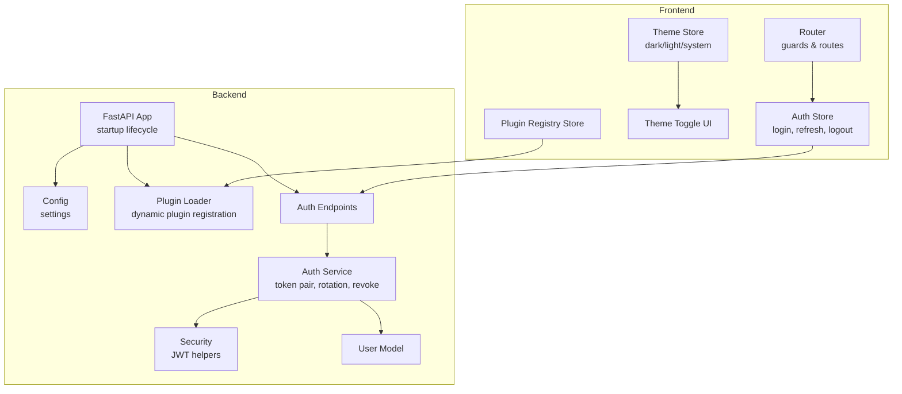
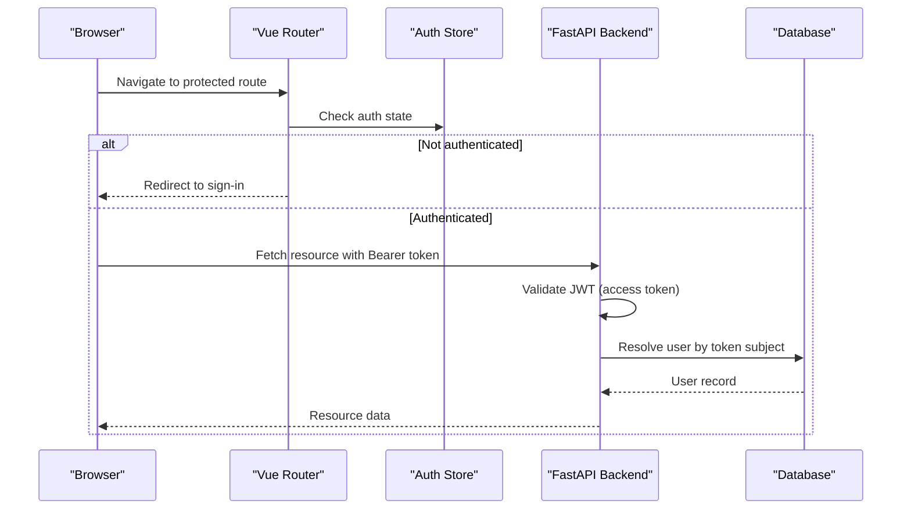
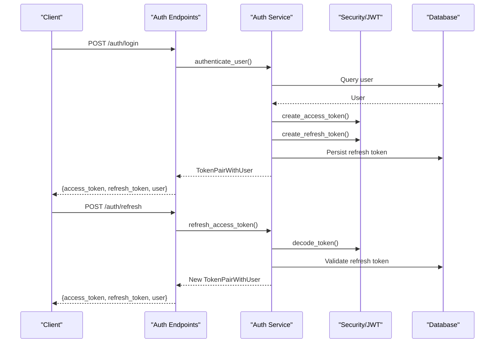
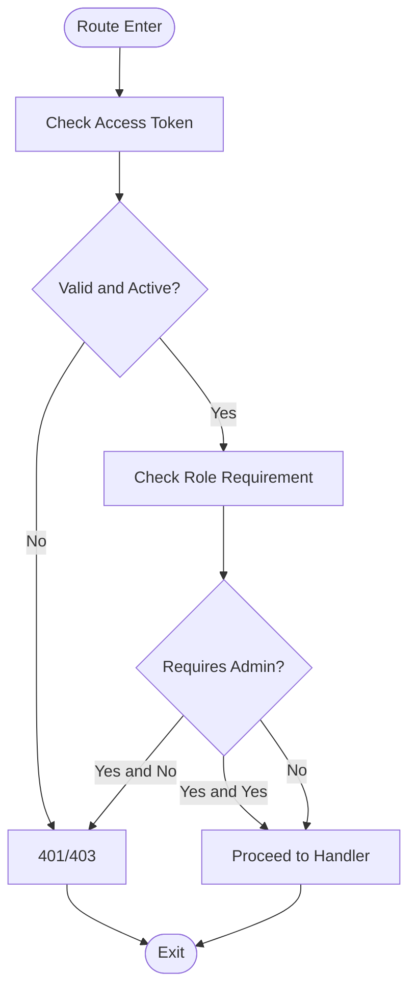
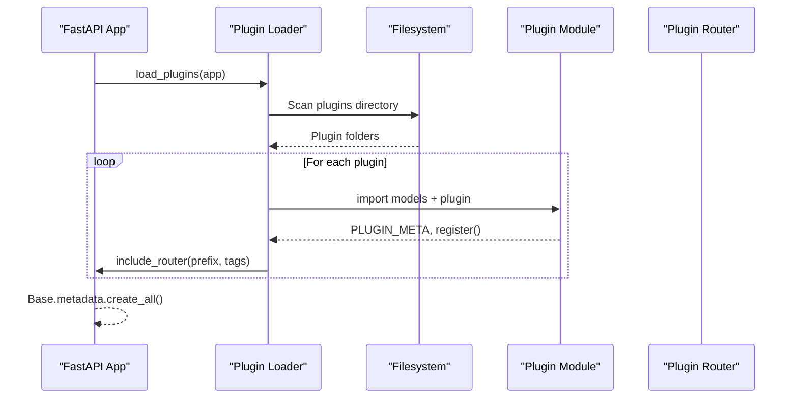
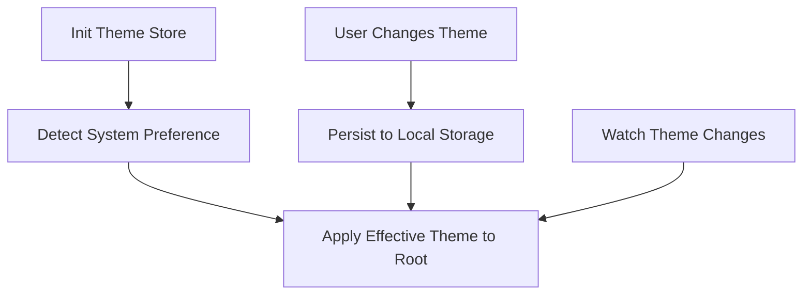
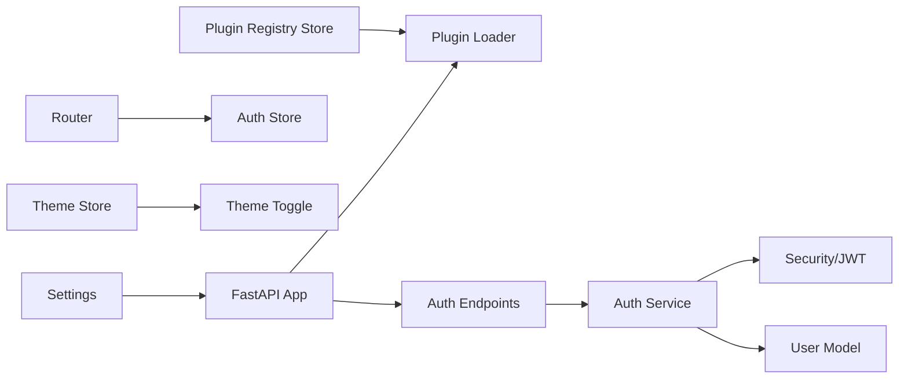

# Key Features

<cite>
**Referenced Files in This Document**
- [backend/app/main.py](file://backend/app/main.py)
- [backend/app/core/config.py](file://backend/app/core/config.py)
- [backend/app/core/security.py](file://backend/app/core/security.py)
- [backend/app/services/auth_service.py](file://backend/app/services/auth_service.py)
- [backend/app/models/user.py](file://backend/app/models/user.py)
- [backend/app/api/v1/endpoints/auth.py](file://backend/app/api/v1/endpoints/auth.py)
- [backend/app/core/plugin_loader.py](file://backend/app/core/plugin_loader.py)
- [backend/app/plugins/accounting/plugin.py](file://backend/app/plugins/accounting/plugin.py)
- [frontend/src/stores/auth.js](file://frontend/src/stores/auth.js)
- [frontend/src/router/index.js](file://frontend/src/router/index.js)
- [frontend/src/stores/theme.js](file://frontend/src/stores/theme.js)
- [frontend/src/components/ui/ThemeToggle.vue](file://frontend/src/components/ui/ThemeToggle.vue)
- [frontend/src/stores/pluginRegistry.js](file://frontend/src/stores/pluginRegistry.js)
- [backend/app/schemas/auth.py](file://backend/app/schemas/auth.py)
</cite>

## Table of Contents
1. [Introduction](#introduction)
2. [Project Structure](#project-structure)
3. [Core Components](#core-components)
4. [Architecture Overview](#architecture-overview)
5. [Detailed Component Analysis](#detailed-component-analysis)
6. [Dependency Analysis](#dependency-analysis)
7. [Performance Considerations](#performance-considerations)
8. [Troubleshooting Guide](#troubleshooting-guide)
9. [Conclusion](#conclusion)
10. [Appendices](#appendices)

## Introduction
This document presents the key features of the NOC Vision platform with a focus on:
- Authentication and authorization using JWT tokens
- User management with role-based access control
- Plugin architecture with dynamic loading
- Modern UI with dark mode support

It explains the purpose and benefits of each feature, how they integrate, and how they work together to deliver a cohesive NOC solution. Both conceptual overviews for stakeholders and technical implementation details for developers are included.

## Project Structure
The platform consists of:
- Backend: FastAPI application with JWT-based auth, RBAC helpers, plugin loader, and database models
- Frontend: Vue 3 + Pinia + Vue Router with theme management and plugin registry

**Diagram sources**
- [backend/app/main.py:17-48](file://backend/app/main.py#L17-L48)
- [backend/app/core/config.py:5-46](file://backend/app/core/config.py#L5-L46)
- [backend/app/core/security.py:31-98](file://backend/app/core/security.py#L31-L98)
- [backend/app/services/auth_service.py:19-139](file://backend/app/services/auth_service.py#L19-L139)
- [backend/app/models/user.py:7-35](file://backend/app/models/user.py#L7-L35)
- [backend/app/core/plugin_loader.py:25-100](file://backend/app/core/plugin_loader.py#L25-L100)
- [backend/app/api/v1/endpoints/auth.py:20-106](file://backend/app/api/v1/endpoints/auth.py#L20-L106)
- [frontend/src/router/index.js:159-171](file://frontend/src/router/index.js#L159-L171)
- [frontend/src/stores/auth.js:29-197](file://frontend/src/stores/auth.js#L29-L197)
- [frontend/src/stores/theme.js:17-42](file://frontend/src/stores/theme.js#L17-L42)
- [frontend/src/components/ui/ThemeToggle.vue:10-35](file://frontend/src/components/ui/ThemeToggle.vue#L10-L35)
- [frontend/src/stores/pluginRegistry.js:26-52](file://frontend/src/stores/pluginRegistry.js#L26-L52)

**Section sources**
- [backend/app/main.py:17-87](file://backend/app/main.py#L17-L87)
- [backend/app/core/config.py:5-46](file://backend/app/core/config.py#L5-L46)
- [frontend/src/router/index.js:159-171](file://frontend/src/router/index.js#L159-L171)

## Core Components
- Authentication and Authorization with JWT tokens
  - Purpose: Secure user identity and session continuity with short-lived access tokens and long-lived refresh tokens.
  - Benefits: Stateless, scalable, secure token rotation, and centralized credential validation.
  - Implementation highlights: Access and refresh token creation, decoding, and validation; protected endpoints; admin-only endpoints.

- User Management with Role-Based Access Control (RBAC)
  - Purpose: Enforce who can access what via roles (admin/user) and active status checks.
  - Benefits: Granular permissions, audit-friendly, and easy policy enforcement.
  - Implementation highlights: Current user retrieval, active user check, admin guard, and user model with role and activity fields.

- Plugin Architecture with Dynamic Loading
  - Purpose: Extend functionality without modifying core code; enable modular features.
  - Benefits: Pluggable modules, runtime extensibility, and isolated feature sets.
  - Implementation highlights: Plugin discovery, metadata validation, dynamic router inclusion, and optional enablement filtering.

- Modern UI with Dark Mode Support
  - Purpose: Provide a contemporary, comfortable user experience with theme flexibility.
  - Benefits: Improved usability, reduced eye strain, and alignment with user preferences.
  - Implementation highlights: Theme store with system preference detection, persistent storage, and UI toggle.

**Section sources**
- [backend/app/core/security.py:31-98](file://backend/app/core/security.py#L31-L98)
- [backend/app/models/user.py:7-35](file://backend/app/models/user.py#L7-L35)
- [backend/app/api/v1/endpoints/auth.py:20-106](file://backend/app/api/v1/endpoints/auth.py#L20-L106)
- [backend/app/core/plugin_loader.py:25-100](file://backend/app/core/plugin_loader.py#L25-L100)
- [frontend/src/stores/theme.js:17-42](file://frontend/src/stores/theme.js#L17-L42)
- [frontend/src/components/ui/ThemeToggle.vue:10-35](file://frontend/src/components/ui/ThemeToggle.vue#L10-L35)

## Architecture Overview
The platform integrates backend and frontend components around a central JWT-based authentication flow, RBAC guards, dynamic plugins, and a theme-aware UI.

**Diagram sources**
- [frontend/src/router/index.js:159-171](file://frontend/src/router/index.js#L159-L171)
- [frontend/src/stores/auth.js:29-197](file://frontend/src/stores/auth.js#L29-L197)
- [backend/app/core/security.py:61-98](file://backend/app/core/security.py#L61-L98)
- [backend/app/api/v1/endpoints/auth.py:20-106](file://backend/app/api/v1/endpoints/auth.py#L20-L106)

## Detailed Component Analysis

### Authentication and Authorization with JWT Tokens
- Purpose
  - Establish trusted identity for API requests and protect routes.
- Key Behaviors
  - Login: Accepts credentials, validates user, and issues access and refresh tokens.
  - Token Rotation: Exchanges refresh tokens for fresh access/refresh pairs.
  - Logout: Revokes refresh tokens to invalidate sessions.
  - Protected Routes: Validates access tokens and enforces active/admin checks.
- Implementation Notes
  - Access tokens carry user identity and role; refresh tokens carry a unique identifier for rotation and revocation.
  - Token lifetimes and signing are configured centrally.
  - Frontend stores tokens locally and automatically refreshes on 401 Unauthorized.

**Diagram sources**
- [backend/app/api/v1/endpoints/auth.py:20-106](file://backend/app/api/v1/endpoints/auth.py#L20-L106)
- [backend/app/services/auth_service.py:19-139](file://backend/app/services/auth_service.py#L19-L139)
- [backend/app/core/security.py:31-98](file://backend/app/core/security.py#L31-L98)
- [backend/app/schemas/auth.py:5-26](file://backend/app/schemas/auth.py#L5-L26)

**Section sources**
- [backend/app/api/v1/endpoints/auth.py:20-106](file://backend/app/api/v1/endpoints/auth.py#L20-L106)
- [backend/app/services/auth_service.py:19-139](file://backend/app/services/auth_service.py#L19-L139)
- [backend/app/core/security.py:31-98](file://backend/app/core/security.py#L31-L98)
- [backend/app/schemas/auth.py:5-26](file://backend/app/schemas/auth.py#L5-L26)
- [frontend/src/stores/auth.js:29-197](file://frontend/src/stores/auth.js#L29-L197)

### User Management with Role-Based Access Control (RBAC)
- Purpose
  - Define who can perform actions and access resources.
- Key Behaviors
  - Active user check prevents disabled accounts from accessing protected endpoints.
  - Admin guard restricts sensitive operations to administrators.
  - User model stores role and activity status.
- Implementation Notes
  - Guards depend on the current access token’s payload to derive identity and role.
  - Admin-only endpoints require the active user to have the admin role.

**Diagram sources**
- [backend/app/core/security.py:82-98](file://backend/app/core/security.py#L82-L98)
- [backend/app/models/user.py:15](file://backend/app/models/user.py#L15)
- [frontend/src/router/index.js:162-168](file://frontend/src/router/index.js#L162-L168)

**Section sources**
- [backend/app/core/security.py:82-98](file://backend/app/core/security.py#L82-L98)
- [backend/app/models/user.py:15](file://backend/app/models/user.py#L15)
- [frontend/src/router/index.js:162-168](file://frontend/src/router/index.js#L162-L168)

### Plugin Architecture with Dynamic Loading
- Purpose
  - Enable modular feature sets that extend the core platform without hard coupling.
- Key Behaviors
  - Discover plugins at startup, import models and plugin modules, validate metadata, and register routers under a plugin-specific prefix.
  - Optionally filter enabled plugins via configuration.
- Implementation Notes
  - Plugins expose a metadata object and a registration function that receives the FastAPI app and a context with shared utilities.
  - The frontend maintains a plugin registry to aggregate menu items and manage visibility.

**Diagram sources**
- [backend/app/core/plugin_loader.py:25-100](file://backend/app/core/plugin_loader.py#L25-L100)
- [backend/app/plugins/accounting/plugin.py:1-17](file://backend/app/plugins/accounting/plugin.py#L1-L17)
- [backend/app/main.py:25-30](file://backend/app/main.py#L25-L30)

**Section sources**
- [backend/app/core/plugin_loader.py:25-100](file://backend/app/core/plugin_loader.py#L25-L100)
- [backend/app/plugins/accounting/plugin.py:1-17](file://backend/app/plugins/accounting/plugin.py#L1-L17)
- [backend/app/main.py:25-30](file://backend/app/main.py#L25-L30)
- [frontend/src/stores/pluginRegistry.js:26-52](file://frontend/src/stores/pluginRegistry.js#L26-L52)

### Modern UI with Dark Mode Support
- Purpose
  - Deliver a responsive, accessible, and visually comfortable interface.
- Key Behaviors
  - Theme store persists user choice and follows system preference when set to “system”.
  - Theme toggle UI exposes options for light, dark, and system modes.
  - Router guards protect routes based on authentication state.
- Implementation Notes
  - Theme changes update the root element classes to apply Tailwind dark mode.
  - Local storage ensures theme persistence across sessions.

**Diagram sources**
- [frontend/src/stores/theme.js:17-42](file://frontend/src/stores/theme.js#L17-L42)
- [frontend/src/components/ui/ThemeToggle.vue:10-35](file://frontend/src/components/ui/ThemeToggle.vue#L10-L35)
- [frontend/src/router/index.js:159-171](file://frontend/src/router/index.js#L159-L171)

**Section sources**
- [frontend/src/stores/theme.js:17-42](file://frontend/src/stores/theme.js#L17-L42)
- [frontend/src/components/ui/ThemeToggle.vue:10-35](file://frontend/src/components/ui/ThemeToggle.vue#L10-L35)
- [frontend/src/router/index.js:159-171](file://frontend/src/router/index.js#L159-L171)

## Dependency Analysis
- Backend startup depends on configuration, plugin loading, and default admin initialization.
- Auth endpoints depend on the auth service and security utilities.
- Frontend router guards depend on the auth store; theme store is independent but UI components consume it.
- Plugin registry in the frontend aggregates plugin-provided metadata and menu items.

**Diagram sources**
- [backend/app/main.py:17-48](file://backend/app/main.py#L17-L48)
- [backend/app/core/config.py:5-46](file://backend/app/core/config.py#L5-L46)
- [backend/app/core/plugin_loader.py:25-100](file://backend/app/core/plugin_loader.py#L25-L100)
- [backend/app/api/v1/endpoints/auth.py:20-106](file://backend/app/api/v1/endpoints/auth.py#L20-L106)
- [backend/app/services/auth_service.py:19-139](file://backend/app/services/auth_service.py#L19-L139)
- [backend/app/core/security.py:31-98](file://backend/app/core/security.py#L31-L98)
- [frontend/src/router/index.js:159-171](file://frontend/src/router/index.js#L159-L171)
- [frontend/src/stores/auth.js:29-197](file://frontend/src/stores/auth.js#L29-L197)
- [frontend/src/stores/theme.js:17-42](file://frontend/src/stores/theme.js#L17-L42)
- [frontend/src/stores/pluginRegistry.js:26-52](file://frontend/src/stores/pluginRegistry.js#L26-L52)

**Section sources**
- [backend/app/main.py:17-48](file://backend/app/main.py#L17-L48)
- [frontend/src/router/index.js:159-171](file://frontend/src/router/index.js#L159-L171)

## Performance Considerations
- Token Validation Overhead: Keep token verification lightweight; avoid heavy operations in middleware.
- Database Queries: Cache frequently accessed user roles and statuses where appropriate; ensure indexes on usernames and refresh token identifiers.
- Plugin Discovery: Limit plugin scanning scope and avoid unnecessary imports; consider enabling only required plugins.
- Theme Persistence: Avoid excessive DOM manipulations by batching theme updates and relying on reactive stores.

## Troubleshooting Guide
- Authentication Failures
  - Symptom: 401 Unauthorized after login.
  - Checks: Verify access token validity, expiration, and that the user is active.
  - Actions: Trigger token refresh; confirm refresh token is valid and not revoked.
- Admin-Only Access Denied
  - Symptom: 403 Forbidden on admin routes.
  - Checks: Confirm current user role and active status.
- Plugin Load Errors
  - Symptom: Plugin fails to load or appears with error status.
  - Checks: Ensure PLUGIN_META and register function exist; verify models import; check ENABLED_PLUGINS configuration.
- Theme Not Applying
  - Symptom: Switching theme does not change appearance.
  - Checks: Confirm effective theme computation and root class application; verify local storage persistence.

**Section sources**
- [backend/app/core/security.py:61-98](file://backend/app/core/security.py#L61-L98)
- [backend/app/services/auth_service.py:45-100](file://backend/app/services/auth_service.py#L45-L100)
- [backend/app/core/plugin_loader.py:89-97](file://backend/app/core/plugin_loader.py#L89-L97)
- [frontend/src/stores/theme.js:23-30](file://frontend/src/stores/theme.js#L23-L30)

## Conclusion
NOC Vision’s key features—JWT-based authentication, RBAC, dynamic plugins, and a theme-aware UI—are designed to be modular, secure, and user-centric. Together, they enable a scalable, maintainable, and adaptable platform suitable for modern network operations centers.

## Appendices
- Practical Example: Admin User Creation
  - On first boot, the backend attempts to create a default admin if none exists. This ensures initial access for setup and administration tasks.
  - Reference: [backend/app/main.py:32-40](file://backend/app/main.py#L32-L40), [backend/app/services/auth_service.py:122-139](file://backend/app/services/auth_service.py#L122-L139)

- Feature Interdependencies
  - Authentication depends on security utilities and database-backed refresh tokens.
  - RBAC relies on validated access tokens and user records.
  - Plugins extend the API surface and UI via registration and metadata.
  - Theme independence allows UI customization without affecting core logic.