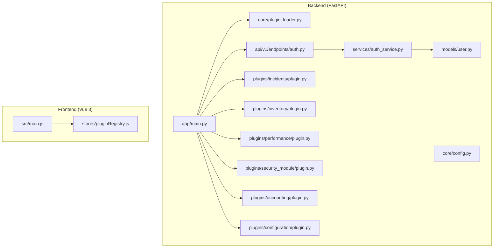
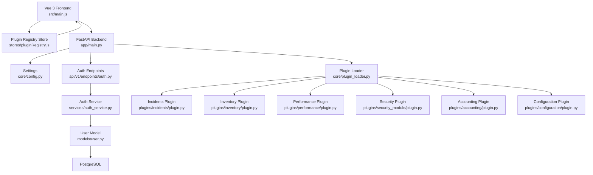
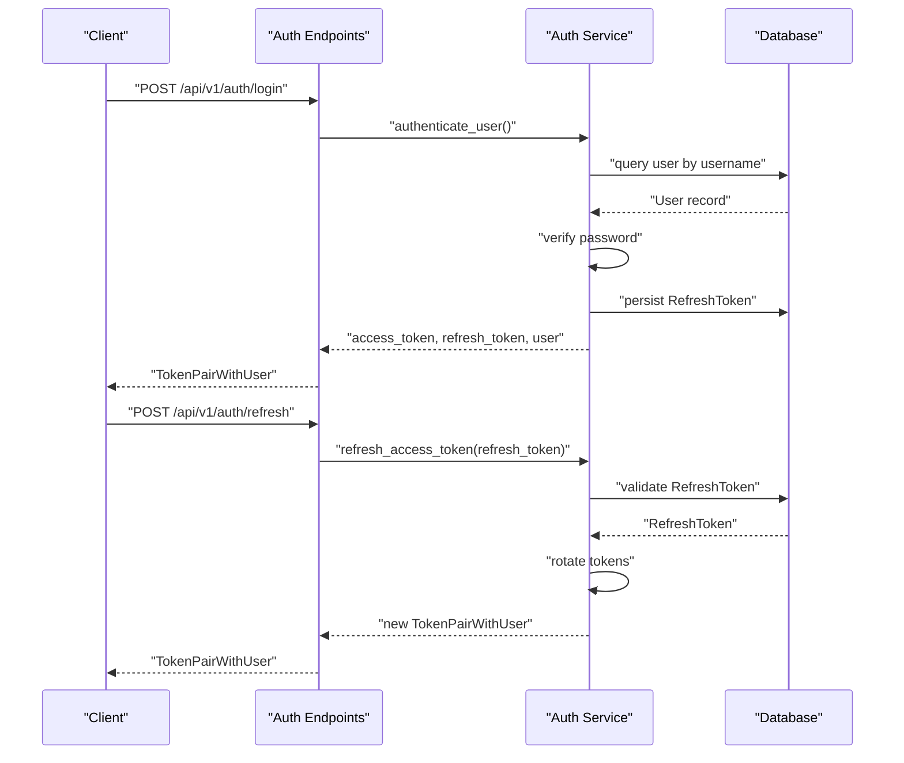
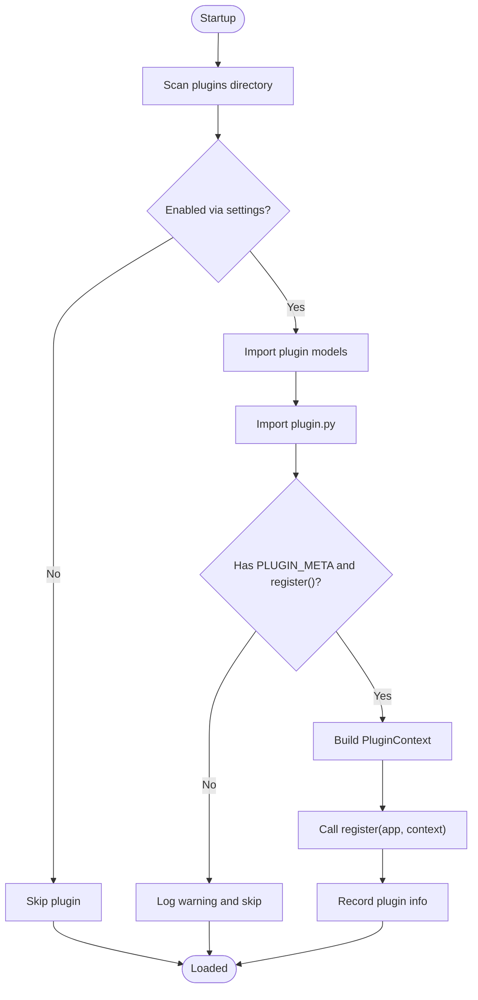
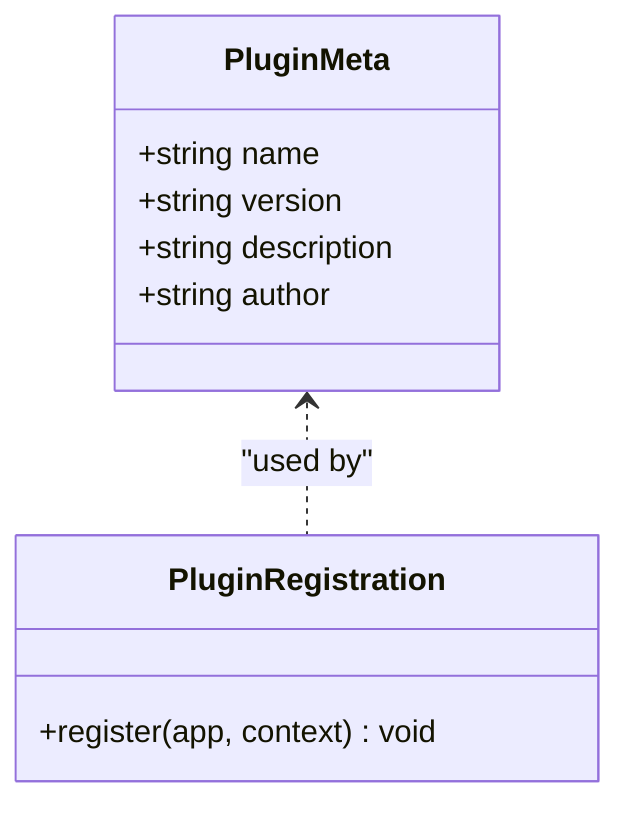
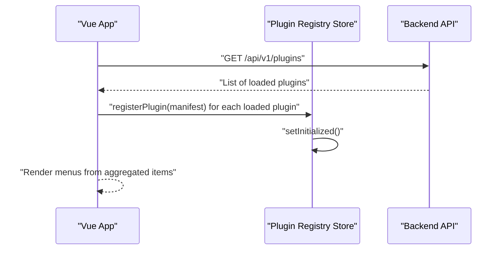
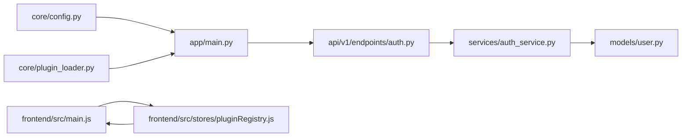

# Project Overview

<cite>
**Referenced Files in This Document**
- [README.md](file://README.md)
- [backend/app/main.py](file://backend/app/main.py)
- [backend/app/core/plugin_loader.py](file://backend/app/core/plugin_loader.py)
- [backend/app/core/config.py](file://backend/app/core/config.py)
- [backend/app/api/v1/endpoints/auth.py](file://backend/app/api/v1/endpoints/auth.py)
- [backend/app/services/auth_service.py](file://backend/app/services/auth_service.py)
- [backend/app/models/user.py](file://backend/app/models/user.py)
- [backend/app/plugins/incidents/plugin.py](file://backend/app/plugins/incidents/plugin.py)
- [backend/app/plugins/inventory/plugin.py](file://backend/app/plugins/inventory/plugin.py)
- [backend/app/plugins/performance/plugin.py](file://backend/app/plugins/performance/plugin.py)
- [backend/app/plugins/security_module/plugin.py](file://backend/app/plugins/security_module/plugin.py)
- [backend/app/plugins/accounting/plugin.py](file://backend/app/plugins/accounting/plugin.py)
- [backend/app/plugins/configuration/plugin.py](file://backend/app/plugins/configuration/plugin.py)
- [frontend/src/main.js](file://frontend/src/main.js)
- [frontend/src/stores/pluginRegistry.js](file://frontend/src/stores/pluginRegistry.js)
</cite>

## Table of Contents
1. [Introduction](#introduction)
2. [Project Structure](#project-structure)
3. [Core Components](#core-components)
4. [Architecture Overview](#architecture-overview)
5. [Detailed Component Analysis](#detailed-component-analysis)
6. [Dependency Analysis](#dependency-analysis)
7. [Performance Considerations](#performance-considerations)
8. [Troubleshooting Guide](#troubleshooting-guide)
9. [Conclusion](#conclusion)
10. [Appendices](#appendices)

## Introduction
NOC Vision is a modern, plugin-based Network Operations Center (NOC) platform designed to streamline operations across networking domains. It combines a FastAPI backend with a Vue 3 frontend, delivering a responsive, extensible system with robust authentication, user management, and a dynamic plugin architecture. Out of the box, it ships with six built-in plugins covering Incidents, Inventory, Performance, Security Module, Accounting, and Configuration, enabling operators to manage networks comprehensively from a single interface.

Target audience:
- Network engineers and NOC operators needing centralized visibility and control
- Administrators requiring role-based access and secure authentication
- Developers extending the platform via the plugin system

Use cases:
- Centralized incident tracking and resolution
- Equipment and asset lifecycle management
- Real-time performance monitoring and alerting
- Security event monitoring and auditing
- Traffic accounting and billing insights
- Device configuration management and compliance

Benefits:
- Modular design enables incremental adoption and customization
- Strong security posture with JWT-based authentication and refresh tokens
- Developer-friendly plugin system with standardized metadata and registration
- Modern UI with dark mode and responsive layout

## Project Structure
The repository is organized into two primary parts:
- backend: FastAPI application with API v1 endpoints, core configuration, database models, plugin loader, and services
- frontend: Vue 3 application with Pinia stores, Vue Router, reusable UI components, and plugin-specific views

**Diagram sources**
- [backend/app/main.py:1-87](file://backend/app/main.py#L1-L87)
- [backend/app/core/plugin_loader.py:1-100](file://backend/app/core/plugin_loader.py#L1-L100)
- [backend/app/core/config.py:1-46](file://backend/app/core/config.py#L1-L46)
- [backend/app/api/v1/endpoints/auth.py:1-106](file://backend/app/api/v1/endpoints/auth.py#L1-L106)
- [backend/app/services/auth_service.py:1-139](file://backend/app/services/auth_service.py#L1-L139)
- [backend/app/models/user.py:1-35](file://backend/app/models/user.py#L1-L35)
- [backend/app/plugins/incidents/plugin.py:1-17](file://backend/app/plugins/incidents/plugin.py#L1-L17)
- [backend/app/plugins/inventory/plugin.py:1-17](file://backend/app/plugins/inventory/plugin.py#L1-L17)
- [backend/app/plugins/performance/plugin.py:1-17](file://backend/app/plugins/performance/plugin.py#L1-L17)
- [backend/app/plugins/security_module/plugin.py:1-17](file://backend/app/plugins/security_module/plugin.py#L1-L17)
- [backend/app/plugins/accounting/plugin.py:1-17](file://backend/app/plugins/accounting/plugin.py#L1-L17)
- [backend/app/plugins/configuration/plugin.py:1-17](file://backend/app/plugins/configuration/plugin.py#L1-L17)
- [frontend/src/main.js:1-132](file://frontend/src/main.js#L1-L132)
- [frontend/src/stores/pluginRegistry.js:1-53](file://frontend/src/stores/pluginRegistry.js#L1-L53)

**Section sources**
- [README.md:5-31](file://README.md#L5-L31)
- [backend/app/main.py:17-48](file://backend/app/main.py#L17-L48)
- [frontend/src/main.js:18-51](file://frontend/src/main.js#L18-L51)

## Core Components
- FastAPI application with lifecycle hooks for startup/shutdown, CORS configuration, and plugin loading
- Plugin loader that dynamically discovers and registers plugins with standardized metadata and routing
- Authentication and authorization services supporting JWT access tokens and refresh tokens with rotation and revocation
- User model with role-based attributes and relationships to refresh tokens
- Frontend plugin registry that initializes from backend plugin metadata and generates dynamic menus

Key highlights:
- Startup lifecycle creates database tables, loads plugins, ensures default admin, and cleans up expired tokens
- Plugin system enforces a consistent contract: PLUGIN_META and a register(app, context) function
- Authentication supports login, refresh, logout, and admin-initiated user creation
- Frontend fetches plugin list and builds navigation items per plugin

**Section sources**
- [backend/app/main.py:17-48](file://backend/app/main.py#L17-L48)
- [backend/app/core/plugin_loader.py:25-99](file://backend/app/core/plugin_loader.py#L25-L99)
- [backend/app/api/v1/endpoints/auth.py:20-106](file://backend/app/api/v1/endpoints/auth.py#L20-L106)
- [backend/app/services/auth_service.py:19-139](file://backend/app/services/auth_service.py#L19-L139)
- [backend/app/models/user.py:7-35](file://backend/app/models/user.py#L7-L35)
- [frontend/src/main.js:18-51](file://frontend/src/main.js#L18-L51)
- [frontend/src/stores/pluginRegistry.js:26-52](file://frontend/src/stores/pluginRegistry.js#L26-L52)

## Architecture Overview
NOC Vision follows a layered architecture:
- Presentation layer: Vue 3 frontend with Pinia and Vue Router
- API layer: FastAPI with v1 endpoints and plugin-specific routers
- Domain services: Authentication, user management, and plugin orchestration
- Persistence: SQLAlchemy models backed by PostgreSQL

**Diagram sources**
- [backend/app/main.py:50-87](file://backend/app/main.py#L50-L87)
- [backend/app/core/config.py:5-46](file://backend/app/core/config.py#L5-L46)
- [backend/app/core/plugin_loader.py:25-99](file://backend/app/core/plugin_loader.py#L25-L99)
- [backend/app/api/v1/endpoints/auth.py:1-106](file://backend/app/api/v1/endpoints/auth.py#L1-L106)
- [backend/app/services/auth_service.py:1-139](file://backend/app/services/auth_service.py#L1-L139)
- [backend/app/models/user.py:1-35](file://backend/app/models/user.py#L1-L35)
- [backend/app/plugins/incidents/plugin.py:1-17](file://backend/app/plugins/incidents/plugin.py#L1-L17)
- [backend/app/plugins/inventory/plugin.py:1-17](file://backend/app/plugins/inventory/plugin.py#L1-L17)
- [backend/app/plugins/performance/plugin.py:1-17](file://backend/app/plugins/performance/plugin.py#L1-L17)
- [backend/app/plugins/security_module/plugin.py:1-17](file://backend/app/plugins/security_module/plugin.py#L1-L17)
- [backend/app/plugins/accounting/plugin.py:1-17](file://backend/app/plugins/accounting/plugin.py#L1-L17)
- [backend/app/plugins/configuration/plugin.py:1-17](file://backend/app/plugins/configuration/plugin.py#L1-L17)
- [frontend/src/main.js:18-51](file://frontend/src/main.js#L18-L51)
- [frontend/src/stores/pluginRegistry.js:1-53](file://frontend/src/stores/pluginRegistry.js#L1-L53)

## Detailed Component Analysis

### Authentication and Authorization
NOC Vision implements JWT-based authentication with refresh token rotation and revocation. The flow includes:
- Login: validates credentials, constructs access and refresh tokens, persists refresh token
- Refresh: accepts a valid refresh token, rotates tokens, and returns a new pair
- Logout: revokes a refresh token
- Admin-init: creates a default admin if none exists

**Diagram sources**
- [backend/app/api/v1/endpoints/auth.py:20-51](file://backend/app/api/v1/endpoints/auth.py#L20-L51)
- [backend/app/services/auth_service.py:19-74](file://backend/app/services/auth_service.py#L19-L74)
- [backend/app/models/user.py:20-34](file://backend/app/models/user.py#L20-L34)

Practical example:
- After successful login, clients store both access and refresh tokens and use the refresh endpoint to obtain a new access token when the previous one expires.

**Section sources**
- [backend/app/api/v1/endpoints/auth.py:20-106](file://backend/app/api/v1/endpoints/auth.py#L20-L106)
- [backend/app/services/auth_service.py:19-139](file://backend/app/services/auth_service.py#L19-L139)
- [backend/app/models/user.py:7-35](file://backend/app/models/user.py#L7-L35)

### Plugin System
The plugin system enables dynamic discovery and registration of functionality. The backend scans the plugins directory, imports plugin modules, reads metadata, and registers routers under plugin-specific prefixes. The frontend queries the backend for loaded plugins and builds menus accordingly.

**Diagram sources**
- [backend/app/core/plugin_loader.py:25-99](file://backend/app/core/plugin_loader.py#L25-L99)
- [backend/app/main.py:25-30](file://backend/app/main.py#L25-L30)
- [frontend/src/main.js:18-51](file://frontend/src/main.js#L18-L51)

Practical example:
- To enable only specific plugins, set the environment variable to a comma-separated list. The loader filters plugins accordingly.

**Section sources**
- [backend/app/core/plugin_loader.py:25-99](file://backend/app/core/plugin_loader.py#L25-L99)
- [backend/app/core/config.py:25-26](file://backend/app/core/config.py#L25-L26)
- [backend/app/main.py:25-30](file://backend/app/main.py#L25-L30)
- [frontend/src/main.js:18-51](file://frontend/src/main.js#L18-L51)

### Built-in Plugins
NOC Vision ships with six built-in plugins, each exposing its own endpoints and metadata:

- Incidents: Incident management and tracking
- Inventory: Equipment and asset management
- Performance: Performance monitoring and metrics
- Security Module: Security event monitoring
- Accounting: Traffic accounting and billing
- Configuration: Device configuration management

Each plugin adheres to the same registration pattern and exposes endpoints under a dedicated prefix.

**Diagram sources**
- [backend/app/plugins/incidents/plugin.py:1-17](file://backend/app/plugins/incidents/plugin.py#L1-L17)
- [backend/app/plugins/inventory/plugin.py:1-17](file://backend/app/plugins/inventory/plugin.py#L1-L17)
- [backend/app/plugins/performance/plugin.py:1-17](file://backend/app/plugins/performance/plugin.py#L1-L17)
- [backend/app/plugins/security_module/plugin.py:1-17](file://backend/app/plugins/security_module/plugin.py#L1-L17)
- [backend/app/plugins/accounting/plugin.py:1-17](file://backend/app/plugins/accounting/plugin.py#L1-L17)
- [backend/app/plugins/configuration/plugin.py:1-17](file://backend/app/plugins/configuration/plugin.py#L1-L17)

Practical example:
- The frontend defines menu items for each plugin and integrates them into the sidebar after fetching the backend plugin list.

**Section sources**
- [backend/app/plugins/incidents/plugin.py:1-17](file://backend/app/plugins/incidents/plugin.py#L1-L17)
- [backend/app/plugins/inventory/plugin.py:1-17](file://backend/app/plugins/inventory/plugin.py#L1-L17)
- [backend/app/plugins/performance/plugin.py:1-17](file://backend/app/plugins/performance/plugin.py#L1-L17)
- [backend/app/plugins/security_module/plugin.py:1-17](file://backend/app/plugins/security_module/plugin.py#L1-L17)
- [backend/app/plugins/accounting/plugin.py:1-17](file://backend/app/plugins/accounting/plugin.py#L1-L17)
- [backend/app/plugins/configuration/plugin.py:1-17](file://backend/app/plugins/configuration/plugin.py#L1-L17)
- [frontend/src/main.js:53-113](file://frontend/src/main.js#L53-L113)

### Frontend Plugin Registry
The frontend initializes the plugin registry by fetching the backend plugin list and registering manifests with menu items. It computes enabled plugins, aggregates menu items, and sorts them by section and order.

**Diagram sources**
- [frontend/src/main.js:18-51](file://frontend/src/main.js#L18-L51)
- [frontend/src/stores/pluginRegistry.js:26-52](file://frontend/src/stores/pluginRegistry.js#L26-L52)
- [backend/app/main.py:84-87](file://backend/app/main.py#L84-L87)

Practical example:
- The registry exposes helpers to filter menu items by section and retrieve a specific plugin by name.

**Section sources**
- [frontend/src/main.js:18-51](file://frontend/src/main.js#L18-L51)
- [frontend/src/stores/pluginRegistry.js:1-53](file://frontend/src/stores/pluginRegistry.js#L1-L53)

## Dependency Analysis
The system exhibits clear separation of concerns:
- Backend depends on FastAPI, SQLAlchemy, Pydantic, and Alembic for configuration, persistence, and migrations
- Authentication depends on cryptographic utilities and token handling
- Plugin loader depends on filesystem scanning and dynamic imports
- Frontend depends on Vue 3, Pinia, and Vue Router; it consumes backend plugin metadata

**Diagram sources**
- [backend/app/core/config.py:5-46](file://backend/app/core/config.py#L5-L46)
- [backend/app/main.py:1-14](file://backend/app/main.py#L1-L14)
- [backend/app/core/plugin_loader.py:1-13](file://backend/app/core/plugin_loader.py#L1-L13)
- [backend/app/api/v1/endpoints/auth.py:1-17](file://backend/app/api/v1/endpoints/auth.py#L1-L17)
- [backend/app/services/auth_service.py:1-17](file://backend/app/services/auth_service.py#L1-L17)
- [backend/app/models/user.py:1-4](file://backend/app/models/user.py#L1-L4)
- [frontend/src/main.js:1-16](file://frontend/src/main.js#L1-L16)
- [frontend/src/stores/pluginRegistry.js:1-4](file://frontend/src/stores/pluginRegistry.js#L1-L4)

**Section sources**
- [backend/app/core/config.py:5-46](file://backend/app/core/config.py#L5-L46)
- [backend/app/main.py:1-14](file://backend/app/main.py#L1-L14)
- [backend/app/core/plugin_loader.py:1-13](file://backend/app/core/plugin_loader.py#L1-L13)
- [backend/app/api/v1/endpoints/auth.py:1-17](file://backend/app/api/v1/endpoints/auth.py#L1-L17)
- [backend/app/services/auth_service.py:1-17](file://backend/app/services/auth_service.py#L1-L17)
- [backend/app/models/user.py:1-4](file://backend/app/models/user.py#L1-L4)
- [frontend/src/main.js:1-16](file://frontend/src/main.js#L1-L16)
- [frontend/src/stores/pluginRegistry.js:1-4](file://frontend/src/stores/pluginRegistry.js#L1-L4)

## Performance Considerations
- Use production-grade database migrations (Alembic) and avoid automatic table creation in production
- Enable backend logging at appropriate levels and monitor token rotation and cleanup tasks
- Keep frontend plugin initialization lightweight; avoid unnecessary re-renders by leveraging computed properties
- Consider caching plugin metadata on the frontend to reduce repeated fetches during navigation

## Troubleshooting Guide
Common issues and resolutions:
- Backend fails to start:
  - Verify PostgreSQL is running and reachable
  - Confirm DATABASE_URL and environment variables are set correctly
  - Ensure dependencies are installed and Alembic migrations are applied
- Frontend fails to start:
  - Clear node_modules and reinstall dependencies
  - Confirm backend is running at the expected host/port
  - Adjust ALLOWED_ORIGINS to match frontend URLs
- Database connection errors:
  - Ensure the database service is running
  - Validate credentials and confirm the database exists

**Section sources**
- [README.md:220-238](file://README.md#L220-L238)

## Conclusion
NOC Vision delivers a modern, extensible NOC platform with a strong foundation in security, modularity, and developer ergonomics. Its plugin-based architecture allows teams to adopt core capabilities incrementally while extending functionality as needs evolve. The combination of FastAPI and Vue 3 provides a responsive, maintainable stack suitable for enterprise-grade deployments.

## Appendices
- Quick start options:
  - Docker Compose for containerized deployment
  - Manual setup for development with Python virtual environments and Node.js
- Default admin credentials and API documentation endpoints are provided for immediate evaluation

**Section sources**
- [README.md:65-128](file://README.md#L65-L128)
- [README.md:159-164](file://README.md#L159-L164)