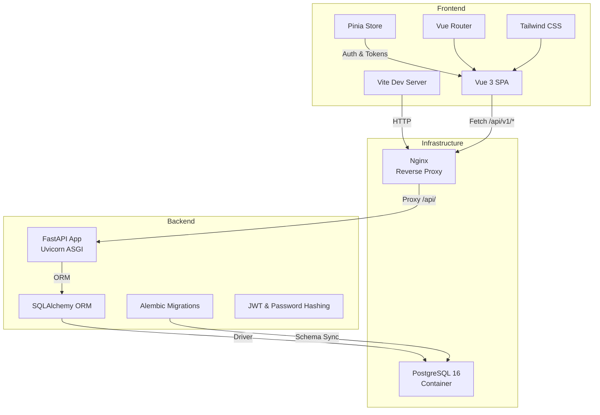
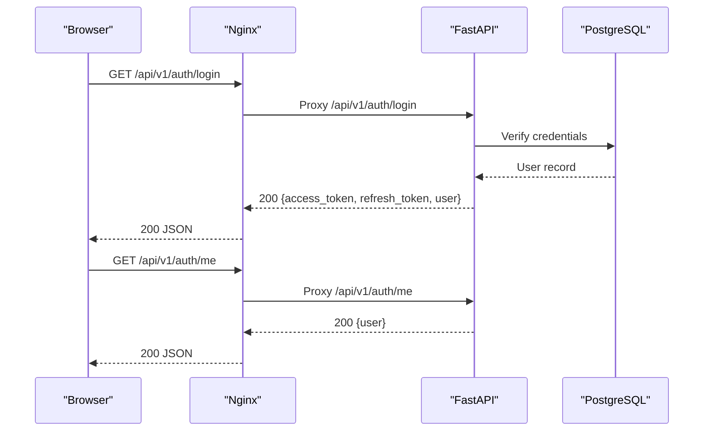
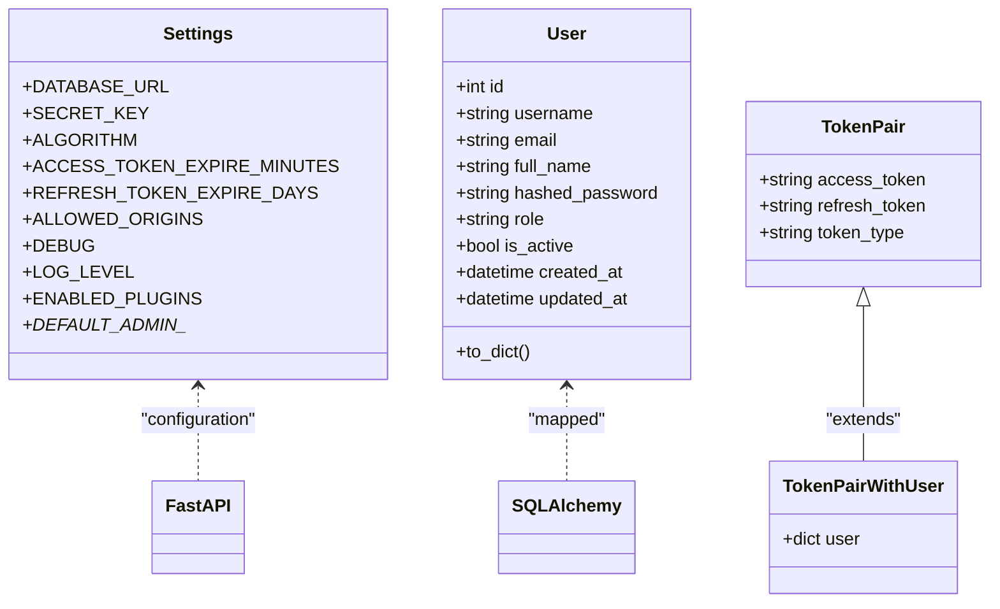
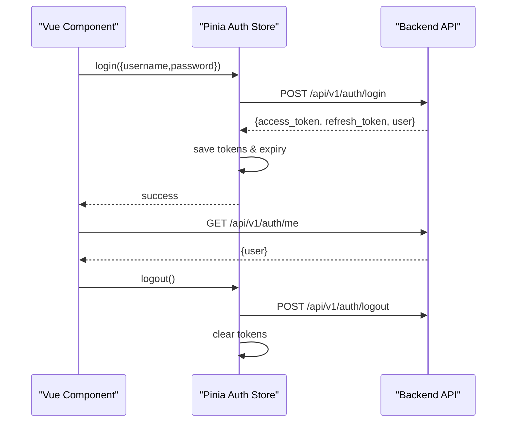
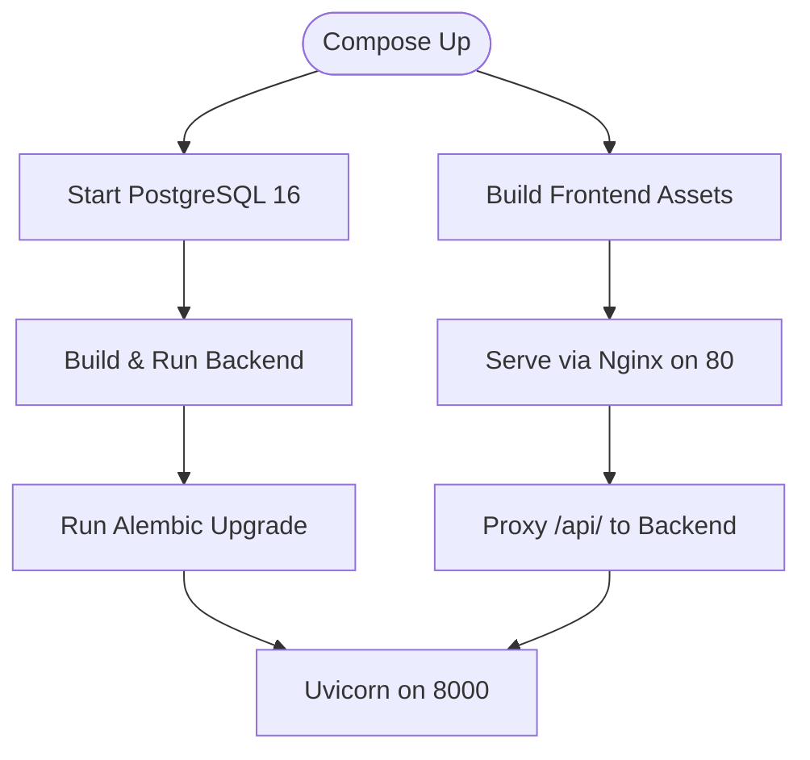
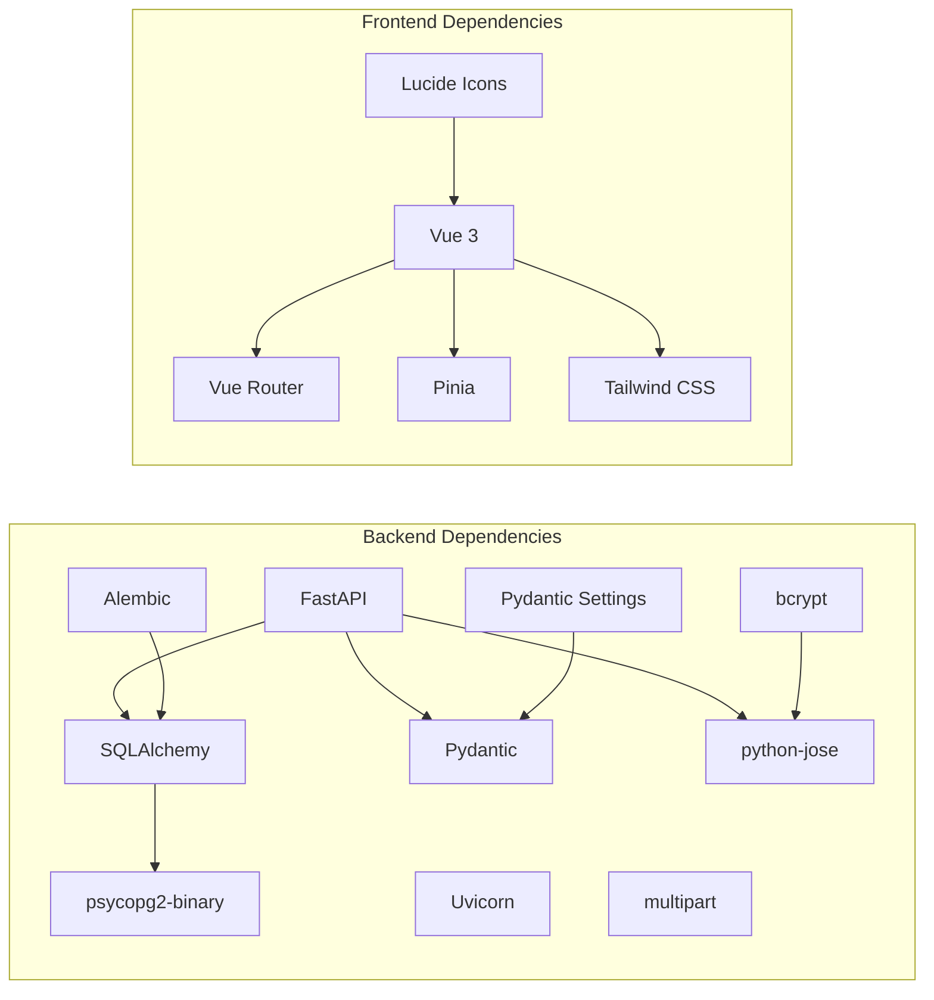

# Technology Stack

<cite>
**Referenced Files in This Document**
- [backend/requirements.txt](file://backend/requirements.txt)
- [backend/app/main.py](file://backend/app/main.py)
- [backend/app/core/config.py](file://backend/app/core/config.py)
- [backend/app/core/security.py](file://backend/app/core/security.py)
- [backend/app/models/user.py](file://backend/app/models/user.py)
- [backend/app/schemas/auth.py](file://backend/app/schemas/auth.py)
- [backend/alembic/env.py](file://backend/alembic/env.py)
- [backend/Dockerfile](file://backend/Dockerfile)
- [frontend/package.json](file://frontend/package.json)
- [frontend/src/router/index.js](file://frontend/src/router/index.js)
- [frontend/src/stores/auth.js](file://frontend/src/stores/auth.js)
- [frontend/tailwind.config.js](file://frontend/tailwind.config.js)
- [frontend/postcss.config.js](file://frontend/postcss.config.js)
- [frontend/nginx.conf](file://frontend/nginx.conf)
- [frontend/Dockerfile](file://frontend/Dockerfile)
- [frontend/vite.config.cjs](file://frontend/vite.config.cjs)
- [docker-compose.yml](file://docker-compose.yml)
</cite>

## Table of Contents
1. [Introduction](#introduction)
2. [Project Structure](#project-structure)
3. [Core Components](#core-components)
4. [Architecture Overview](#architecture-overview)
5. [Detailed Component Analysis](#detailed-component-analysis)
6. [Dependency Analysis](#dependency-analysis)
7. [Performance Considerations](#performance-considerations)
8. [Troubleshooting Guide](#troubleshooting-guide)
9. [Conclusion](#conclusion)

## Introduction
This document describes the NOC Vision technology stack, covering backend, frontend, and infrastructure technologies. It explains the rationale for each choice, version requirements, integration patterns, compatibility, performance characteristics, and scalability considerations. The backend is built on FastAPI, SQLAlchemy, Pydantic, JWT authentication, and Alembic migrations. The frontend leverages Vue 3, Vite, Pinia, Vue Router, Tailwind CSS, and Lucide icons. Infrastructure is containerized with PostgreSQL, Docker, and Nginx.

## Project Structure
The repository is organized into three major parts:
- Backend: Python application with FastAPI, SQLAlchemy ORM, Alembic migrations, and JWT-based authentication.
- Frontend: Vue 3 SPA with Pinia for state management, Vue Router for navigation, Tailwind CSS for styling, and Vite for development/build.
- Infrastructure: Docker Compose orchestrating PostgreSQL, backend, and frontend with Nginx serving static assets and reverse proxy.

**Diagram sources**
- [docker-compose.yml:1-52](file://docker-compose.yml#L1-L52)
- [backend/Dockerfile:1-17](file://backend/Dockerfile#L1-L17)
- [frontend/Dockerfile:1-13](file://frontend/Dockerfile#L1-L13)
- [frontend/nginx.conf:1-20](file://frontend/nginx.conf#L1-L20)

**Section sources**
- [docker-compose.yml:1-52](file://docker-compose.yml#L1-L52)

## Core Components
This section outlines the selected technologies, their roles, and how they integrate.

- Backend
  - FastAPI: Web framework providing automatic OpenAPI docs, dependency injection, and async support.
  - SQLAlchemy: ORM for database modeling and queries.
  - Pydantic: Data validation and settings management.
  - JWT Authentication: Stateless bearer tokens with refresh flow.
  - Alembic: Database schema migration tool integrated with SQLAlchemy metadata.

- Frontend
  - Vue 3: Reactive UI framework with Composition API.
  - Vite: Build tool and dev server with fast HMR.
  - Pinia: Centralized state management.
  - Vue Router: Client-side routing with guards.
  - Tailwind CSS: Utility-first CSS framework with dark mode and animations.
  - Lucide Icons: Icon library via lucide-vue-next.

- Infrastructure
  - PostgreSQL 16: Relational database with health checks.
  - Docker: Containerization for backend and frontend.
  - Nginx: Static asset hosting and reverse proxy for API requests.

**Section sources**
- [backend/requirements.txt:1-11](file://backend/requirements.txt#L1-L11)
- [backend/app/main.py:1-87](file://backend/app/main.py#L1-L87)
- [backend/app/core/config.py:1-46](file://backend/app/core/config.py#L1-L46)
- [backend/app/core/security.py:1-99](file://backend/app/core/security.py#L1-L99)
- [backend/app/models/user.py:1-35](file://backend/app/models/user.py#L1-L35)
- [backend/app/schemas/auth.py:1-26](file://backend/app/schemas/auth.py#L1-L26)
- [backend/alembic/env.py:1-63](file://backend/alembic/env.py#L1-L63)
- [frontend/package.json:1-30](file://frontend/package.json#L1-L30)
- [frontend/src/router/index.js:1-174](file://frontend/src/router/index.js#L1-L174)
- [frontend/src/stores/auth.js:1-198](file://frontend/src/stores/auth.js#L1-L198)
- [frontend/tailwind.config.js:1-59](file://frontend/tailwind.config.js#L1-L59)
- [frontend/postcss.config.js:1-7](file://frontend/postcss.config.js#L1-L7)
- [frontend/nginx.conf:1-20](file://frontend/nginx.conf#L1-L20)
- [frontend/Dockerfile:1-13](file://frontend/Dockerfile#L1-L13)
- [frontend/vite.config.cjs:1-23](file://frontend/vite.config.cjs#L1-L23)
- [backend/Dockerfile:1-17](file://backend/Dockerfile#L1-L17)

## Architecture Overview
The system follows a modern SPA architecture:
- The frontend (Vue 3 + Vite) runs locally during development and builds static assets served by Nginx in production.
- Nginx proxies API requests (/api/) to the backend service.
- The backend (FastAPI) exposes REST endpoints, manages authentication, and interacts with the database via SQLAlchemy.
- Alembic synchronizes schema changes with PostgreSQL.
- Docker Compose orchestrates services with persistent storage for PostgreSQL.

**Diagram sources**
- [frontend/nginx.conf:11-18](file://frontend/nginx.conf#L11-L18)
- [backend/app/core/security.py:61-79](file://backend/app/core/security.py#L61-L79)
- [backend/app/schemas/auth.py:16-18](file://backend/app/schemas/auth.py#L16-L18)

**Section sources**
- [docker-compose.yml:1-52](file://docker-compose.yml#L1-L52)
- [frontend/nginx.conf:1-20](file://frontend/nginx.conf#L1-L20)
- [backend/app/core/security.py:1-99](file://backend/app/core/security.py#L1-L99)

## Detailed Component Analysis

### Backend: FastAPI, SQLAlchemy, Pydantic, JWT, Alembic
- FastAPI
  - Application lifecycle hooks initialize database tables, load plugins, and clean up resources.
  - CORS middleware configured from settings.
  - API router mounted under /api/v1.
- SQLAlchemy
  - Base metadata and engine configured; models registered centrally.
  - User model defines fields and relationships; includes a serialization helper.
- Pydantic
  - Settings class encapsulates environment-driven configuration including database URL, JWT parameters, CORS origins, and defaults.
  - Request/response schemas enforce validation for authentication flows.
- JWT Authentication
  - OAuth2 password bearer scheme for protected endpoints.
  - Password hashing with bcrypt; token encoding/decoding with HS256.
  - Access and refresh tokens with expiration; token type differentiation.
  - Current user resolution via bearer token lookup and DB query.
- Alembic
  - Migration environment imports core and plugin models to register metadata.
  - Overrides SQLAlchemy URL from application settings.
  - Supports offline and online migration modes.

**Diagram sources**
- [backend/app/core/config.py:5-46](file://backend/app/core/config.py#L5-L46)
- [backend/app/models/user.py:7-35](file://backend/app/models/user.py#L7-L35)
- [backend/app/schemas/auth.py:10-26](file://backend/app/schemas/auth.py#L10-L26)

**Section sources**
- [backend/app/main.py:17-48](file://backend/app/main.py#L17-L48)
- [backend/app/core/config.py:1-46](file://backend/app/core/config.py#L1-L46)
- [backend/app/core/security.py:1-99](file://backend/app/core/security.py#L1-L99)
- [backend/app/models/user.py:1-35](file://backend/app/models/user.py#L1-L35)
- [backend/app/schemas/auth.py:1-26](file://backend/app/schemas/auth.py#L1-L26)
- [backend/alembic/env.py:14-32](file://backend/alembic/env.py#L14-L32)

### Frontend: Vue 3, Vite, Pinia, Vue Router, Tailwind CSS, Lucide Icons
- Vue 3 + Vite
  - Development server configured with proxy to backend API.
  - Alias '@' resolves to src directory.
- Pinia
  - Authentication store persists tokens in localStorage, computes session state, and handles login/register/logout flows.
  - Provides an authFetch wrapper that auto-refreshes tokens on 401 Unauthorized.
- Vue Router
  - Guards enforce guest/requiresAuth/admin restrictions.
  - Dynamic imports for plugin views enable modular loading.
- Tailwind CSS + PostCSS
  - Dark mode, custom color palette, and animations configured.
  - PostCSS pipeline enabled with Tailwind and Autoprefixer.
- Lucide Icons
  - Integrated via lucide-vue-next for scalable vector icons.

**Diagram sources**
- [frontend/src/stores/auth.js:29-67](file://frontend/src/stores/auth.js#L29-L67)
- [frontend/src/stores/auth.js:91-103](file://frontend/src/stores/auth.js#L91-L103)
- [frontend/src/stores/auth.js:136-158](file://frontend/src/stores/auth.js#L136-L158)
- [frontend/src/router/index.js:159-171](file://frontend/src/router/index.js#L159-L171)

**Section sources**
- [frontend/vite.config.cjs:1-23](file://frontend/vite.config.cjs#L1-L23)
- [frontend/src/stores/auth.js:1-198](file://frontend/src/stores/auth.js#L1-L198)
- [frontend/src/router/index.js:1-174](file://frontend/src/router/index.js#L1-L174)
- [frontend/tailwind.config.js:1-59](file://frontend/tailwind.config.js#L1-L59)
- [frontend/postcss.config.js:1-7](file://frontend/postcss.config.js#L1-L7)
- [frontend/package.json:11-28](file://frontend/package.json#L11-L28)

### Infrastructure: PostgreSQL, Docker, Nginx
- PostgreSQL 16
  - Health-checked container with named volume for persistence.
  - Environment variables configure superuser, password, and database name.
- Docker
  - Backend image installs Python dependencies, copies code, exposes port 8000, and runs Alembic migrations before starting Uvicorn.
  - Frontend image builds with Node, installs dependencies, builds static assets, then serves via Nginx using a multi-stage build.
- Nginx
  - Serves static assets from /usr/share/nginx/html.
  - Proxies /api/ to backend service on port 8000.
  - Passes client headers for upstream compatibility.

**Diagram sources**
- [docker-compose.yml:4-49](file://docker-compose.yml#L4-L49)
- [backend/Dockerfile:1-17](file://backend/Dockerfile#L1-L17)
- [frontend/Dockerfile:1-13](file://frontend/Dockerfile#L1-L13)
- [frontend/nginx.conf:11-18](file://frontend/nginx.conf#L11-L18)

**Section sources**
- [docker-compose.yml:1-52](file://docker-compose.yml#L1-L52)
- [backend/Dockerfile:1-17](file://backend/Dockerfile#L1-L17)
- [frontend/Dockerfile:1-13](file://frontend/Dockerfile#L1-L13)
- [frontend/nginx.conf:1-20](file://frontend/nginx.conf#L1-L20)

## Dependency Analysis
- Backend runtime dependencies include FastAPI, Uvicorn, SQLAlchemy, Alembic, psycopg2-binary, Pydantic, Pydantic Settings, python-jose, bcrypt, and multipart parsing.
- Frontend dependencies include Vue 3, Vue Router, Pinia, Lucide icons, and Tailwind-based utilities.
- Docker Compose ties services together with explicit ports and health checks.

**Diagram sources**
- [backend/requirements.txt:1-11](file://backend/requirements.txt#L1-L11)
- [frontend/package.json:11-28](file://frontend/package.json#L11-L28)

**Section sources**
- [backend/requirements.txt:1-11](file://backend/requirements.txt#L1-L11)
- [frontend/package.json:1-30](file://frontend/package.json#L1-L30)

## Performance Considerations
- Backend
  - Asynchronous request handling via FastAPI improves concurrency.
  - Alembic migrations should be run before scaling to avoid downtime.
  - Use connection pooling and limit concurrent requests at the gateway/Nginx level.
- Frontend
  - Lazy-load plugin views to reduce initial bundle size.
  - Enable production builds and minification for optimal delivery.
- Infrastructure
  - Persist PostgreSQL data with volumes; monitor disk usage.
  - Tune Nginx worker processes and keepalive timeouts for static assets and API proxying.

[No sources needed since this section provides general guidance]

## Troubleshooting Guide
- Authentication failures
  - Verify SECRET_KEY and ALGORITHM match between frontend and backend.
  - Ensure ALLOWED_ORIGINS includes frontend origins.
- Database connectivity
  - Confirm DATABASE_URL matches PostgreSQL service and credentials.
  - Check health check status for the db service.
- API proxy issues
  - Validate Nginx proxy_pass target and headers.
  - Ensure /api/ route is proxied to backend port 8000.
- Token handling
  - Confirm localStorage tokens are present and not expired.
  - Use authFetch wrapper to automatically refresh tokens on 401.

**Section sources**
- [backend/app/core/config.py:5-46](file://backend/app/core/config.py#L5-L46)
- [backend/app/core/security.py:61-79](file://backend/app/core/security.py#L61-L79)
- [frontend/src/stores/auth.js:160-177](file://frontend/src/stores/auth.js#L160-L177)
- [frontend/nginx.conf:11-18](file://frontend/nginx.conf#L11-L18)
- [docker-compose.yml:14-18](file://docker-compose.yml#L14-L18)

## Conclusion
NOC Vision employs a cohesive stack: FastAPI for robust backend APIs, SQLAlchemy with Alembic for reliable persistence, JWT for secure authentication, and Vue 3 with Pinia/Vue Router for a modern SPA. Docker and Nginx provide containerized deployment and efficient reverse proxying. This combination balances developer productivity, maintainability, and operational scalability.

[No sources needed since this section summarizes without analyzing specific files]