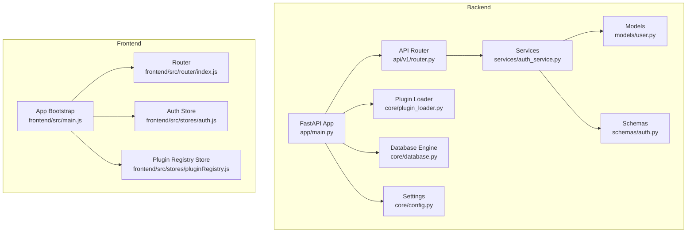
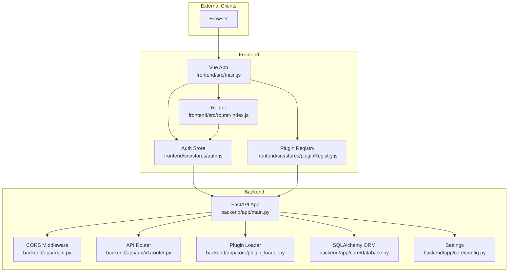
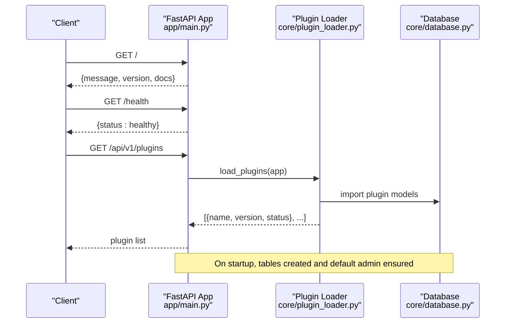
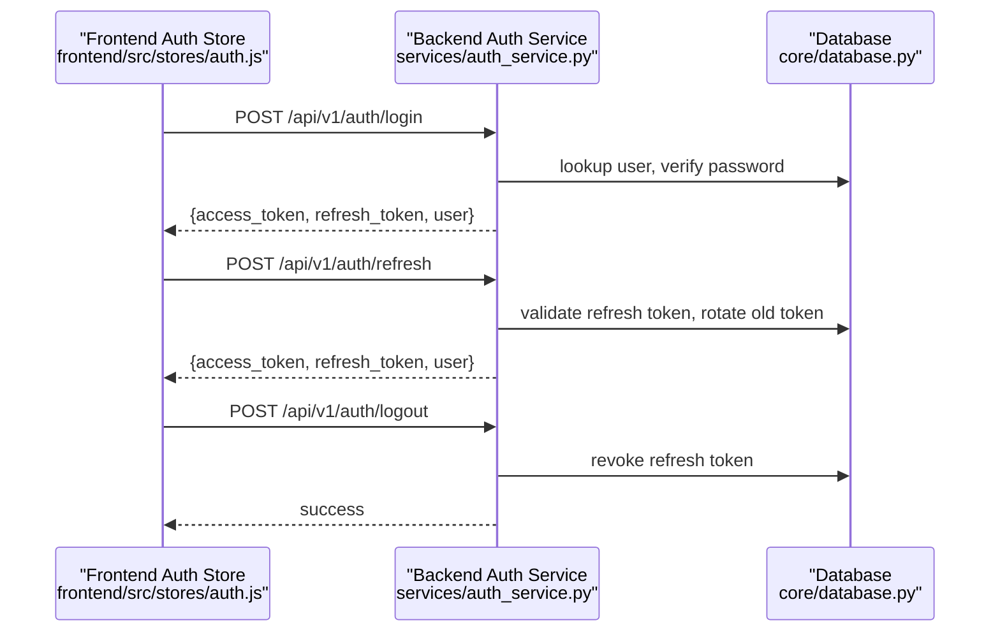
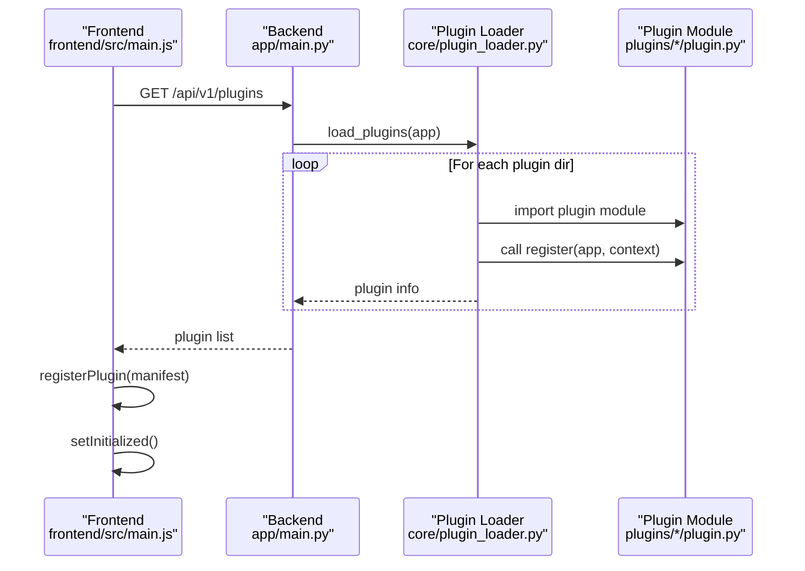
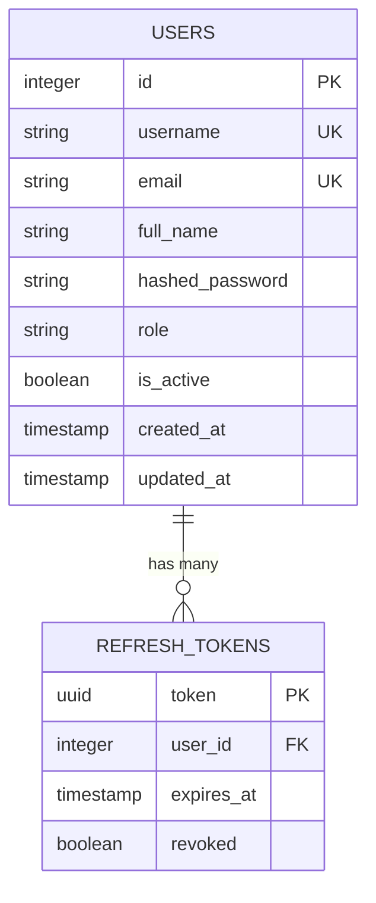
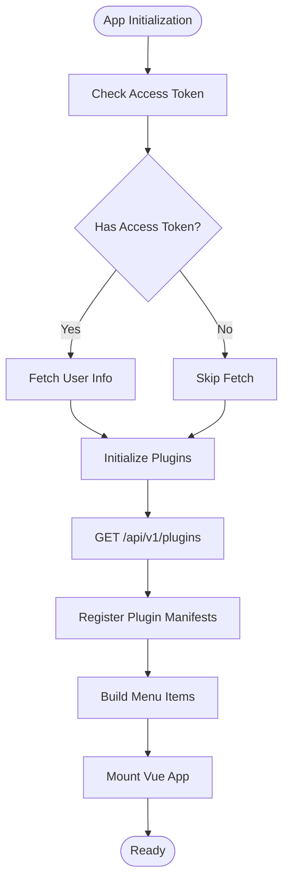
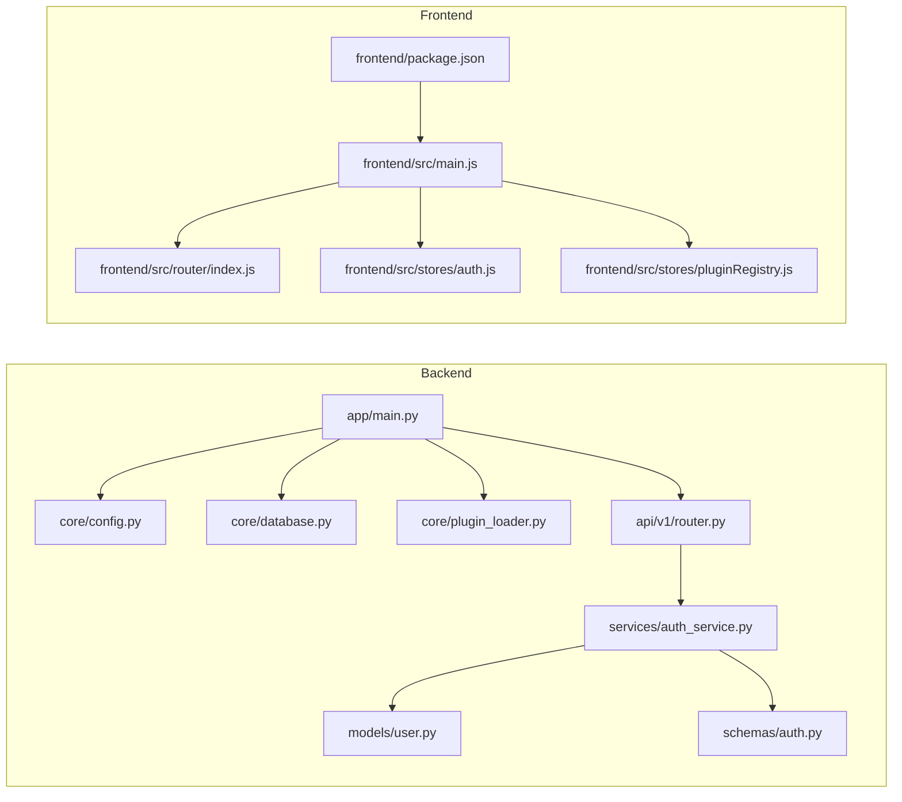

# Technology Stack & Architecture

<cite>
**Referenced Files in This Document**
- [backend/app/main.py](file://backend/app/main.py)
- [backend/app/core/config.py](file://backend/app/core/config.py)
- [backend/app/core/database.py](file://backend/app/core/database.py)
- [backend/app/core/plugin_loader.py](file://backend/app/core/plugin_loader.py)
- [backend/app/api/v1/router.py](file://backend/app/api/v1/router.py)
- [backend/app/services/auth_service.py](file://backend/app/services/auth_service.py)
- [backend/app/models/user.py](file://backend/app/models/user.py)
- [backend/app/schemas/auth.py](file://backend/app/schemas/auth.py)
- [backend/docker-compose.yml](file://backend/docker-compose.yml)
- [frontend/src/main.js](file://frontend/src/main.js)
- [frontend/src/router/index.js](file://frontend/src/router/index.js)
- [frontend/src/stores/auth.js](file://frontend/src/stores/auth.js)
- [frontend/src/stores/pluginRegistry.js](file://frontend/src/stores/pluginRegistry.js)
- [frontend/package.json](file://frontend/package.json)
</cite>

## Table of Contents
1. [Introduction](#introduction)
2. [Project Structure](#project-structure)
3. [Core Components](#core-components)
4. [Architecture Overview](#architecture-overview)
5. [Detailed Component Analysis](#detailed-component-analysis)
6. [Dependency Analysis](#dependency-analysis)
7. [Performance Considerations](#performance-considerations)
8. [Troubleshooting Guide](#troubleshooting-guide)
9. [Conclusion](#conclusion)
10. [Appendices](#appendices)

## Introduction
This document describes the technology stack and system architecture of NOC Vision, a Network Operations Center platform. The system combines a FastAPI backend with a Vue 3 frontend, organized around modular plugins and layered services. It emphasizes extensibility via a plugin loader, robust authentication and token lifecycle management, and a clean separation of concerns across models, schemas, services, and API routers. The document also covers system boundaries, data flows, integration patterns, infrastructure requirements, scalability considerations, and cross-cutting concerns such as security and monitoring.

## Project Structure
The repository is split into two primary areas:
- Backend: Python-based FastAPI application with SQLAlchemy ORM, Alembic migrations, and a plugin loader.
- Frontend: Vue 3 application using Pinia for state management, Vue Router for navigation, and dynamic plugin registration.

**Diagram sources**
- [backend/app/main.py:1-87](file://backend/app/main.py#L1-L87)
- [backend/app/core/config.py:1-46](file://backend/app/core/config.py#L1-L46)
- [backend/app/core/database.py:1-18](file://backend/app/core/database.py#L1-L18)
- [backend/app/core/plugin_loader.py:1-100](file://backend/app/core/plugin_loader.py#L1-L100)
- [backend/app/api/v1/router.py:1-10](file://backend/app/api/v1/router.py#L1-L10)
- [backend/app/services/auth_service.py:1-139](file://backend/app/services/auth_service.py#L1-L139)
- [backend/app/models/user.py:1-35](file://backend/app/models/user.py#L1-L35)
- [backend/app/schemas/auth.py:1-26](file://backend/app/schemas/auth.py#L1-L26)
- [frontend/src/main.js:1-132](file://frontend/src/main.js#L1-L132)
- [frontend/src/router/index.js:1-174](file://frontend/src/router/index.js#L1-L174)
- [frontend/src/stores/auth.js:1-198](file://frontend/src/stores/auth.js#L1-L198)
- [frontend/src/stores/pluginRegistry.js:1-53](file://frontend/src/stores/pluginRegistry.js#L1-L53)

**Section sources**
- [backend/app/main.py:1-87](file://backend/app/main.py#L1-L87)
- [backend/app/core/config.py:1-46](file://backend/app/core/config.py#L1-L46)
- [backend/app/core/database.py:1-18](file://backend/app/core/database.py#L1-L18)
- [backend/app/core/plugin_loader.py:1-100](file://backend/app/core/plugin_loader.py#L1-L100)
- [backend/app/api/v1/router.py:1-10](file://backend/app/api/v1/router.py#L1-L10)
- [frontend/src/main.js:1-132](file://frontend/src/main.js#L1-L132)
- [frontend/src/router/index.js:1-174](file://frontend/src/router/index.js#L1-L174)

## Core Components
- FastAPI Application: Initializes middleware, loads plugins, sets up routing, and exposes health and plugin listing endpoints.
- Configuration: Centralized settings for database, security, CORS, logging, and default admin account.
- Database Layer: SQLAlchemy engine, session factory, declarative base, and a reusable dependency for route handlers.
- Plugin Loader: Discovers and registers plugin modules, wiring plugin endpoints under dynamic prefixes and sharing a common context.
- API Routers: Modular grouping of endpoints for Authentication, Users, Dashboard, and Settings.
- Services: Business logic for authentication, token rotation, revocation, and default admin creation.
- Models and Schemas: Data models for users and refresh tokens, and Pydantic schemas for request/response validation.
- Frontend App: Vue 3 bootstrap initializes Pinia, router, and dynamic plugin registry; auth store manages tokens and requests; plugin registry aggregates plugin metadata and menu items.

**Section sources**
- [backend/app/main.py:1-87](file://backend/app/main.py#L1-L87)
- [backend/app/core/config.py:1-46](file://backend/app/core/config.py#L1-L46)
- [backend/app/core/database.py:1-18](file://backend/app/core/database.py#L1-L18)
- [backend/app/core/plugin_loader.py:1-100](file://backend/app/core/plugin_loader.py#L1-L100)
- [backend/app/api/v1/router.py:1-10](file://backend/app/api/v1/router.py#L1-L10)
- [backend/app/services/auth_service.py:1-139](file://backend/app/services/auth_service.py#L1-L139)
- [backend/app/models/user.py:1-35](file://backend/app/models/user.py#L1-L35)
- [backend/app/schemas/auth.py:1-26](file://backend/app/schemas/auth.py#L1-L26)
- [frontend/src/main.js:1-132](file://frontend/src/main.js#L1-L132)
- [frontend/src/stores/auth.js:1-198](file://frontend/src/stores/auth.js#L1-L198)
- [frontend/src/stores/pluginRegistry.js:1-53](file://frontend/src/stores/pluginRegistry.js#L1-L53)

## Architecture Overview
NOC Vision follows a layered backend architecture with a plugin-driven extension mechanism and a Vue 3 SPA frontend. The backend exposes REST-like endpoints via FastAPI, while the frontend orchestrates navigation, authentication, and plugin rendering.

**Diagram sources**
- [backend/app/main.py:1-87](file://backend/app/main.py#L1-L87)
- [backend/app/api/v1/router.py:1-10](file://backend/app/api/v1/router.py#L1-L10)
- [backend/app/core/plugin_loader.py:1-100](file://backend/app/core/plugin_loader.py#L1-L100)
- [backend/app/core/database.py:1-18](file://backend/app/core/database.py#L1-L18)
- [backend/app/core/config.py:1-46](file://backend/app/core/config.py#L1-L46)
- [frontend/src/main.js:1-132](file://frontend/src/main.js#L1-L132)
- [frontend/src/router/index.js:1-174](file://frontend/src/router/index.js#L1-L174)
- [frontend/src/stores/auth.js:1-198](file://frontend/src/stores/auth.js#L1-L198)
- [frontend/src/stores/pluginRegistry.js:1-53](file://frontend/src/stores/pluginRegistry.js#L1-L53)

## Detailed Component Analysis

### Backend Application Lifecycle and Plugin Loading
The backend FastAPI app initializes logging, creates database tables, loads plugins, ensures a default admin exists, and exposes health and plugin listing endpoints. Plugins are discovered from a dedicated directory and registered with a shared context that includes database base, API prefix, and security helpers.

**Diagram sources**
- [backend/app/main.py:17-87](file://backend/app/main.py#L17-L87)
- [backend/app/core/plugin_loader.py:25-100](file://backend/app/core/plugin_loader.py#L25-L100)
- [backend/app/core/database.py:1-18](file://backend/app/core/database.py#L1-L18)

**Section sources**
- [backend/app/main.py:17-87](file://backend/app/main.py#L17-L87)
- [backend/app/core/plugin_loader.py:25-100](file://backend/app/core/plugin_loader.py#L25-L100)

### Authentication and Token Management
The authentication service handles token pair creation, refresh, revocation, and cleanup of expired tokens. The frontend auth store coordinates login, registration, token refresh, and protected requests.

**Diagram sources**
- [frontend/src/stores/auth.js:29-134](file://frontend/src/stores/auth.js#L29-L134)
- [backend/app/services/auth_service.py:19-120](file://backend/app/services/auth_service.py#L19-L120)
- [backend/app/core/database.py:1-18](file://backend/app/core/database.py#L1-L18)

**Section sources**
- [frontend/src/stores/auth.js:29-134](file://frontend/src/stores/auth.js#L29-L134)
- [backend/app/services/auth_service.py:19-120](file://backend/app/services/auth_service.py#L19-L120)
- [backend/app/schemas/auth.py:1-26](file://backend/app/schemas/auth.py#L1-L26)
- [backend/app/models/user.py:1-35](file://backend/app/models/user.py#L1-L35)

### Plugin Architecture and Dynamic Registration
Plugins are modular extensions that expose endpoints and models. The plugin loader imports plugin modules, validates metadata, and registers routers under dynamic prefixes. The frontend fetches the plugin list and registers plugin manifests with menu items.

**Diagram sources**
- [frontend/src/main.js:18-51](file://frontend/src/main.js#L18-L51)
- [backend/app/main.py:84-87](file://backend/app/main.py#L84-L87)
- [backend/app/core/plugin_loader.py:25-100](file://backend/app/core/plugin_loader.py#L25-L100)
- [backend/app/plugins/accounting/plugin.py:1-17](file://backend/app/plugins/accounting/plugin.py#L1-L17)

**Section sources**
- [backend/app/core/plugin_loader.py:25-100](file://backend/app/core/plugin_loader.py#L25-L100)
- [frontend/src/main.js:18-51](file://frontend/src/main.js#L18-L51)
- [frontend/src/stores/pluginRegistry.js:1-53](file://frontend/src/stores/pluginRegistry.js#L1-L53)

### Data Models and Relationships
The backend defines core data models and relationships. The User model includes fields for identity, role, activity, and timestamps, with a relationship to RefreshToken entries.

**Diagram sources**
- [backend/app/models/user.py:7-35](file://backend/app/models/user.py#L7-L35)

**Section sources**
- [backend/app/models/user.py:1-35](file://backend/app/models/user.py#L1-L35)

### Frontend Routing and Plugin Menu Integration
The frontend router defines core routes and lazy-loads plugin views. The plugin registry aggregates plugin manifests and menu items, enabling dynamic sidebar navigation.

**Diagram sources**
- [frontend/src/main.js:115-132](file://frontend/src/main.js#L115-L132)
- [frontend/src/router/index.js:34-152](file://frontend/src/router/index.js#L34-L152)
- [frontend/src/stores/pluginRegistry.js:1-53](file://frontend/src/stores/pluginRegistry.js#L1-L53)

**Section sources**
- [frontend/src/router/index.js:1-174](file://frontend/src/router/index.js#L1-L174)
- [frontend/src/stores/pluginRegistry.js:1-53](file://frontend/src/stores/pluginRegistry.js#L1-L53)

## Dependency Analysis
The backend exhibits clear layering:
- app/main.py orchestrates configuration, database, plugin loading, and API routing.
- core/config.py centralizes environment-driven settings.
- core/database.py provides engine, sessions, and dependency.
- core/plugin_loader.py discovers and registers plugins.
- api/v1/router.py aggregates endpoint routers.
- services/auth_service.py encapsulates business logic.
- models and schemas define data contracts.

Frontend dependencies are minimal and focused:
- Vue 3, Vue Router, and Pinia for reactive UI and state.
- Tailwind CSS toolchain for styling.
- lucide-vue-next for UI icons.

**Diagram sources**
- [backend/app/main.py:1-87](file://backend/app/main.py#L1-L87)
- [backend/app/core/config.py:1-46](file://backend/app/core/config.py#L1-L46)
- [backend/app/core/database.py:1-18](file://backend/app/core/database.py#L1-L18)
- [backend/app/core/plugin_loader.py:1-100](file://backend/app/core/plugin_loader.py#L1-L100)
- [backend/app/api/v1/router.py:1-10](file://backend/app/api/v1/router.py#L1-L10)
- [backend/app/services/auth_service.py:1-139](file://backend/app/services/auth_service.py#L1-L139)
- [backend/app/models/user.py:1-35](file://backend/app/models/user.py#L1-L35)
- [backend/app/schemas/auth.py:1-26](file://backend/app/schemas/auth.py#L1-L26)
- [frontend/src/main.js:1-132](file://frontend/src/main.js#L1-L132)
- [frontend/src/router/index.js:1-174](file://frontend/src/router/index.js#L1-L174)
- [frontend/src/stores/auth.js:1-198](file://frontend/src/stores/auth.js#L1-L198)
- [frontend/src/stores/pluginRegistry.js:1-53](file://frontend/src/stores/pluginRegistry.js#L1-L53)
- [frontend/package.json:1-30](file://frontend/package.json#L1-L30)

**Section sources**
- [backend/app/main.py:1-87](file://backend/app/main.py#L1-L87)
- [frontend/src/main.js:1-132](file://frontend/src/main.js#L1-L132)
- [frontend/package.json:1-30](file://frontend/package.json#L1-L30)

## Performance Considerations
- Database pooling and pre-ping: The SQLAlchemy engine uses pool_pre_ping to mitigate stale connections.
- Token rotation: Refresh tokens enable reduced long-lived access tokens, lowering exposure windows.
- Lazy plugin loading: Plugins are imported only when present, minimizing startup overhead.
- Frontend lazy routes: Plugin views are dynamically imported to reduce initial bundle size.
- Caching: Consider adding Redis for rate limiting, session storage, and caching frequent queries.
- Horizontal scaling: Stateless backend allows load balancing; ensure shared database and consistent secrets across instances.

[No sources needed since this section provides general guidance]

## Troubleshooting Guide
Common operational issues and remedies:
- Database connectivity: Verify DATABASE_URL and container health checks; ensure PostgreSQL is reachable and credentials match.
- CORS errors: Confirm ALLOWED_ORIGINS includes frontend origins; adjust during development and production.
- Plugin loading failures: Check plugin directory structure and presence of plugin.py with required metadata and register function.
- Token expiration: Ensure client-side token expiry is respected; implement automatic refresh via the auth store.
- Health checks: Use /health to confirm backend availability; inspect logs for startup errors.

**Section sources**
- [backend/app/core/config.py:6-19](file://backend/app/core/config.py#L6-L19)
- [backend/app/core/plugin_loader.py:25-100](file://backend/app/core/plugin_loader.py#L25-L100)
- [frontend/src/stores/auth.js:160-177](file://frontend/src/stores/auth.js#L160-L177)
- [backend/docker-compose.yml:1-52](file://backend/docker-compose.yml#L1-L52)

## Conclusion
NOC Vision’s architecture balances modularity and simplicity. The FastAPI backend provides a robust foundation with a plugin loader, layered services, and strong data modeling. The Vue 3 frontend delivers a responsive, dynamic experience with secure authentication and plugin-driven navigation. Together, these components support extensibility, maintainability, and scalable deployment.

[No sources needed since this section summarizes without analyzing specific files]

## Appendices

### System Boundaries and Integration Patterns
- Internal boundaries: Backend API, plugin modules, and frontend SPA.
- External integrations: PostgreSQL for persistence; optional Redis for caching/session storage; Nginx for reverse proxying (frontend Dockerfile references nginx.conf).
- API contracts: Defined via FastAPI routers and Pydantic schemas; authentication endpoints follow token-based bearer scheme.

**Section sources**
- [backend/docker-compose.yml:1-52](file://backend/docker-compose.yml#L1-L52)
- [frontend/Dockerfile](file://frontend/Dockerfile)
- [frontend/nginx.conf](file://frontend/nginx.conf)

### Infrastructure Requirements and Deployment Topology
- Containers:
  - Postgres: persistent volume for data, health checks, and exposed port mapping.
  - Backend: Python runtime, mounted code, environment variables for database and secrets, command to run the server.
  - Frontend: Nginx serving static assets, mapped to port 80 inside container, exposed to host.
- Networking: Backend depends on DB health; frontend depends on backend availability.
- Secrets: DATABASE_URL, SECRET_KEY, and default admin credentials are configured via environment variables.

**Section sources**
- [backend/docker-compose.yml:1-52](file://backend/docker-compose.yml#L1-L52)

### Cross-Cutting Concerns
- Security:
  - JWT-based authentication with separate access and refresh tokens.
  - Password hashing and verification via the authentication service.
  - CORS middleware configured via settings.
- Monitoring:
  - Health endpoint for readiness/liveness checks.
  - Logging level configurable via settings.
- Database design:
  - Users and RefreshTokens with explicit relationships and timestamps.
  - Alembic configuration present for migrations.

**Section sources**
- [backend/app/services/auth_service.py:19-120](file://backend/app/services/auth_service.py#L19-L120)
- [backend/app/core/config.py:9-23](file://backend/app/core/config.py#L9-L23)
- [backend/app/models/user.py:1-35](file://backend/app/models/user.py#L1-L35)
- [backend/alembic/env.py](file://backend/alembic/env.py)
- [backend/alembic/script.py.mako](file://backend/alembic/script.py.mako)