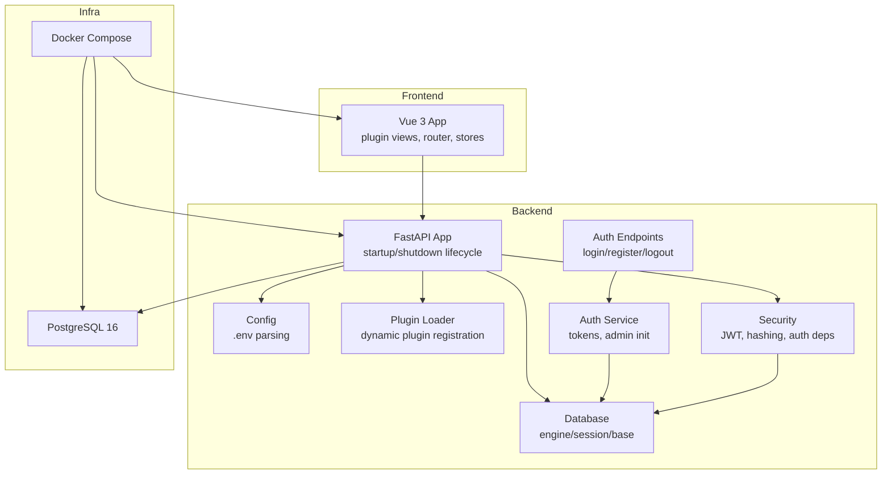
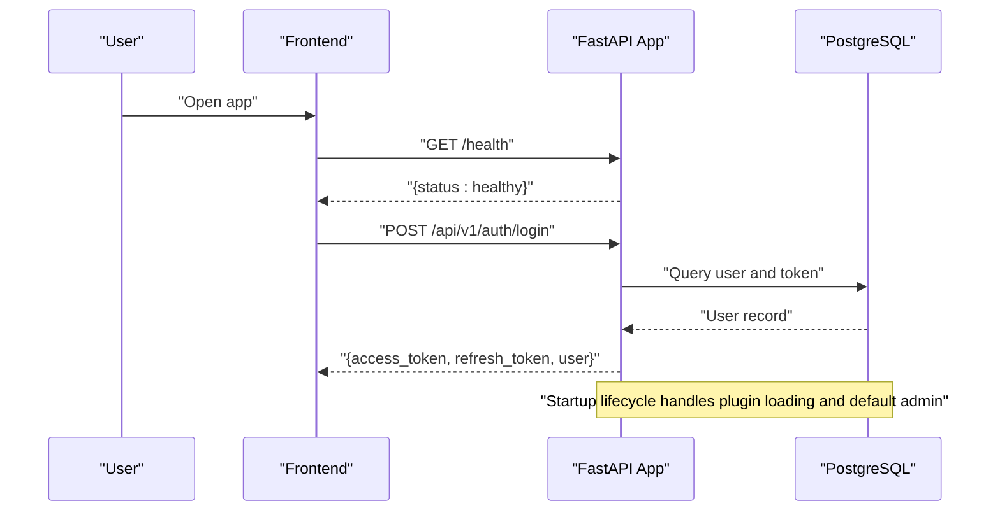
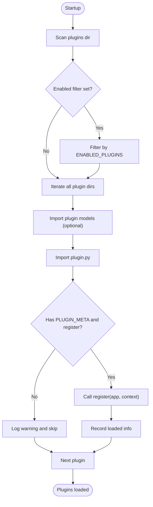
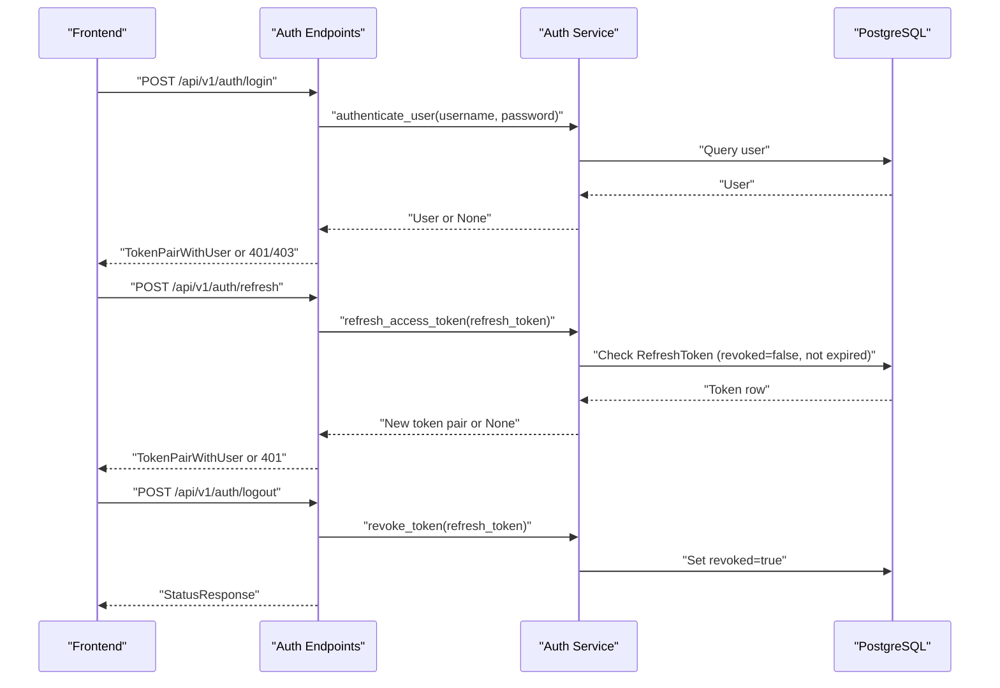
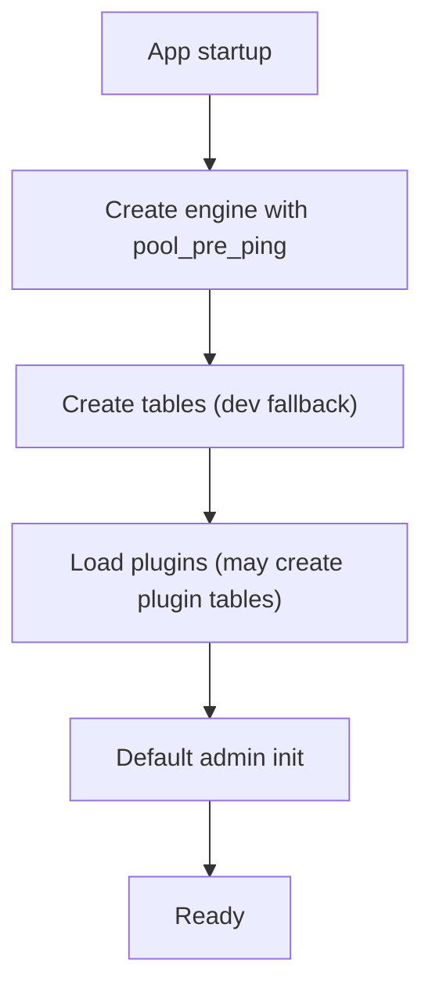
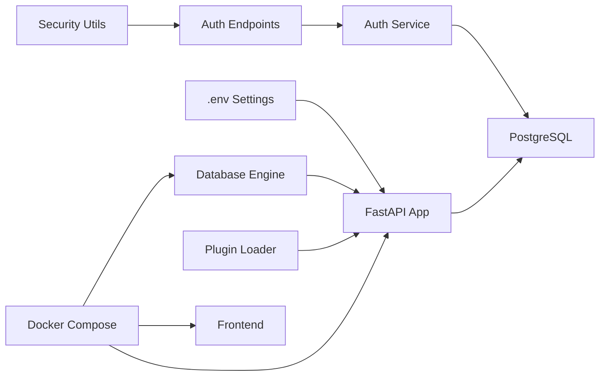

# Troubleshooting & FAQ

<cite>
**Referenced Files in This Document**
- [README.md](file://README.md)
- [docker-compose.yml](file://docker-compose.yml)
- [backend/app/main.py](file://backend/app/main.py)
- [backend/app/core/config.py](file://backend/app/core/config.py)
- [backend/app/core/database.py](file://backend/app/core/database.py)
- [backend/app/core/plugin_loader.py](file://backend/app/core/plugin_loader.py)
- [backend/app/core/security.py](file://backend/app/core/security.py)
- [backend/app/services/auth_service.py](file://backend/app/services/auth_service.py)
- [backend/app/api/v1/endpoints/auth.py](file://backend/app/api/v1/endpoints/auth.py)
- [backend/app/models/user.py](file://backend/app/models/user.py)
- [backend/app/models/refresh_token.py](file://backend/app/models/refresh_token.py)
- [backend/run.py](file://backend/run.py)
- [backend/alembic.ini](file://backend/alembic.ini)
</cite>

## Table of Contents
1. [Introduction](#introduction)
2. [Project Structure](#project-structure)
3. [Core Components](#core-components)
4. [Architecture Overview](#architecture-overview)
5. [Detailed Component Analysis](#detailed-component-analysis)
6. [Dependency Analysis](#dependency-analysis)
7. [Performance Considerations](#performance-considerations)
8. [Troubleshooting Guide](#troubleshooting-guide)
9. [FAQ](#faq)
10. [Conclusion](#conclusion)
11. [Appendices](#appendices)

## Introduction
This document provides comprehensive troubleshooting guidance and Frequently Asked Questions for NOC Vision. It covers installation issues, configuration problems, runtime errors, debugging techniques, log analysis, diagnostics, performance tuning, memory leak considerations, database connectivity, authentication failures, and plugin loading issues. It also includes system requirements, compatibility notes, migration scenarios, and error code meanings with resolution steps.

## Project Structure
NOC Vision consists of:
- Backend: FastAPI application with plugin architecture, JWT authentication, SQLAlchemy ORM, and Alembic migrations.
- Frontend: Vue 3 application with Vite, Pinia, and plugin views.
- Docker Compose: Orchestration for backend, frontend, and PostgreSQL services.

**Diagram sources**
- [backend/app/main.py:17-48](file://backend/app/main.py#L17-L48)
- [backend/app/core/config.py:5-46](file://backend/app/core/config.py#L5-L46)
- [backend/app/core/database.py:1-18](file://backend/app/core/database.py#L1-L18)
- [backend/app/core/plugin_loader.py:25-99](file://backend/app/core/plugin_loader.py#L25-L99)
- [backend/app/core/security.py:13-99](file://backend/app/core/security.py#L13-L99)
- [backend/app/services/auth_service.py:19-139](file://backend/app/services/auth_service.py#L19-L139)
- [backend/app/api/v1/endpoints/auth.py:20-106](file://backend/app/api/v1/endpoints/auth.py#L20-L106)
- [docker-compose.yml:3-52](file://docker-compose.yml#L3-L52)

**Section sources**
- [README.md:5-31](file://README.md#L5-L31)
- [docker-compose.yml:1-52](file://docker-compose.yml#L1-L52)

## Core Components
- Configuration: Centralized settings via environment variables (.env) with defaults and parsing helpers.
- Database: Engine with pre-ping, scoped sessions, declarative base, and a health endpoint.
- Plugin Loader: Discovers and registers plugins dynamically, logs successes/failures, and supports enabling/disabling via configuration.
- Security: JWT creation/decoding, password hashing/verification, and dependency providers for protected routes.
- Authentication Service: Token pair creation, refresh, revoke, cleanup, and default admin initialization.
- API Endpoints: Login, refresh, register, logout, whoami, and admin init endpoints.

**Section sources**
- [backend/app/core/config.py:5-46](file://backend/app/core/config.py#L5-L46)
- [backend/app/core/database.py:1-18](file://backend/app/core/database.py#L1-L18)
- [backend/app/core/plugin_loader.py:25-99](file://backend/app/core/plugin_loader.py#L25-L99)
- [backend/app/core/security.py:13-99](file://backend/app/core/security.py#L13-L99)
- [backend/app/services/auth_service.py:19-139](file://backend/app/services/auth_service.py#L19-L139)
- [backend/app/api/v1/endpoints/auth.py:20-106](file://backend/app/api/v1/endpoints/auth.py#L20-L106)

## Architecture Overview
The backend initializes logging, creates tables, loads plugins, ensures default admin, and exposes health and plugin listing endpoints. The frontend communicates with the backend API, while Docker Compose orchestrates PostgreSQL, backend, and frontend.

**Diagram sources**
- [backend/app/main.py:17-48](file://backend/app/main.py#L17-L48)
- [backend/app/api/v1/endpoints/auth.py:20-37](file://backend/app/api/v1/endpoints/auth.py#L20-L37)
- [backend/app/core/database.py:12-18](file://backend/app/core/database.py#L12-L18)

## Detailed Component Analysis

### Plugin Loading System
Dynamic plugin discovery and registration:
- Scans the plugins directory, filters by ENABLED_PLUGINS, imports models first, then plugin module.
- Validates presence of PLUGIN_META and register function.
- Registers routes under /api/v1/plugins/<plugin_name> with tags.
- Logs warnings/errors per plugin and persists status in app.state.loaded_plugins.

**Diagram sources**
- [backend/app/core/plugin_loader.py:25-99](file://backend/app/core/plugin_loader.py#L25-L99)

**Section sources**
- [backend/app/core/plugin_loader.py:25-99](file://backend/app/core/plugin_loader.py#L25-L99)
- [backend/app/main.py:25-44](file://backend/app/main.py#L25-L44)

### Authentication and Token Lifecycle
JWT-based authentication with refresh tokens:
- Access tokens carry type "access" and user identity; refresh tokens carry type "refresh" and JTI.
- Refresh validates token, checks revocation and expiry, rotates tokens by revoking previous.
- Logout revokes a specific refresh token; cleanup removes expired refresh tokens.
- Default admin is created if none exists.

**Diagram sources**
- [backend/app/api/v1/endpoints/auth.py:20-91](file://backend/app/api/v1/endpoints/auth.py#L20-L91)
- [backend/app/services/auth_service.py:19-110](file://backend/app/services/auth_service.py#L19-L110)
- [backend/app/core/security.py:31-98](file://backend/app/core/security.py#L31-L98)
- [backend/app/models/user.py:7-35](file://backend/app/models/user.py#L7-L35)
- [backend/app/models/refresh_token.py:7-18](file://backend/app/models/refresh_token.py#L7-L18)

**Section sources**
- [backend/app/api/v1/endpoints/auth.py:20-106](file://backend/app/api/v1/endpoints/auth.py#L20-L106)
- [backend/app/services/auth_service.py:19-139](file://backend/app/services/auth_service.py#L19-L139)
- [backend/app/core/security.py:13-99](file://backend/app/core/security.py#L13-L99)
- [backend/app/models/user.py:7-35](file://backend/app/models/user.py#L7-L35)
- [backend/app/models/refresh_token.py:7-18](file://backend/app/models/refresh_token.py#L7-L18)

### Database Connectivity and Migrations
- Engine configured with pre-ping for robust connections.
- Tables created on startup (development fallback); Alembic recommended for production.
- Health check in Docker Compose verifies PostgreSQL readiness.

**Diagram sources**
- [backend/app/main.py:17-48](file://backend/app/main.py#L17-L48)
- [backend/app/core/database.py:1-18](file://backend/app/core/database.py#L1-L18)
- [docker-compose.yml:14-18](file://docker-compose.yml#L14-L18)

**Section sources**
- [backend/app/core/database.py:1-18](file://backend/app/core/database.py#L1-L18)
- [backend/app/main.py:22-30](file://backend/app/main.py#L22-L30)
- [docker-compose.yml:14-18](file://docker-compose.yml#L14-L18)
- [backend/alembic.ini:1-36](file://backend/alembic.ini#L1-L36)

## Dependency Analysis
- Backend startup depends on configuration, database engine, plugin loader, and models being imported.
- Plugin registration depends on the plugin module exposing PLUGIN_META and a register function.
- Authentication endpoints depend on the auth service and security utilities.
- Docker Compose ties services together and sets environment variables for the backend.

**Diagram sources**
- [backend/app/main.py:17-48](file://backend/app/main.py#L17-L48)
- [backend/app/core/config.py:5-46](file://backend/app/core/config.py#L5-L46)
- [backend/app/core/plugin_loader.py:25-99](file://backend/app/core/plugin_loader.py#L25-L99)
- [backend/app/core/security.py:13-99](file://backend/app/core/security.py#L13-L99)
- [backend/app/api/v1/endpoints/auth.py:20-106](file://backend/app/api/v1/endpoints/auth.py#L20-L106)
- [backend/app/services/auth_service.py:19-139](file://backend/app/services/auth_service.py#L19-L139)
- [docker-compose.yml:20-49](file://docker-compose.yml#L20-L49)

**Section sources**
- [backend/app/main.py:17-48](file://backend/app/main.py#L17-L48)
- [backend/app/core/plugin_loader.py:25-99](file://backend/app/core/plugin_loader.py#L25-L99)
- [backend/app/api/v1/endpoints/auth.py:20-106](file://backend/app/api/v1/endpoints/auth.py#L20-L106)
- [docker-compose.yml:20-49](file://docker-compose.yml#L20-L49)

## Performance Considerations
- Logging level: Adjust LOG_LEVEL to balance verbosity and overhead.
- Database pooling: Engine uses pre-ping; ensure appropriate pool settings for production.
- Plugin loading: Limit ENABLED_PLUGINS to reduce startup cost and memory footprint.
- Token rotation: Frequent refreshes increase DB writes; tune token lifetimes accordingly.
- Alembic migrations: Prefer Alembic over ad-hoc table creation in production for predictable schema evolution.

[No sources needed since this section provides general guidance]

## Troubleshooting Guide

### Installation and Environment Setup
- Docker-based deployment is recommended. Ensure Docker and Docker Compose are installed and running.
- Confirm ports are free: frontend on 3000, backend on 8003, database on 5432.
- Verify environment variables in .env and docker-compose.yml match your setup.

Common symptoms and fixes:
- Backend does not start:
  - Check PostgreSQL health and credentials.
  - Validate DATABASE_URL and that the database is reachable.
  - Ensure dependencies are installed (pip install -r requirements.txt).
- Frontend does not start:
  - Clear node_modules and reinstall dependencies.
  - Confirm backend is running at http://localhost:8003.
  - Align ALLOWED_ORIGINS with frontend URLs.

**Section sources**
- [README.md:67-128](file://README.md#L67-L128)
- [docker-compose.yml:20-49](file://docker-compose.yml#L20-L49)
- [backend/app/core/config.py:5-46](file://backend/app/core/config.py#L5-L46)

### Configuration Problems
- CORS misconfiguration:
  - Ensure ALLOWED_ORIGINS includes frontend origins.
  - Restart backend after changes.
- Secret keys and token lifetimes:
  - Change SECRET_KEY to a secure random value in production.
  - Tune ACCESS_TOKEN_EXPIRE_MINUTES and REFRESH_TOKEN_EXPIRE_DAYS as needed.
- Plugin enablement:
  - Set ENABLED_PLUGINS to a comma-separated list of plugin names to restrict loading.

**Section sources**
- [backend/app/core/config.py:5-46](file://backend/app/core/config.py#L5-L46)
- [backend/app/core/plugin_loader.py:34-48](file://backend/app/core/plugin_loader.py#L34-L48)

### Runtime Errors and Diagnostics
- Health endpoint:
  - GET /health should return a healthy status. If not, inspect backend logs.
- Plugin loading errors:
  - Check backend logs for plugin load warnings/errors.
  - Verify plugin.py exports PLUGIN_META and register function.
  - Ensure plugin models are importable if present.
- Default admin initialization:
  - Call /api/v1/auth/init to create admin if missing.

Debugging steps:
- Increase LOG_LEVEL to DEBUG for more verbose logs during startup.
- Inspect startup logs for plugin load summaries and errors.
- Validate JWT configuration and secret key alignment across services.

**Section sources**
- [backend/app/main.py:17-48](file://backend/app/main.py#L17-L48)
- [backend/app/core/plugin_loader.py:89-97](file://backend/app/core/plugin_loader.py#L89-L97)
- [backend/app/api/v1/endpoints/auth.py:100-106](file://backend/app/api/v1/endpoints/auth.py#L100-L106)

### Database Connectivity Problems
- Symptoms: startup fails with database errors, queries fail.
- Checks:
  - Confirm PostgreSQL is healthy and accepting connections.
  - Validate DATABASE_URL format and credentials.
  - Ensure database exists and user has privileges.
- Migrations:
  - Use Alembic for schema updates in production.
  - Review alembic.ini for logging configuration.

**Section sources**
- [backend/app/core/database.py:1-18](file://backend/app/core/database.py#L1-L18)
- [docker-compose.yml:14-18](file://docker-compose.yml#L14-L18)
- [backend/alembic.ini:1-36](file://backend/alembic.ini#L1-L36)

### Authentication Failures
- Login returns 401/403:
  - Incorrect credentials or disabled user.
  - Verify user exists and is active.
- Refresh token invalid/expired:
  - Ensure refresh token is not revoked and not expired.
  - Rotate tokens on successful refresh.
- Logout not effective:
  - Confirm refresh token was revoked in the database.

**Section sources**
- [backend/app/api/v1/endpoints/auth.py:20-51](file://backend/app/api/v1/endpoints/auth.py#L20-L51)
- [backend/app/services/auth_service.py:45-110](file://backend/app/services/auth_service.py#L45-L110)
- [backend/app/core/security.py:61-98](file://backend/app/core/security.py#L61-L98)

### Plugin Loading Issues
- Missing PLUGIN_META or register():
  - Add required metadata and registration function.
- Import errors in plugin models:
  - Fix import paths and ensure models are compatible with Base.
- Route conflicts:
  - Ensure unique route prefixes for plugins.

**Section sources**
- [backend/app/core/plugin_loader.py:63-78](file://backend/app/core/plugin_loader.py#L63-L78)

### Memory Leaks and Resource Cleanup
- Sessions:
  - Sessions are closed after each request; ensure no long-lived references to DB sessions.
- Engine disposal:
  - Engine is disposed on shutdown; confirm graceful shutdown in production.
- Token cleanup:
  - Regularly run expired token cleanup to prevent accumulation.

**Section sources**
- [backend/app/core/database.py:12-18](file://backend/app/core/database.py#L12-L18)
- [backend/app/main.py:46-48](file://backend/app/main.py#L46-L48)
- [backend/app/services/auth_service.py:103-110](file://backend/app/services/auth_service.py#L103-L110)

### Error Codes and Meanings
- HTTP 401 Unauthorized:
  - Invalid or missing bearer token; incorrect login credentials.
- HTTP 403 Forbidden:
  - Inactive user or insufficient permissions (admin required).
- HTTP 400 Bad Request:
  - Duplicate username/email during registration.
- HTTP 200 OK:
  - Successful operations (login, refresh, logout, init, whoami).

Resolution steps:
- For 401/403: Re-authenticate or contact administrator.
- For 400: Correct input (unique username/email).
- For 5xx: Check backend logs and database connectivity.

**Section sources**
- [backend/app/api/v1/endpoints/auth.py:26-36](file://backend/app/api/v1/endpoints/auth.py#L26-L36)
- [backend/app/api/v1/endpoints/auth.py:62-71](file://backend/app/api/v1/endpoints/auth.py#L62-L71)
- [backend/app/api/v1/endpoints/auth.py:46-50](file://backend/app/api/v1/endpoints/auth.py#L46-L50)

## FAQ

### System Requirements
- Backend: Python 3.9+, PostgreSQL 16+, FastAPI stack.
- Frontend: Node.js 18+, modern browser.
- Docker: Optional but recommended for local development.

**Section sources**
- [README.md:57-64](file://README.md#L57-L64)

### Compatibility Notes
- Python 3.9+ required for backend.
- Node.js 18+ required for frontend development.
- PostgreSQL 16+ recommended; earlier versions may work but are unsupported.

**Section sources**
- [README.md:61-64](file://README.md#L61-L64)

### Migration Scenarios
- From development tables to production:
  - Use Alembic to manage schema migrations.
  - Review and adjust alembic.ini logging as needed.
- Upgrading plugins:
  - Ensure plugin models are importable and compatible.
  - Test plugin loading after upgrades.

**Section sources**
- [README.md:194-204](file://README.md#L194-L204)
- [backend/alembic.ini:1-36](file://backend/alembic.ini#L1-L36)
- [backend/app/core/plugin_loader.py:52-55](file://backend/app/core/plugin_loader.py#L52-L55)

### Debugging Techniques
- Enable DEBUG and adjust LOG_LEVEL for detailed logs.
- Use /health to verify service availability.
- Inspect plugin loading status via /api/v1/plugins.
- Validate JWT configuration and secrets across backend and frontend.

**Section sources**
- [backend/app/main.py:17-48](file://backend/app/main.py#L17-L48)
- [backend/app/main.py:79-87](file://backend/app/main.py#L79-L87)
- [backend/app/core/config.py:21-26](file://backend/app/core/config.py#L21-L26)

### Security Best Practices
- Change SECRET_KEY to a cryptographically secure value.
- Use HTTPS in production and secure cookies.
- Limit ENABLED_PLUGINS to only required plugins.
- Regularly rotate tokens and clean up expired ones.

**Section sources**
- [backend/app/core/config.py:9-13](file://backend/app/core/config.py#L9-L13)
- [backend/app/services/auth_service.py:103-110](file://backend/app/services/auth_service.py#L103-L110)

## Conclusion
This guide consolidates actionable troubleshooting steps, configuration tips, and diagnostic procedures for NOC Vision. By validating environment setup, reviewing logs, ensuring database connectivity, and following security and performance recommendations, most issues can be resolved quickly. Use the provided references to locate relevant code and configuration files for deeper investigation.

## Appendices

### Quick Checklist
- Docker: services healthy, ports mapped, .env aligned.
- Backend: LOG_LEVEL adequate, DATABASE_URL correct, plugins loaded.
- Frontend: backend reachable, CORS aligned, tokens valid.
- Database: migrations applied, tables created, user privileges granted.

**Section sources**
- [docker-compose.yml:3-52](file://docker-compose.yml#L3-L52)
- [backend/app/core/config.py:5-46](file://backend/app/core/config.py#L5-L46)
- [backend/app/core/database.py:1-18](file://backend/app/core/database.py#L1-L18)
- [backend/app/main.py:17-48](file://backend/app/main.py#L17-L48)